# 拥抱脸的 Gradio 入门

> 原文：<https://www.assemblyai.com/blog/getting-started-with-huggingfaces-gradio/>

**[Gradio](https://gradio.app/)** 是一个开源库，只使用 Python 就可以构建易于使用、易于共享的应用。它特别适用于机器学习项目，旨在使测试、共享和展示模型变得简单而直观。

在本教程中，我们将学习如何使用 Gradio 来构建以下 **[音频智能仪表板](https://huggingface.co/spaces/oconnoob/audio-intelligence-dashboard)** ，这将允许我们使用深度学习来分析音频文件或录音，以获得各种智能见解。

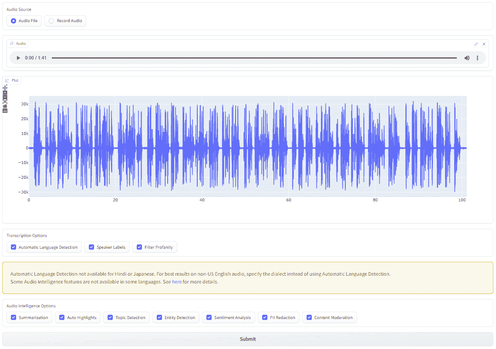

提交文件后，您将能够以一种易于理解的方式查看音频智能洞察，如自动突出显示、摘要和检测到的主题:

<https://www.assemblyai.com/blog/content/media/2022/09/analysis.mp4>


首先，我们将学习如何使用音频智能仪表板并解析结果，然后我们将学习如何使用拥抱脸的 Gradio 构建仪表板，最后我们将使用拥抱脸的空间部署仪表板。我们开始吧！

## 如何使用仪表板

在这一节中，我们将学习如何使用仪表板提交音频文件进行分析，您可以在这里找到。如果您只想查看示例输出，请跳至[查看结果](#examining-the-results)。如果你想直接看实现，跳到[用 Gradio](#building-the-dashboard-ui-with-gradio) 构建仪表板 UI。

### 启动仪表板

可以通过两种方式之一访问仪表板。第一种方式不需要设置——只需[转到项目空间](https://huggingface.co/spaces/oconnoob/audio-intelligence-dashboard),那里有一个公开的仪表板版本。如果你正在使用这种方法，现在你可以跳到[的下一节](#enter-assemblyai-key)。

第二种访问仪表板的方式需要一些设置，但是允许您在本地运行它以获得更好的性能。你需要为这个方法安装 [Python 3](https://www.python.org/downloads/) 、 [git](https://git-scm.com/downloads) 、 [pip](https://pip.pypa.io/en/stable/installation/) 和 [virtualenv](https://virtualenv.pypa.io/en/latest/installation.html#via-pip) 。只需在终端中执行以下命令，从 GitHub 下载项目存储库并运行仪表板:

```py
# Clone the repo
git clone https://github.com/AssemblyAI-Examples/audio-intelligence-dashboard.git

# Enter repo
cd audio-intelligence-dashboard

# Create virtual environment
virtualenv venv

# Activate virtual environment - MacOS/Linux
source venv/bin/activate

# Activate virtual environment - Windows
.\venv\Scripts\activate.bat

# Install requirements to virtual environment (will take a few minutes)
pip install -r requirements.txt - will take a few minutes

# Enter app directory
cd app

# Runn app (made need to use `python3` instead of `python`)
python app.py
```

终端将显示一个可以访问该应用程序的本地 URL。在浏览器中输入此 URL 以访问应用程序。

暗/亮模式注释

Gradio 有一个“暗”模式和一个“亮”模式，可以改变应用程序的默认外观。根据您的操作系统和浏览器，仪表板可能会以黑暗模式显示。在 Gradio 3.2 中，无法强制应用程序在 Python 中显示为主题或其他。然而，您可以通过运行`app.py`将`?__theme=light`附加到 URL 输出来强制使用轻量模式。

音频智能仪表板旨在以亮模式运行，因此如果您在本地运行时看到暗模式，请尝试上述方法强制应用程序以亮模式显示

### 输入 AssemblyAI 键

将执行我们音频智能分析的“引擎”是 [AssemblyAI API](https://www.assemblyai.com/) ，所以首先我们需要一个 API 密钥——你可以在这里找到你的或者免费得到一个[。转到您的](https://app.assemblyai.com/signup) [AssemblyAI 仪表盘](https://app.assemblyai.com/)并点击您的 API 键下的值以复制其值。

<https://www.assemblyai.com/blog/content/media/2022/09/api_key.mp4>


现在回到[音频智能仪表板](https://huggingface.co/spaces/oconnoob/audio-intelligence-dashboard)并将你复制的密钥粘贴到 **API 密钥**字段。

<https://www.assemblyai.com/blog/content/media/2022/09/key_paste.mp4>


重要说明

千万不要和任何人分享你的 API 密匙或者上传到 GitHub。您的密钥**与您的帐户唯一关联**，应该保密。

### 上传或录制文件

现在我们需要指定我们想要分析的音频。在**音频源**下，选择**音频文件**如果您想使用存储在您设备上的音频文件，或者选择**录制音频**来录制一个要使用的文件。下面我们可以看到一个文件被拖放上传。

<https://www.assemblyai.com/blog/content/media/2022/09/audio_upload.mp4>


### 选择转录和音频智能选项

既然我们已经指定了我们想要分析的音频，我们必须指定我们想要运行什么类型的分析。默认情况下选择所有选项，但您可以取消选择任何您不感兴趣的分析。关于每个选项的信息可以在下面的**描述**下拉列表中找到。

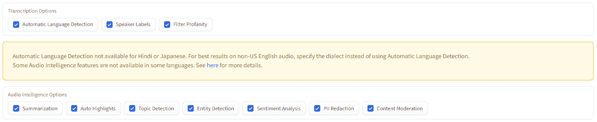

描述

*   **转录选项**
    *   **[自动语言检测](https://www.assemblyai.com/docs/core-transcription#automatic-language-detection)** 会自动检测音频中所说的语言。
    *   **[说话人标签](https://www.assemblyai.com/docs/core-transcription#speaker-labels-speaker-diarization)** 会识别音频中不同的说话人，确定哪些句子是哪个说话人说的。
    *   **[过滤脏话](https://www.assemblyai.com/docs/core-transcription#profanity-filtering)** 将对识别出的脏话进行编辑。
*   **音频智能选项**
    *   **[摘要](https://www.assemblyai.com/docs/audio-intelligence#auto-chapters-summarization)** 将生成音频的每个不同部分的摘要。
    *   **[自动高亮显示](https://www.assemblyai.com/docs/audio-intelligence#detect-important-phrases-and-words)** 将识别抄本中的关键词和短语。
    *   **[话题检测](https://www.assemblyai.com/docs/audio-intelligence#topic-detection-iab-classification)** 将决定音频中讨论哪些话题。
    *   **[实体检测](https://www.assemblyai.com/docs/audio-intelligence#entity-detection)** 将检测音频中的位置和组织等实体。
    *   **[情绪分析](https://www.assemblyai.com/docs/audio-intelligence#sentiment-analysis)** 将确定与抄本中的每个句子相关联的情绪的极性和程度。
    *   **[PII 编校](https://www.assemblyai.com/docs/audio-intelligence#pii-redaction)** 将编校个人身份信息(PII)。
    *   **[内容适度](https://www.assemblyai.com/docs/audio-intelligence#content-moderation)** 将决定音频中不同敏感话题的讨论程度。

### 使服从

指定要分析的音频和要运行的分析后，只需点击**提交**即可提交音频进行分析。根据音频的长度，这可能需要一些时间。预计分析将占用音频文件持续时间的 15-30%,最少约 20 秒。

## 检查结果

音频分析完成后，结果将显示在页面底部的选项卡组中。现在让我们来看看每个选项卡，并检查一个示例音频文件的结果。

### 副本

第一个选项卡显示了最基本的结果，这是音频的格式化副本。

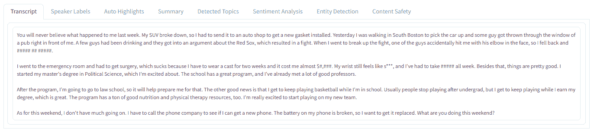

(full resolution available [here](https://github.com/AssemblyAI-Examples/audio-intelligence-dashboard/blob/mastimg/transcript.png))

你会注意到有几个值被修改了。特别是， **PII 修订**功能被设置为修订**药物**、**身体伤害**、**姓名**，以及**金额**。因此，

1.  "*于是我摔了一跤，摔断了手腕*"已经被转录为"*于是我摔了一跤#### ## #####* "
2.  "*花费了我将近 1000 美元*"已经被翻译成"*花费了我将近$ number，###* "
3.  "*我不得不服用 Advil 整整一周*"已经被转录为"*我不得不服用#####整整一周*"

此外，**过滤脏话**选项是抄本显示“*我的手腕仍然感觉像 s**** ”的原因。

### 扬声器标签

第二个选项卡显示相同的脚本，但这次在脚本中相应的文本上方显示每个音频部分的演讲者。说话人被识别为*说话人 A* 、*说话人 B* 等。在这种情况下，只有一个发言人，因此整个记录归功于*发言人 A* 。

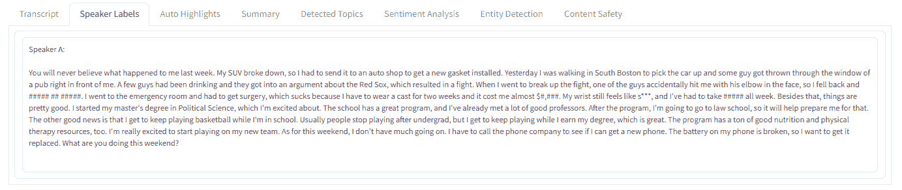

(full resolution available [here](https://github.com/AssemblyAI-Examples/audio-intelligence-dashboard/blob/mastimg/speaker_labels.png))

### 自动突出显示

第三个选项卡显示来自[自动高亮显示](https://www.assemblyai.com/docs/audio-intelligence#detect-important-phrases-and-words)分析的结果。标识并突出显示关键词和短语，突出显示的不透明度对应于该词/短语的相关性。

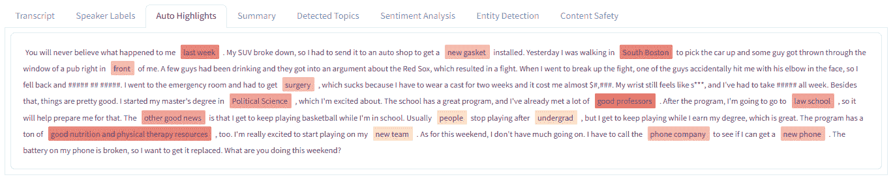

(full resolution available [here](https://github.com/AssemblyAI-Examples/audio-intelligence-dashboard/blob/mastimg/auto_highlights.png))

### 摘要

第四个选项卡显示[汇总](https://www.assemblyai.com/docs/audio-intelligence#auto-chapters-summarization)结果。音频被自动分割成概念上不同的部分，然后每个部分用粗体标题概括。在这种情况下，只有一个部分被确定为存在，导致只有一个标题，如下所示:

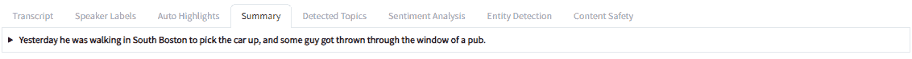

(full resolution available [here](https://github.com/AssemblyAI-Examples/audio-intelligence-dashboard/blob/mastimg/summary_headline.png))

单击任何给定的标题都会显示该部分的更详细摘要:

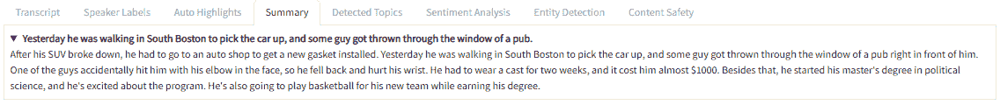

(full resolution available [here](https://github.com/AssemblyAI-Examples/audio-intelligence-dashboard/blob/mastimg/summary_full.png))

### 检测到的主题

第五个选项卡显示在音频中检测到的 IAB 分类中的[主题](https://www.assemblyai.com/docs/audio-intelligence#topic-detection-iab-classification)。每个主题的子主题都列在它的下面，缩进排列，其中任何以紫色突出显示的主题都被检测到将在音频中讨论。


(full resolution available [here](https://github.com/AssemblyAI-Examples/audio-intelligence-dashboard/blob/mastimg/detected_topics.png))

例如，主题“*研究生教育*”和“*本科教育*”都是检测到的主题，并且属于类别“*大学教育*”，其属于类别“*教育*”，尽管后两个主题本身都没有被检测到。

另一方面，“*大学篮球*”属于类别“*大学体育*”，这是*本身*属于类别“*体育*的检测主题(如其紫色所示)，这不是*本身检测到的。*

### 情感分析

第六个选项卡显示音频上[情感分析](https://www.assemblyai.com/docs/audio-intelligence#sentiment-analysis)的结果。抄本的每一句都是

1.  突出显示**红色**为**负面**情绪
2.  突出显示**绿色**表示**正面**情绪，或者
3.  已经**没有突出**为**中立**的情绪。

高光的不透明度对应于情绪的程度。

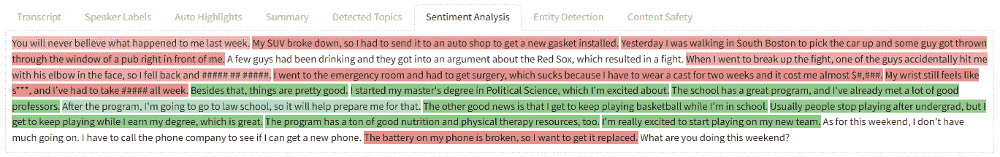

(full resolution available [here](https://github.com/AssemblyAI-Examples/audio-intelligence-dashboard/blob/mastimg/sentiment_analysis.png))

### 实体检测

第七个选项卡显示在音频中检测到的实体[。每个实体类型都以紫色显示，下面列出了检测到的实例。检测到的实体以黄色突出显示，两边用几个单词围绕，表示上下文。](https://www.assemblyai.com/docs/audio-intelligence#entity-detection)


(full resolution available [here](https://github.com/AssemblyAI-Examples/audio-intelligence-dashboard/blob/mastimg/entity_detection.png))

例如，音频中提到的两个实体被检测为“*医疗流程*”*-“*手术*”和“*理疗*”。这些实体中的每一个都在相应的实体类型下以黄色突出显示。*

*一些高亮显示为“*【修订】*”，因为 **PII 修订**功能已开启。*

### *内容安全*

*第八个也是最后一个标签显示了在音频中检测到的[敏感话题](https://www.assemblyai.com/docs/audio-intelligence#content-moderation)的摘要。检测到的每个敏感主题都列在条形图的左侧，条形图的长度对应于该主题在音频中作为一个整体出现的程度，0 表示最小值，1 表示最大值。*

*在我们的示例中，我们看到主题“*犯罪暴力*”、“*酒精*”和“*事故*”都被检测到，其中“*酒精*”是最相关/存在的。*

*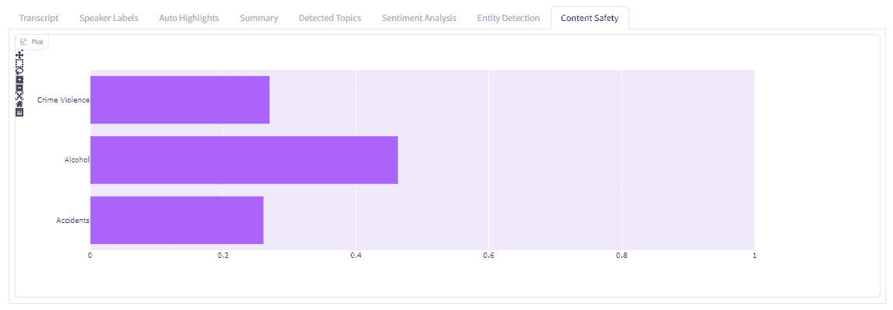

(full resolution available [here](https://github.com/AssemblyAI-Examples/audio-intelligence-dashboard/blob/mastimg/content_safety.png))* 

### *摘要*

*这就是使用[音频智能仪表板](https://huggingface.co/spaces/oconnoob/audio-intelligence-dashboard)对音频文件进行广泛深入分析的全部内容！请随意查看 [AssemblyAI 文档](https://www.assemblyai.com/docs/)以了解以上每个分析的更多信息。*

*现在我们已经学习了仪表板的用法，让我们学习一下 **Gradio** 是如何工作的，为我们自己构建仪表板做准备。如果你已经熟悉了 Gradio，并想直接实现它，可以跳到[用 Gradio](#building-the-dashboard-ui-with-gradio) 构建仪表板 UI。*

## *Gradio 简介*

*在这一部分中，我们将先对 Gradio 进行简要概述，以便在深入研究音频智能仪表板实施之前，了解其结构/理念。*

### *Gradio 概述*

*让我们来看一个非常基本的 Gradio 示例，其中我们实现了一个基本情感分析模型的应用程序。*

```py
*`import gradio as gr

def analyze_sentiment(sentence):
    if "good" in sentence:
        return "positive"
    elif "bad" in sentence:
        return "negative"
    else:
        return "neutral"

app = gr.Interface(fn=analyze_sentiment, inputs="text", outputs="label")

app.launch()`*
```

*首先，我们定义了`analyze_sentiment`方法，这是我们的机器学习“模型”，它接受一个句子并返回一个情感分类`"positive"`、`"negative"`或`"neutral"`。接下来，我们用`[gr.Interface()](https://gradio.app/docs/#interface)`定义应用程序，指定构成“模型”的函数及其输入和输出类型。最后，我们简单地使用`app.launch()`来启动应用程序。*

*运行上述脚本后，您可以访问应用程序的本地 URL 将显示在终端中。将此 URL 粘贴到浏览器中以打开应用程序。然后，您可以放入一个示例输入，并查看模型产生的输出*

*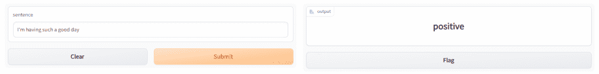*

*这就是用 Gradio 构建一个简单应用程序的全部内容！*

### *Gradio 块*

*对于更复杂的应用，Gradio 提供了一个更低级的 **[块](https://gradio.app/blocks_and_event_listeners/)** API，允许更精细的控制。我们将使用积木来构建音频智能仪表板，现在让我们熟悉一下吧。上面的应用程序是用下面的代码块重新创建的:*

```py
*`import gradio as gr

def analyze_sentiment(sentence):
    if "good" in sentence:
        return "positive"
    elif "bad" in sentence:
        return "negative"
    else:
        return "neutral"

with gr.Blocks() as app:
    sentence = gr.Textbox()
    sentiment = gr.Label()
    submit = gr.Button()

    submit.click(fn=analyze_sentiment,
                 inputs=sentence,
                 outputs=sentiment)

app.launch()`*
```

*所有的代码都是一样的，除了用`with gr.Blocks() as app:`块替换了`app = gr.Interface(...)`行。我们在这个块中定义的所有东西都是应用程序的一个组件。我们实例化:*

1.  *一个`[gr.Textbox()](https://gradio.app/docs/#textbox)`元素，为我们输入的句子创建一个文本区域来输入或显示一个字符串*
2.  *一个`[gr.Label()](https://gradio.app/docs/#label)`元素，为我们的输出情感分类创建一个显示分类标签的区域，以及*
3.  *一个`[gr.Button()](https://gradio.app/docs/#button)`元素，创建一个可点击的按钮，用于运行情感分析。*

*实例化后，组件彼此之间没有任何关系。为了增加功能，我们添加了`submit.click()`方法，它告诉应用程序**当点击`submit`按钮**时该做什么。在我们的例子中，我们想要运行函数`analyze_sentiment`，使用`sentence`文本框作为输入，使用`sentiment`标签作为输出。运行该脚本会产生以下应用程序:*

*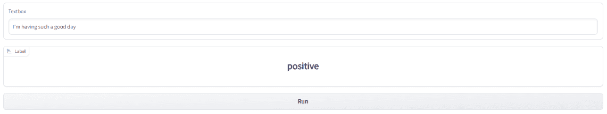*

*我们现在有了一个功能上等同于我们在上面的中使用的[方法的应用程序！](#gradio-overview)*

### *梯度块-更精细的控制*

*利用积木，我们可以变得更有创意。下面我们看到了上述块示例的修改版本。*

```py
*`import gradio as gr

def analyze_sentiment(sentence):
    if "good" in sentence:
        label = "positive"
    elif "bad" in sentence:
        label = "negative"
    else:
        label = "neutral"
    return gr.Label.update(value=label, visible=True)

with gr.Blocks() as app:
    with gr.Row():
        sentence = gr.Textbox(label='Input Sentence',
                              placeholder="Enter a sentence here ...")
        sentiment = gr.Label(visible=False)

    submit = gr.Button()

    submit.click(fn=analyze_sentiment,
                 inputs=sentence,
                 outputs=sentiment)

app.launch()`*
```

*让我们来看看每个修改和它做了什么。*

*首先，通过向`gr.Textbox()`构造函数添加关键字参数，我们可以向元素添加一个`label`，向文本框添加`placeholder`文本，通过向`gr.Label()`构造函数添加`visible=False`，我们可以使标签组件在默认情况下不可见。这是应用程序加载后的样子:*

*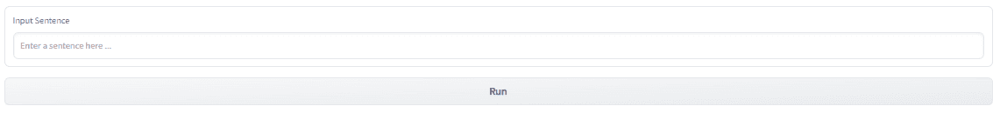*

*接下来，不是在`analyze_sentiment`中返回一个字符串，而是返回`gr.Label.update()`方法，这允许我们更新一个`gr.Label`的特定属性。在我们的例子中，我们像以前一样更新了`value`,但是也指定了`visible=True`,以使组件在运行情感分析之后可见。这是提交一句话进行分析后 app 的样子:*

*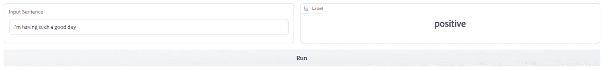*

*`with gr.Row():`块告诉应用程序将文本框和标签组件并排放置，而不是默认布局的垂直放置。*

*现在我们了解了 Gradio 模块的工作原理，我们终于可以自己动手构建音频智能仪表板了！首先，我们将从定义用户界面(UI)开始，然后我们将实现功能。*

## *使用 Gradio 构建仪表板 UI*

*首先，让我们看一下我们是如何仅使用 Python 定义仪表板(UI)的。回想一下，UI 由`[with gr.Blocks() as demo:](https://github.com/AssemblyAI-Examples/audio-intelligence-dashboard/blob/bd160b7601a99535d0e9b332ccb1b90042e70b3d/app/app.py#L247)` [块](https://github.com/AssemblyAI-Examples/audio-intelligence-dashboard/blob/bd160b7601a99535d0e9b332ccb1b90042e70b3d/app/app.py#L247)中定义的所有 Gradio 组件组成。如果您对 UI 定义不感兴趣，想直接实现功能，请转到[将功能添加到仪表板](#adding-functionality-to-the-dashboard)部分。*

*我们开始吧！*

### *介绍性 HTML 和 API 密钥*

*首先，我们使用一些`[gr.HTML()](https://gradio.app/docs/#html)`组件来构建仪表板上的介绍块，如下所示。`gr.HTML()`允许我们在仪表板上定义任意的 HTML 元素。虽然仪表盘上显示的 HTML 细节超出了本教程的范围，但相关代码可以在 GitHub [这里](https://github.com/AssemblyAI-Examples/audio-intelligence-dashboard/blob/f9f8dc20c880b2605190b1c9dde6b7492759716e/app/app.py#L247)找到，供感兴趣的读者参考。*

*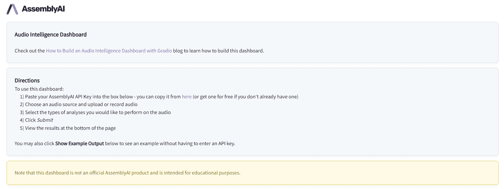*

*接下来，我们为 API 键创建输入字段，如下所示:*

*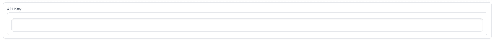*

*[我们创建一个](https://github.com/AssemblyAI-Examples/audio-intelligence-dashboard/blob/71866bdb5f1b68b7e407609fd0834fd57dca2114/app/app.py#L273) `[gr.Box()](https://github.com/AssemblyAI-Examples/audio-intelligence-dashboard/blob/71866bdb5f1b68b7e407609fd0834fd57dca2114/app/app.py#L273)`，框来包含它下面的块中定义的元素。`gr.Box()`的工作方式与`gr.Row()`相似，我们在[梯度块-精细控制](#gradio-blocksfiner-control)部分使用了它。在盒子里，我们放入(1)一个用作标签的`gr.HTML()`组件，和(2)一个将输入 API 密钥的`gr.Textbox()`:*

```py
*`import gradio as gr

with gr.Blocks(css=css) as demo:
    with gr.Box():
        gr.HTML("<p class=\"apikey\">API Key:</p>")
        # API key textbox (password-style)
        api_key = gr.Textbox(label="", elem_id="pw")`*
```

*通过在`api_key`构造函数中指定`elem_id=pw`，我们给这个组件一个 HTML ID，我们可以使用[用 CSS](https://github.com/AssemblyAI-Examples/audio-intelligence-dashboard/blob/71866bdb5f1b68b7e407609fd0834fd57dca2114/app/styles.css#L43) 对它进行样式化，如下所示:*

```py
*`#pw {
  -webkit-text-security: disc;
}`*
```

*这个 CSS 将输入到`api_key`中的字符编辑成 API 密匙的额外安全层*

*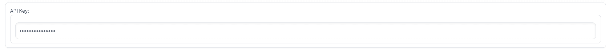*

*这种风格也是我们在`api_key`构造函数中指定`label=""`并用不同的 HTML 元素标记文本框的原因——否则标签*也会*被编辑。*

*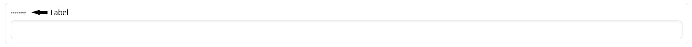*

*CSS 存储在`[app/styles.css](https://github.com/AssemblyAI-Examples/audio-intelligence-dashboard/blob/master/app/styles.css)`中，并通过传递给应用程序*

```py
*`with open('styles.css', 'r') as f:
    css = f.read()

with gr.Blocks(css=css) as demo:
	# ...`*
```

### *格拉迪欧州*

*接下来，我们定义几个`gr.State()`组件。这些组件是状态变量，并存储给定用户实例的*的值。在函数调用之外定义的任何 Python 变量都是在所有用户之间共享的**，而用`gr.State()`定义的变量只对定义它们的会话是可访问的**。更多信息请参见 [Gradio 快速入门](https://gradio.app/state_in_blocks/)。******

***我们添加了一个存储显示的音频图的状态和保存每个音频源(文件或麦克风)上传的数据的状态，以便在 UI 中的选项之间切换时显示给定源的适当数据。***

```py
***`with gr.Blocks(css=css) as demo:
	# ...

	# Gradio states for - plotly Figure object, audio data for file source, and audio data for mic source
    plot = gr.State(px.line(labels={'x':'Time (s)', 'y':''}))
    file_data = gr.State([1, [0]])  # [sample rate, [data]]
    mic_data = gr.State([1, [0]])  # [Sample rate, [data]]

    # Options that the user wants
    selected_tran_opts = gr.State(list(transcription_options_headers.keys()))
    selected_audint_opts = gr.State(list(audio_intelligence_headers.keys()))

    # Current options = selected options - unavailable options for specified language
    current_tran_opts = gr.State([])
    current_audint_opts = gr.State([])`***
```

***然后，我们定义存储用户*选择*的分析选项和*当前*分析选项的状态，这些分析选项是所选选项和不可用于所选语言(如果指定)的选项之间的差异。换句话说，如果用户正在转录一个法语音频文件，并希望对其运行 [PII 修订](https://www.assemblyai.com/docs/audio-intelligence#pii-redaction)，这对于法语不可用，那么这些状态将允许我们禁止对法语的这一选择，但如果所选语言被更改为例如美国英语，则自动启用它，对于美国英语，PII 修订*可用*。***

```py
***`with gr.Blocks(css=css) as demo:
	# ...

	# Gradio states for - plotly Figure object, audio data for file source, and audio data for mic source
    plot = gr.State(px.line(labels={'x':'Time (s)', 'y':''}))
    file_data = gr.State([1, [0]])  # [sample rate, [data]]
    mic_data = gr.State([1, [0]])  # [Sample rate, [data]]

    # Options that the user wants
    selected_tran_opts = gr.State(list(transcription_options_headers.keys()))
    selected_audint_opts = gr.State(list(audio_intelligence_headers.keys()))

    # Current options = selected options - unavailable options for specified language
    current_tran_opts = gr.State([])
    current_audint_opts = gr.State([])`***
```

***有关支持的语言以及每种语言可用的转录和音频智能选项的列表，请查看 [AssemblyAI 文档](https://www.assemblyai.com/docs#supported-languages)。***

### ***音频组件***

***接下来，我们定义用于上传音频的`[gr.Audio()](https://gradio.app/docs/#audio)`组件。***

***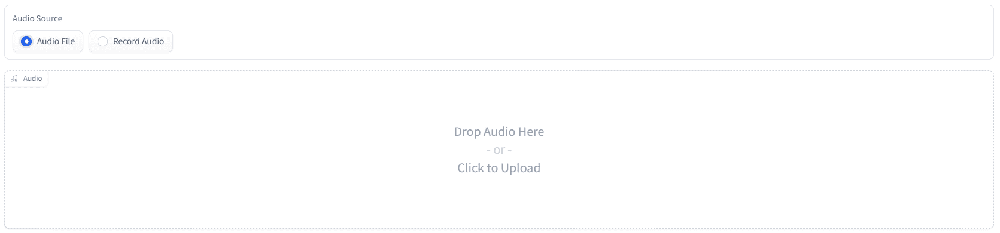***

***我们添加了一个 [`gr.Radio()`](https://gradio.app/docs/#radio) 组件，其中包含了可以/必须选择的选项。我们在列表中提供可能的值，然后添加标签和默认值。***

```py
***`with gr.Blocks(css=css) as demo:
    # ...

    # Selector for audio source
    radio = gr.Radio(["Audio File", "Record Audio"], label="Audio Source", value="Audio File")`***
```

***接下来，我们添加两个 [`gr.Audio()`](https://gradio.app/docs/#audio) 组件，用于上传/录制音频。我们添加了一个文件上传组件和一个音频录制组件。我们通过将`source="microphone"`添加到构造函数中来指定记录组件的源是麦克风，并且我们还使用`visible=False`指定组件在默认情况下不可见。稍后，我们将使用上面的单选组件来更改哪个组件可见。***

```py
***`with gr.Blocks(css=css) as demo:
    # ...

    # Audio object for both file and microphone data
    audio_file = gr.Audio()
    mic_recording = gr.Audio(source="microphone", visible=False)`***
```

***最后，我们添加一个图来显示上传/录制音频的波形。***

```py
***`with gr.Blocks(css=css) as demo:
    # ...

    # Audio wave plot
    audio_wave = gr.Plot(plot.value)`***
```

### ***转录和音频智能选项***

***接下来我们添加两个`gr.CheckboxGroup()`组件，它们提供了一组复选框，可以选择(取消选择)它们的任意组合。***

***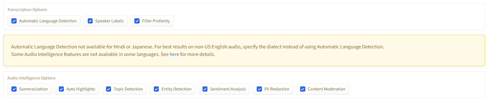***

***我们为转录选项添加了一个 CheckboxGroup，为音频智能选项添加了一个 checkbox group，中间有一个警告(为了简洁起见，已经替换为`"<WARNING>"`)。***

```py
***`with gr.Blocks(css=css) as demo:
	# ...

    # Checkbox for transcription options
    transcription_options = gr.CheckboxGroup(
        choices=list(transcription_options_headers.keys()),
        value=list(transcription_options_headers.keys()),
        label="Transcription Options",
    )

    # Warning for using Automatic Language detection
    w = "<WARNING>"
    auto_lang_detect_warning = gr.HTML(w)

    # Checkbox for Audio Intelligence options
    audio_intelligence_selector = gr.CheckboxGroup(
        choices=list(audio_intelligence_headers.keys()),
        value=list(audio_intelligence_headers.keys()),
        label='Audio Intelligence Options'
    )`***
```

***在每种情况下，我们将可能的`choices`指定为从`helpers.py`导入的[相关字典](https://github.com/AssemblyAI-Examples/audio-intelligence-dashboard/blob/708f4493a4d31710844d7e1b827b313afab620fa/app/helpers.py#L18)的键，并且我们将`value`列为相同的，以默认选择所有选项。***

### ***提交和示例按钮***

***接下来我们添加**提交**和**显示示例输出**按钮。***

******

***每个按钮都是一个`[gr.Button()](https://gradio.app/docs/#button)`组件，传递给构造函数的文本显示在 UI 中的按钮上。***

```py
***`with gr.Blocks(css=css) as demo:
    # ...

    # Button to submit audio for processing with selected options
    submit = gr.Button('Submit')

    # Button to submit audio for processing with selected options
    example = gr.Button('Show Example Output')`***
```

### ***结果选项卡***

***最后，我们添加用于显示结果的选项卡。***

***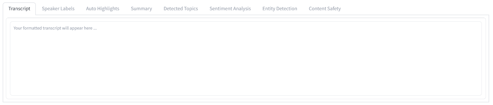***

***每个选项卡都是用`with gr.Tab():`创建的，其中块中定义的任何东西都成为选项卡的子选项卡。在我们的例子中，我们指定了几种不同类型的组件，主要依赖于`gr.HTML()`为我们提供显示结果的灵活性。我们还没有看到的唯一使用的组件是 [`gr.HighlightedText()`](https://gradio.app/docs/#highlightedtext) 组件，它类似于`gr.Textbox()`，除了它提供了突出显示文本部分的选项。默认情况下，我们使用`phl`变量使每个标签具有相似的高度。***

```py
***`with gr.Blocks(css=css) as demo:
    # ...

    # Results tab group
    phl = 10
    with gr.Tab('Transcript'):
        trans_tab = gr.Textbox(placeholder="Your formatted transcript will appear here ...",
                               lines=phl,
                               max_lines=25,
                               show_label=False)
    with gr.Tab('Speaker Labels'):
        diarization_tab = gr.Textbox(placeholder="Your diarized transcript will appear here ...",
                                     lines=phl,
                                     max_lines=25,
                                     show_label=False)
    with gr.Tab('Auto Highlights'):
        highlights_tab = gr.HighlightedText()
    with gr.Tab('Summary'):
        summary_tab = gr.HTML("<br>"*phl)
    with gr.Tab("Detected Topics"):
        topics_tab = gr.HTML("<br>"*phl)
    with gr.Tab("Sentiment Analysis"):
        sentiment_tab = gr.HTML("<br>"*phl)
    with gr.Tab("Entity Detection"):
        entity_tab = gr.HTML("<br>"*phl)
    with gr.Tab("Content Safety"):
        content_tab = gr.Plot()`***
```

***这就是用 Gradio 构建 UI 的全部内容！现在我们已经完成了 UI 的制作，让我们看看如何添加功能，使它成为一个成熟的音频智能仪表板。***

## ***向仪表板添加功能***

***让我们来看看如何向我们在上一节中定义的 UI 添加功能。所有功能都在主`with gr.Blocks(css=css) as demo:`模块下类似地定义，如上文 [Gradio 模块](#gradio-blocks)部分所示，这是使用 Gradio 模块样式时的要求。***

### ***音频源选择***

***首先，我们将实现音频源选择器(即`radio`)改变时的适当功能。该功能通过`change_audio_source()`功能实现，该功能根据`radio`源选择，用存储在会话状态中的适当数据更新绘图。该功能的输入、输出和概述如下图所示。***

***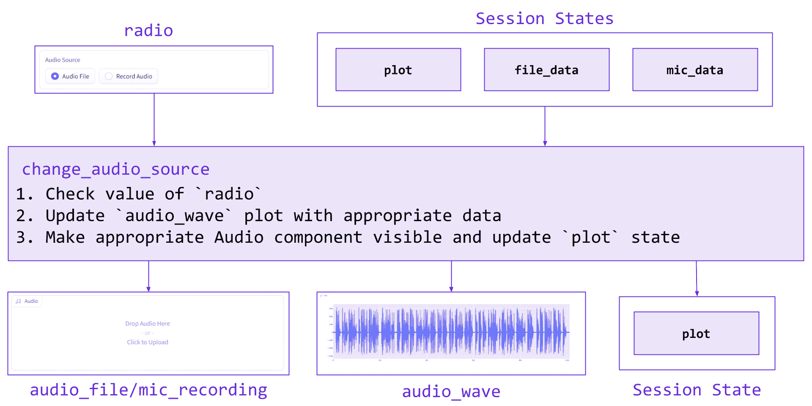***

***相应的代码如下所示:***

```py
***`def change_audio_source(radio, plot, file_data, mic_data):
    # Empty plot
    plot.update_traces(go.Line(y=[]))

    # Update plot with appropriate data and change visibility of audio components
    if radio == "Audio File":
        sample_rate, audio_data = file_data
        plot.update_traces(go.Line(y=audio_data, x=np.arange(len(audio_data)) / sample_rate))
        return [gr.Audio.update(visible=True), gr.Audio.update(visible=False),
                gr.Plot.update(plot), plot]

    elif radio == "Record Audio":
        sample_rate, audio_data = mic_data
        plot.update_traces(go.Line(y=audio_data, x=np.arange(len(audio_data)) / sample_rate))
        return [gr.Audio.update(visible=False), gr.Audio.update(visible=True),
                gr.Plot.update(plot), plot]

with gr.Blocks(css=css) as demo:
    # ...

    radio.change(fn=change_audio_source,
                 inputs=[radio, plot, file_data, mic_data],
                 outputs=[audio_file, mic_recording, audio_wave, plot])`***
```

### ***音频文件上传***

***接下来，我们使用`plot_data()`函数实现绘制和保存上传的音频数据的功能。如果当前音频已被删除，我们清空绘图并将占位符数据写入`file_data`状态。否则，新的音频已经上传，我们绘制它并将数据保存到`file_data`。该功能的输入、输出和概述如下图所示。***

***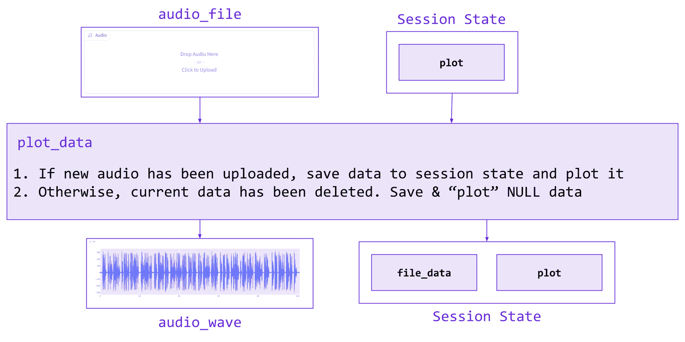***

***类似的设置用于添加麦克风录音的等效功能，而不是上传的文件。相应的代码如下所示:***

```py
***`def plot_data(audio_data, plot):

    if audio_data is None:
        sample_rate, audio_data = [0, np.array([])]
        plot.update_traces(go.Line(y=[]))

    else:
        sample_rate, audio_data = audio_data
        plot.update_traces(go.Line(y=audio_data, x=np.arange(len(audio_data))/sample_rate))

    return [gr.Plot.update(plot), [sample_rate, audio_data], plot]

with gr.Blocks(css=css) as demo:
    # ...

    audio_file.change(fn=plot_data,
                      inputs=[audio_file, plot],
                      outputs=[audio_wave, file_data, plot]
                      )
    mic_recording.change(fn=plot_data,
                         inputs=[mic_recording, plot],
                         outputs=[audio_wave, mic_data, plot])`***
```

### ***语言可见性***

***接下来，当`transcription_options`改变时，我们使用`set_lang_vis`函数实现适当的功能。每当`transcription_options`复选框组改变时，如果没有选择*自动语言检测*，则`language`下拉菜单可见，如果选择了，则不可见。另外，警告相应地变得可见/不可见。该功能的输入、输出和概述如下图所示。***

***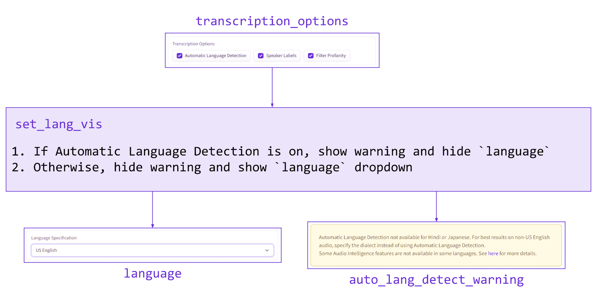***

***相应的代码如下所示，其中`w`是一个全局变量:***

```py
***`def set_lang_vis(transcription_options):
    if 'Automatic Language Detection' in transcription_options:
        text = w
        return [gr.Dropdown.update(visible=False),
                gr.Textbox.update(value=text, visible=True)]
    else:
        text = ""
        return [gr.Dropdown.update(visible=True),
                gr.Textbox.update(value=text, visible=False)]

with gr.Blocks(css=css) as demo:
	# ...

    transcription_options.change(
        fn=set_lang_vis,
        inputs=transcription_options,
        outputs=[language, auto_lang_detect_warning])`***
```

### ***选项验证***

***接下来，我们使用`option_verif`函数来实现当所选语言改变时的适当功能。当选择一种语言时，任何当前选择的不可用于该语言的转录/音频智能选项将被自动移除。此外，任何先前选择的选项，如果在先前的语言中*没有*可用，但在新选择的语言中*有*可用，则会被添加回来。该功能的输入、输出和概述如下图所示。***

***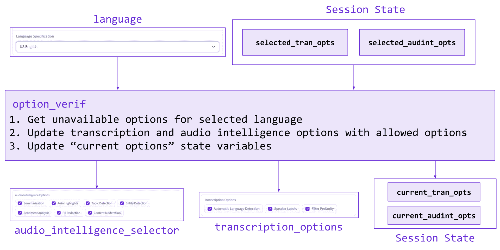***

***相应的代码如下所示:***

```py
***`def option_verif(language, selected_tran_opts, selected_audint_opts):
	# Get unavailable options for the language
    not_available_tran, not_available_audint = get_unavailable_opts(language)

    # Set difference
    current_tran_opts = list(set(selected_tran_opts) - set(not_available_tran))
    current_audint_opts = list(set(selected_audint_opts) - set(not_available_audint))

    # Update CheckboxGroups and States
    return [gr.CheckboxGroup.update(current_tran_opts),
            gr.CheckboxGroup.update(current_audint_opts),
            current_tran_opts,
            current_audint_opts]

with gr.Blocks(css=css) as demo:
	# ...

	language.change(
        fn=option_verif,
        inputs=[language, selected_tran_opts, selected_audint_opts],
        outputs=[transcription_options, audio_intelligence_selector, current_tran_opts, current_audint_opts]
    )`***
```

### ***选项选择***

***接下来，我们实现了一个过滤器，用于当`transcription_options` CheckboxGroup 改变时，即当一个选项被选择或取消选择时。在我们的例子中，某些转录选项在某些语言中是不允许的，所以我们需要使用`tran_selected`来实现一个过滤器来解决这个问题。***

***传递语言和转录选项，然后确定给定语言的不可用选项。计算转录选项和不可用选项之间的[设置差异](https://mathworld.wolfram.com/SetDifference.html)，该差异成为`transcription_options`复选框组和`selected_tran_opts`状态的值。该功能的输入、输出和概述如下图所示。***

***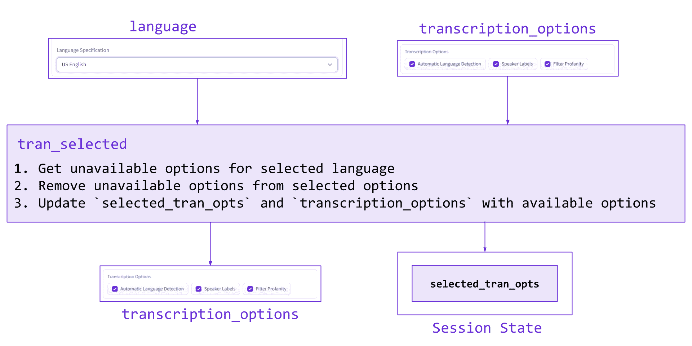***

***相应的代码如下所示:***

```py
***`def tran_selected(language, transcription_options):
    unavailable, _ = get_unavailable_opts(language)
    selected_tran_opts = list(set(transcription_options) - set(unavailable))

    return [gr.CheckboxGroup.update(selected_tran_opts), selected_tran_opts]

with gr.Blocks(css=css) as demo:
	# ...

	# Selecting Tran options adds it to selected if language allows it
    transcription_options.change(
        fn=tran_selected,
        inputs=[language, transcription_options],
        outputs=[transcription_options, selected_tran_opts]
    )`***
```

***注意，在[语言可见性](#language-visibility)部分，我们已经使用了`transcription_options.change()`。使用 Gradio，可以为同一个事件实现多个事件监听器。***

***我们实现了音频智能复选框组的等效功能:***

```py
***`def audint_selected(language, audio_intelligence_selector):
    _, unavailable = get_unavailable_opts(language)
    selected_audint_opts = list(set(audio_intelligence_selector) - set(unavailable))

    return [gr.CheckboxGroup.update(selected_audint_opts), selected_audint_opts]

with gr.Blocks(css=css) as demo:
	# ...

    # Selecting audio intelligence options adds it to selected if language allows it
    audio_intelligence_selector.change(
        fn=audint_selected,
        inputs=[language, audio_intelligence_selector],
        outputs=[audio_intelligence_selector, selected_audint_opts]
    )`***
```

### ***提交和示例输出***

***最后，我们实现了**提交**和**显示示例输出**按钮的功能。***

```py
***`with gr.Blocks(css=css) as demo:
	# ...

	submit.click(fn=submit_to_AAI,
                 inputs=[api_key,
                         transcription_options,
                         audio_intelligence_selector,
                         language,
                         radio,
                         audio_file,
                         mic_recording],
                 outputs=[language,
                          trans_tab,
                          diarization_tab,
                          highlights_tab,
                          summary_tab,
                          topics_tab,
                          sentiment_tab,
                          entity_tab,
                          content_tab])`***
```

***让我们依次看看`submit_to_AAI`的各个部分。下面的许多步骤在 [AssemblyAI 和 Python 5 分钟内完成](https://www.assemblyai.com/blog/assemblyai-and-python-in-5-minutes/)的文章中有更详细的解释，因此感兴趣的读者可以查看该文章以获得更多信息。***

***首先，我们创建一个存储用户 API 密钥的 HTTP 头。这个头将在所有 API 请求中使用，并让 AssemblyAI API 知道用户被授权请求转录和访问结果。`[make_header()](https://github.com/AssemblyAI-Examples/audio-intelligence-dashboard/blob/210a74351dc68c7390ac4e4c47f9577bec89220c/app/helpers.py#L52)`功能可以在`helpers.py`中找到。***

```py
***`def submit_to_AAI(api_key,
                  transcription_options,
                  audio_intelligence_selector,
                  language,
                  radio,
                  audio_file,
                  mic_recording):

    # Make request header
    header = make_header(api_key)`***
```

***接下来，我们创建请求中使用的 JSON。`[make_true_dict()](https://github.com/AssemblyAI-Examples/audio-intelligence-dashboard/blob/210a74351dc68c7390ac4e4c47f9577bec89220c/app/helpers.py#L145)`功能将从仪表板中选择的选项映射到 AssemblyAI API 的[相应键](https://github.com/AssemblyAI-Examples/audio-intelligence-dashboard/blob/210a74351dc68c7390ac4e4c47f9577bec89220c/app/helpers.py#L18)上。接下来，我们使用`[make_final_json](https://github.com/AssemblyAI-Examples/audio-intelligence-dashboard/blob/210a74351dc68c7390ac4e4c47f9577bec89220c/app/helpers.py#L158)`函数将任何剩余的必需数据添加到 JSON 中。例如，`redact_pii`需要一个规范，说明要编辑哪种类型的 PII，这个函数添加了值为`['drug', 'injury', 'person_name', 'money_amount']`的`redact_pii_policies`键。***

```py
***`def submit_to_AAI(api_key,
                  transcription_options,
                  audio_intelligence_selector,
                  language,
                  radio,
                  audio_file,
                  mic_recording):

    # ...

    # Map transcription/audio intelligence options to AssemblyAI API request JSON dict
    true_dict = make_true_dict(transcription_options, audio_intelligence_selector)

    final_json, language = make_final_json(true_dict, language)
    final_json = {**true_dict, **final_json}`***
```

***接下来，我们[上传](https://github.com/AssemblyAI-Examples/audio-intelligence-dashboard/blob/210a74351dc68c7390ac4e4c47f9577bec89220c/app/helpers.py#L85)在提交时选择的任何来源的状态下存储的音频，然后我们[根据我们在仪表板上做出的选择(现在编码在`final_json`中)请求转录](https://github.com/AssemblyAI-Examples/audio-intelligence-dashboard/blob/210a74351dc68c7390ac4e4c47f9577bec89220c/app/helpers.py#L98)和音频智能分析。***

```py
***`def submit_to_AAI(api_key,
                  transcription_options,
                  audio_intelligence_selector,
                  language,
                  radio,
                  audio_file,
                  mic_recording):

    # ...

    # Select which audio to use
    if radio == "Audio File":
        audio_data = audio_file
    elif radio == "Record Audio":
        audio_data = mic_recording

    # Upload the audio
    upload_url = upload_file(audio_data, header, is_file=False)

    # Request transcript
    transcript_response = request_transcript(upload_url, header, **final_json)`***
```

***然后，我们创建一个[轮询](https://en.wikipedia.org/wiki/Polling_(computer_science))端点，这将允许我们用`[wait_for_completion()](https://github.com/AssemblyAI-Examples/audio-intelligence-dashboard/blob/210a74351dc68c7390ac4e4c47f9577bec89220c/app/helpers.py#L131)`函数告知转录何时完成。转录完成后，我们使用一个 [GET](https://developer.mozilla.org/en-US/docs/Web/HTTP/Methods/GET) 请求来获取结果。***

```py
***`def submit_to_AAI(api_key,
                  transcription_options,
                  audio_intelligence_selector,
                  language,
                  radio,
                  audio_file,
                  mic_recording):

    # ...

    # Wait for the transcription to complete
    polling_endpoint = make_polling_endpoint(transcript_response)
    wait_for_completion(polling_endpoint, header)

    # Fetch results JSON
    r = requests.get(polling_endpoint, headers=header, json=final_json).json()`***
```

***最后，我们通过`[create_output()](https://github.com/AssemblyAI-Examples/audio-intelligence-dashboard/blob/210a74351dc68c7390ac4e4c47f9577bec89220c/app/app.py#L129)`函数传递结果响应(和来自`[make_paras_string()](https://github.com/AssemblyAI-Examples/audio-intelligence-dashboard/blob/210a74351dc68c7390ac4e4c47f9577bec89220c/app/helpers.py#L298)`的结果),这为在仪表板中显示做好了准备。`create_output()`的详细情况在下面的[里查看。](#create-output)***

```py
***`def submit_to_AAI(api_key,
                  transcription_options,
                  audio_intelligence_selector,
                  language,
                  radio,
                  audio_file,
                  mic_recording):

    # ...

    # Fetch paragraphs of transcript
    transc_id = r['id']
    paras = make_paras_string(transc_id, header)
    return create_output(r, paras, language, transcription_options, audio_intelligence_selector)`***
```

*****Show Example Output** 按钮加载一个存储的 AssemblyAI API 响应，并将其传递给`create_output()`。***

```py
***`def example_output(language):
    """Displays example output"""
    with open("../example_data/paras.txt", 'r') as f:
        paras = f.read()

    with open('../example_data/response.json', 'r') as f:
        r = json.load(f)

    return create_output(r, paras, language)

with gr.Blocks(css=css) as demo:
	# ...

	example.click(fn=example_output,
                  inputs=language,
                  outputs=[language,
                           trans_tab,
                           diarization_tab,
                           highlights_tab,
                           summary_tab,
                           topics_tab,
                           sentiment_tab,
                           entity_tab,
                           content_tab])`***
```

### ***创建输出***

***如上所述，**提交**和**显示示例输出**按钮将来自 AssemblyAI API 的响应传递给`create_output()`函数，该函数处理响应中的信息，以显示在 Gradio 仪表板中。该功能实际上是一系列不同的组件，每个组件都为仪表板中的一个选项卡对象准备输出。***

***在下面的小节中，我们将检查每一个组件，检查代码本身或一个概念性的概述，这取决于哪一个对给定的组件更有指导意义。所有输出的示例可以在上面的[检查结果](#examining-the-results)部分找到。***

#### ***副本***

***原始抄本在`[helpers.py](https://github.com/AssemblyAI-Examples/audio-intelligence-dashboard/blob/master/app/helpers.py)`中用`[make_paras_string()](https://github.com/AssemblyAI-Examples/audio-intelligence-dashboard/blob/210a74351dc68c7390ac4e4c47f9577bec89220c/app/helpers.py#L298)`创建。该函数首先向 AssemblyAI API 的`/paragraphs`端点发出一个请求，以获取段落对象的列表，然后来自这些对象的文本被分离出来，并用换行符连接起来。***

```py
***`def make_paras_string(transc_id, header):
    endpoint = transcript_endpoint + "/" + transc_id + "/paragraphs"
    paras = requests.get(endpoint, headers=header).json()['paragraphs']
    paras = '\n\n'.join(i['text'] for i in paras)
    return paras`***
```

***您可以在上面的[脚本](#transcript)部分查看示例输出。***

#### ***扬声器标签***

***来自 AssemblyAI API 的`v2/transcript`端点的原始响应的 JSON 包含`utterances`键，它的值是整个音频中的一系列话语，如下所示:***

```py
***`"utterances": [
    {
      "confidence": 0.9550143322475569,
      "end": 99430,
      "speaker": "A",
      "start": 1150,
      "text": "You will never believe what happened to me last week. My SUV broke ... to get it replaced. What are you doing this weekend?",
      "words": [...]         
    }
  ],`***
```

***我们使用列表理解将说话者标签添加到每个话语的文本中，然后将列表元素连接在一起，中间使用换行符，如上所述。***

```py
***`utts = '\n\n\n'.join([f"Speaker {utt['speaker']}:\n\n" + utt['text'] for utt in r['utterances']])`***
```

***这个计算[发生在](https://github.com/AssemblyAI-Examples/audio-intelligence-dashboard/blob/210a74351dc68c7390ac4e4c47f9577bec89220c/app/app.py#L140)`[create_output()](https://github.com/AssemblyAI-Examples/audio-intelligence-dashboard/blob/210a74351dc68c7390ac4e4c47f9577bec89220c/app/app.py#L129)`函数本身的中，因此不依赖于来自`helpers.py`的任何函数。扬声器标签输出示例可在上面的[扬声器标签](#speaker-labels)部分找到。***

#### ***自动突出显示***

***AssemblyAI 响应中的 auto highlights 信息具有以下形式，其中`results`是一个字典列表，每个字典都包含关于给定突出显示的信息***

```py
***`"auto_highlights_result": {
    "status": "success",
    "results": [
      {
        "count": 1,
        "rank": 0.09,
        "text": "good professors",
        "timestamps": [
          {
            "start": 58964,
            "end": 60030
          }
        ]
      },
      {"count": 1...},
      {"count": 1...},
      ...
      {"count": 1...},
    ]
  },`*** 
```

***为了处理这些信息以显示在仪表板上，我们使用了`[helpers.py](https://github.com/AssemblyAI-Examples/audio-intelligence-dashboard/blob/210a74351dc68c7390ac4e4c47f9577bec89220c/app/helpers.py)`中的`[create_highlighted_list()](https://github.com/AssemblyAI-Examples/audio-intelligence-dashboard/blob/210a74351dc68c7390ac4e4c47f9577bec89220c/app/helpers.py#L307)`函数。首先，可能会过滤掉低等级的高光对象，然后计算值，这将允许我们稍后根据等级缩放高光不透明度***

```py
***`def create_highlighted_list(paragraphs_string, highlights_result, rank=0):
    # Max and min opacities to highlight to
    MAX_HIGHLIGHT = 1  # Max allowed = 1
    MIN_HIGHLIGHT = 0.25  # Min allowed = 0

    # Filter list for everything above the input rank
    highlights_result = [i for i in highlights_result if i['rank'] >= rank]

    # Get max/min ranks and find scale/shift we'll need so ranks are mapped to [MIN_HIGHLIGHT, MAX_HIGHLIGHT]
    max_rank = max([i['rank'] for i in highlights_result])
    min_rank = min([i['rank'] for i in highlights_result])
    scale = (MAX_HIGHLIGHT - MIN_HIGHLIGHT) / (max_rank - min_rank)
    shift = (MAX_HIGHLIGHT - max_rank * scale)`***
```

***接下来，使用 RegEx 查找每个高亮对象短语的每个实例，然后使用 list comprehension 创建一个列表，该列表使用适当的格式准备要输入到`[gr.HighlightedText()](https://gradio.app/docs/#highlightedtext)`中的数据。***

***在这种情况下，`"entity"`值是一个在[0，1]范围内的浮点数，对应于实体的高亮不透明度。我们使用一个比例变换来使每个实体的值在`MIN_HIGHLIGHT`和`MAX_HIGHLIGHT`之间，与它的等级成比例。`"start"`和`"end"`值表示整个文本正文中高亮文本的开始和结束字符，在本例中为`paragraphs_string`。***

```py
***`def create_highlighted_list(paragraphs_string, highlights_result, rank=0):
    # ...

    # Isolate only highlight text and rank
    highlights_result = [(i['text'], i['rank']) for i in highlights_result]

    entities = []
    for highlight, rank in highlights_result:
        # For each highlight, find all starting character instances
        starts = [c.start() for c in re.finditer(highlight, paragraphs_string)]
        # Create list of locations for this highlight with entity value (highlight opacity) scaled properly
        e = [{"entity": rank * scale + shift,
              "start": start,
              "end": start + len(highlight)}
             for start in starts]
        entities += e`***
```

***最后，创建输出字典，为`gr.HighlightedText`提供必要的输入结构。我们通过开始字符值对`entities`进行排序，以避免 Gradio 3.2 中的错误，如果不这样做，就会错误地显示文本，然后返回输出字典。***

```py
***`def create_highlighted_list(paragraphs_string, highlights_result, rank=0):
    # ...

    # Create dictionary
    highlight_dict = {"text": paragraphs_string, "entities": entities}

    # Sort entities by start char. A bug in Gradio requires this
    highlight_dict['entities'] = sorted(highlight_dict['entities'], key=lambda x: x['start'])

    return highlight_dict`***
```

***在[自动高亮显示](#auto-highlights)部分可以找到一个自动高亮显示输出的例子。***

#### ***摘要***

***AssemblyAI response JSON 中的摘要信息具有简单的形式——对于每个自动检测到的“章节”,都会返回一个摘要、标题和要点。`summary`是本章的完整摘要，`headline`进一步提炼信息，得到一个更短的摘要，`gist`用几个词提供了最短的摘要。***

```py
***`"chapters": [
    {
      "summary": "After his SUV broke down, he had to go to an auto shop to get a new gasket installed. Yesterday ... the program. He's also going to play basketball for his new team while earning his degree.",
      "headline": "Yesterday he was walking in South Boston to pick the car up, and some guy got thrown through the window of a pub.",
      "gist": "What's up jack.",
      "start": 1150,
      "end": 99430
    }
  ],`***
```

***为了为我们的仪表板正确地格式化这些信息，我们在`[helpers.py](https://github.com/AssemblyAI-Examples/audio-intelligence-dashboard/blob/210a74351dc68c7390ac4e4c47f9577bec89220c/app/helpers.py)`中使用了`[make_summary()](https://github.com/AssemblyAI-Examples/audio-intelligence-dashboard/blob/210a74351dc68c7390ac4e4c47f9577bec89220c/app/helpers.py#L347)`函数，它仅仅使用了一个 HTML `details`标签来显示加粗的`headline`，点击`headline`文本就会出现`summary`。***

***在[总结](#summary)部分可以找到一个总结输出的例子。***

#### ***检测到的主题***

***AssemblyAI 响应 JSON 中的主题检测信息具有以下形式，为了简洁起见，我们只选择了检测到的主题的子集。例如，行`Sports>CollegeSports>CollegeBasketball`暗示检测到主题`CollegeBasketball`，该主题被分类在`CollegeSports`下，该主题又被分类在`Sports`下。***

```py
***`"iab_categories_result": {
  "status": "success",
  "results: [...]
  "summary": {
      "Sports>CollegeSports>CollegeBasketball": 0.9752611517906189,
      "Sports>Basketball": 0.9687691926956177,
      "Automotive>AutoSafety": 0.7185451984405518,
      "Education>CollegeEducation>PostgraduateEducation": 0.14552389085292816,
      "Automotive>AutoTechnology>AutoSafetyTechnologies": 0.11995891481637955,
      "Automotive>AutoRecalls": 0.11385084688663483,
      "Education>CollegeEducation>UndergraduateEducation": 0.11231876164674759,
      "Sports>CollegeSports": 0.08391721546649933,
      "Sports>Boxing": 0.06388098001480103,
      "Automotive>AutoType>DriverlessCars": 0.02020467445254326,
    }
  },`***
```

***为了将这些信息格式化输出到仪表板，我们使用了`[helpers.py](https://github.com/AssemblyAI-Examples/audio-intelligence-dashboard/blob/210a74351dc68c7390ac4e4c47f9577bec89220c/app/helpers.py)`中的`[make_html_from_topics()](https://github.com/AssemblyAI-Examples/audio-intelligence-dashboard/blob/210a74351dc68c7390ac4e4c47f9577bec89220c/app/helpers.py#L278)`函数。这个函数相当复杂，所以我们将看一个概念性的概述，而不是直接看代码，尽管我们鼓励感兴趣的读者点击上面的函数名来查看 GitHub 上的源代码。***

***`make_html_from_topics()`首先只隔离`summary`字典中的关键字，潜在地过滤掉具有低值的关键字(对应于关键字所标识的主题与文本的相关性)。这给[留下了一个列表](https://github.com/AssemblyAI-Examples/audio-intelligence-dashboard/blob/master/example_data/topic_list_example.txt)，如下所示:***

```py
***`['Sports>CollegeSports>CollegeBasketball',
 'Sports>Basketball',
 'Automotive>AutoSafety',
 'Education>CollegeEducation>PostgraduateEducation',
 'Automotive>AutoTechnology>AutoSafetyTechnologies',
 'Automotive>AutoRecalls',
 'Education>CollegeEducation>UndergraduateEducation',
 'Sports>CollegeSports',
 'Sports>Boxing',
 'Automotive>AutoType>DriverlessCars',]`***
```

***然后这个列表通过一个函数传递，这个函数递归地把它变成一个[字典](https://github.com/AssemblyAI-Examples/audio-intelligence-dashboard/blob/master/example_data/topic_dict_example.txt)，它表示一棵树，如下所示。上面列表中出现的每个主题都是一个节点，上面列表中出现的任何子主题都是它的子节点。每个节点还可能有一个空的子节点(在图中用圆圈中的 N 表示，在字典中用空的键-值对表示)，这**表示一个特定的主题是一个已识别的主题**。这是重要的，因为例如`CollegeSports`本身被识别为除了 `CollegeBasketball`之外的检测到的主题*，而*`CollegeBasketball`是它的孩子。***

***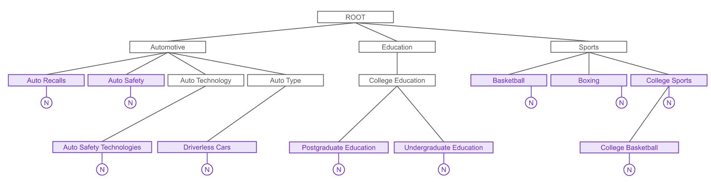***

***`make_html_from_topics()`的其余部分遍历树，将其转换为 HTML，其中每个主题及其子主题递归地列出，给树的每个“层”一个不同的类- `topic-L0`、`topic-L1`等等。所有紫色节点(即确定出现在音频中的主题)也是另一个类`istopic`的一部分，用于为仪表板中的相关文本着色。***

***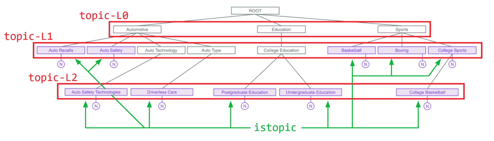***

***下面的 CSS 提供了每个元素的样式。***

```py
***`.istopic {
color: #6b2bd6;
}

.topic-L0 {
font-size: 30px;
text-indent: 0px;
}

.topic-L1 {
font-size: 25px;
text-indent: 18px;
}

.topic-L2 {
font-size: 20px;
text-indent: 36px;
}

.topic-L3 {
font-size: 15px;
text-indent: 54px;
}`***
```

***CSS 被[传递到仪表板](https://github.com/AssemblyAI-Examples/audio-intelligence-dashboard/blob/210a74351dc68c7390ac4e4c47f9577bec89220c/app/app.py#L245)中***

```py
***`with open('styles.css', 'r') as f:
    css = f.read()

with gr.Blocks(css=css) as demo:
	# ...`***
```

***主题检测输出示例可在[检测到的主题](#detected-topics)部分找到。***

#### ***情感分析***

***AssemblyAI response JSON 中的情感分析信息具有以下形式，其中每个句子被规定为一个`"POSITIVE"`、`"NEGATIVE"`或`"NEUTRAL"`情感。***

```py
 ***`"sentiment_analysis_results": [
    {
      "text": "You will never believe what happened to me last week.",
      "start": 1150,
      "end": 4674,
      "sentiment": "NEGATIVE",
      "confidence": 0.5470982193946838,
      "speaker": "A"
    },
    "...",
    {
      "text": "What are you doing this weekend?",
      "start": 98050,
      "end": 99430,
      "sentiment": "NEUTRAL",
      "confidence": 0.8970483541488647,
      "speaker": "A"
    }
  ]`***
```

***为了处理这些数据以显示在我们的仪表板上，我们使用了`[helpers.py](https://github.com/AssemblyAI-Examples/audio-intelligence-dashboard/blob/210a74351dc68c7390ac4e4c47f9577bec89220c/app/helpers.py)`中的`[make_sentiment_output()](https://github.com/AssemblyAI-Examples/audio-intelligence-dashboard/blob/210a74351dc68c7390ac4e4c47f9577bec89220c/app/helpers.py#L365)`函数。这个函数简单地遍历上述内容，根据与`sentiment key`相关的值，使用 HTML `<mark>`标记突出显示绿色或红色文本(或者根本不显示)。***

```py
***`def make_sentiment_output(sentiment_analysis_results):
    p = '<p>'
    for sentiment in sentiment_analysis_results:
        if sentiment['sentiment'] == 'POSITIVE':
            p += f'<mark style="{green + to_hex(sentiment["confidence"])}">' + sentiment['text'] + '</mark> '
        elif sentiment['sentiment'] == "NEGATIVE":
            p += f'<mark style="{red + to_hex(sentiment["confidence"])}">' + sentiment['text'] + '</mark> '
        else:
            p += sentiment['text'] + ' '
    p += "</p>"
    return p`***
```

***在[情感分析](#sentiment_analysis)部分可以找到一个示例情感分析输出。***

#### ***实体检测***

***AssemblyAI 响应 JSON 中的实体检测信息具有以下形式，其中检测到的实体通过`text`被标识为类`entity_type`的实体。***

```py
***`"entities": [
    {
      "entity_type": "location",
      "text": "South Boston",
      "start": 12884,
      "end": 13678
    },
    "...",
    {
      "entity_type": "medical_process",
      "text": "physical therapy",
      "start": 80504,
      "end": 81274
    }
  ]`***
```

***为了处理这些数据以显示在我们的仪表板上，我们使用了`[helpers.py](https://github.com/AssemblyAI-Examples/audio-intelligence-dashboard/blob/210a74351dc68c7390ac4e4c47f9577bec89220c/app/helpers.py)`中的`[make_entity_html()](https://github.com/AssemblyAI-Examples/audio-intelligence-dashboard/blob/210a74351dc68c7390ac4e4c47f9577bec89220c/app/helpers.py#L380)`函数。它简单地遍历上面的列表，创建一个字典，其中每个键是一个标识的`entity_type`，其值是该实体类型的每个检测到的实体(例如`"South Boston"`)的列表，以及上下文转录中的周围单词。如果已识别的实体通过 PII 修订版进行了修订，则文本将替换为`"[REDACTED]"`。***

```py
***`def make_entity_dict(entities, t, offset=40):
    len_text = len(t)

    d = {}
    for entity in entities:
        s = t.find(entity['text'])
        if s == -1:
            p = None
        else:
            len_entity = len(entity['text'])
            p = t[max(0, s - offset):min(s + len_entity + offset, len_text)]
            p = '... ' + ' '.join(p.split(' ')[1:-1]) + ' ...'
        label = ' '.join(entity['entity_type'].split('_')).title()
        if label in d:
            d[label] += [[p, entity['text']]]
        else:
            d[label] = [[p, entity['text']]]

    return d`***
```

***然后，使用`helpers.py`中的`[make_entity_html()](https://github.com/AssemblyAI-Examples/audio-intelligence-dashboard/blob/210a74351dc68c7390ac4e4c47f9577bec89220c/app/helpers.py#L408)`函数，将这个字典转换成 HTML，类似于上面检测到的主题。该函数在 HTML 列表的最高层以紫色显示每个实体类型，每个实体类型实例在子列表中显示在其下方，被识别的实体以黄色突出显示。***

```py
***`def make_entity_html(d, highlight_color="#FFFF0080"):
    """Input is output of `make_entity_dict`. Creates HTML for Entity Detection info"""
    h = "<ul>"
    for i in d:
        h += f"""<li style="color: #6b2bd6; font-size: 20px;">{i}"""
        h += "<ul>"
        for sent, ent in d[i]:
            if sent is None:
                h += f"""<li style="color: black; font-size: 16px;">[REDACTED]</li>"""
            else:
                h += f"""<li style="color: black; font-size: 16px;">{sent.replace(ent, f'<mark style="background-color: {highlight_color}">{ent}</mark>')}</li>"""
        h += '</ul>'
        h += '</li>'
    h += "</ul>"
    return h`*** 
```

***实体检测输出示例可在[实体检测](#entity-detection)部分找到。***

#### ***内容安全***

***AssemblyAI response JSON 中的内容安全信息具有相对复杂的结构，因此我们将下面的`"summary"`信息分离出来:***

```py
***`"content_safety_labels": {
    "...",
    "summary": {
      "accidents": 0.2611353717731301,
      "alcohol": 0.46347422408861444,
      "crime_violence": 0.27030136438470115
    },
}`***
```

***每一个检测到的敏感话题都用一个值列出，该值表示每个话题在文本中的存在程度，范围为 0 到 1。为了准备在我们的仪表板上显示这些信息，我们只需使用`[helpers.py](https://github.com/AssemblyAI-Examples/audio-intelligence-dashboard/blob/210a74351dc68c7390ac4e4c47f9577bec89220c/app/helpers.py)`中的`[make_content_safety_fig()](https://github.com/AssemblyAI-Examples/audio-intelligence-dashboard/blob/210a74351dc68c7390ac4e4c47f9577bec89220c/app/helpers.py#L425)`函数，使用 [plotly](https://plotly.com/python/) 在图表中绘制这些值***

```py
***`def make_content_safety_fig(cont_safety_summary):
    d = {'label': [], 'severity': [], 'color': []}

    for key in cont_safety_summary:
        d['label'] += [' '.join(key.split('_')).title()]
        d['severity'] += [cont_safety_summary[key]]
        d['color'] += ['rgba(107, 43, 214, 1)']

    # Create the figure (n.b. repetitive color info but was running into plotly/Gradio bugs)
    content_fig = px.bar(d, x='severity', y='label', color='color', color_discrete_map={
        'Crime Violence': 'rgba(107, 43, 214, 0.1)',
        'Alcohol': 'rgba(107, 43, 214, 0.1)',
        'Accidents': 'rgba(107, 43, 214, 0.1)'})

    # Update the content figure plot
    content_fig.update_layout({'plot_bgcolor': 'rgba(107, 43, 214, 0.1)'})

    # Scale axes appropriately
    content_fig.update_xaxes(range=[0, 1])
    return content_fig`***
```

***内容安全输出示例可在[内容安全](#content-safety)部分找到。***

## ***运行和部署仪表板***

***在`app.py`中定义所有组件和功能后，只需在文件末尾添加以下内容(在`gr.Blocks()`块之外)即可启动应用程序:***

```py
***`demo.launch()`***
```

***终端将显示一个可以访问仪表板的本地 URL。要获得应用程序的可共享链接，只需添加`share=True`作为关键字参数:***

```py
***`demo.launch(share=True)`***
```

 ***暗/亮模式注释

Gradio 有一个“暗”模式和一个“亮”模式，可以改变应用程序的默认外观。根据您的操作系统和浏览器，仪表板可能会以黑暗模式显示。在 Gradio 3.2 中，无法强制应用程序在 Python 中显示为主题或其他。然而，您可以通过运行`app.py`将`?__theme=light`附加到 URL 输出来强制使用轻量模式。

音频智能仪表板旨在以亮模式运行，因此如果您在本地运行时看到暗模式，请尝试上述方法强制应用程序以亮模式显示***  ***输出的公共 URL 将在 72 小时内有效，但是如果你终止正在运行的进程`app.py`，点击链接将产生一个 [502 错误](https://developer.mozilla.org/en-US/docs/Web/HTTP/Status/502)。为了创建一个持久的应用实例，我们将利用[拥抱面部空间](https://huggingface.co/spaces)。Spaces 允许您在几分钟内轻松部署 Gradio(或 Streamlit 或 Static)应用程序。现在让我们来看看如何做到这一点。

### 将仪表板部署到空间

首先，转到共享空间并登录您的拥抱脸帐户(如果您还没有帐户，请创建一个)。然后选择**创建新空间**:

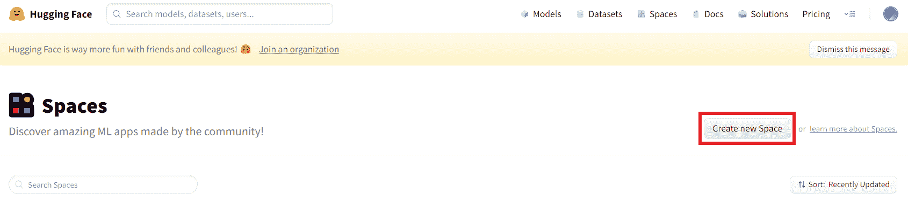

在出现的屏幕中填写所有必要的信息，为 Space SDK 选择 **Gradio** ，然后点击底部的**创建空间**。

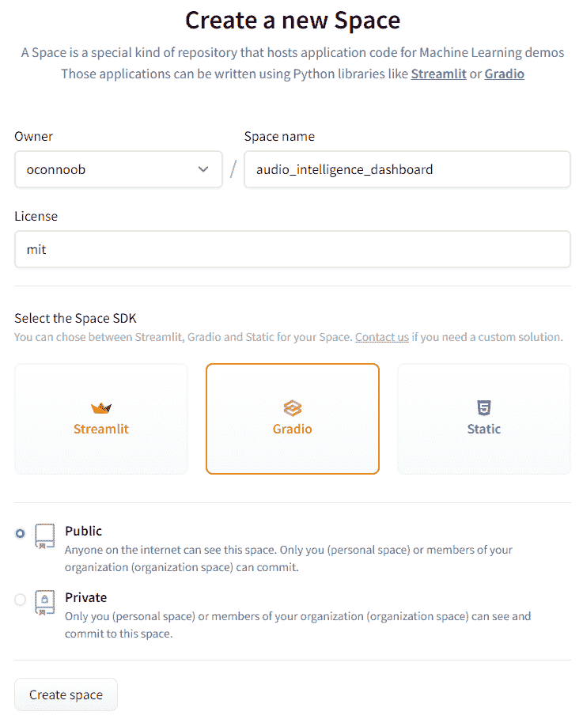

既然已经创建了空间，我们需要将仪表板代码上传到其中。在终端中，导航到仪表板项目存储库并执行以下命令:

```py
git remote add space https://huggingface.co/spaces/FULL_SPACE_NAME
```

用您的用户名和空间名替换`FULL_SPACE_NAME`。例如，部署此仪表板时使用的完整命令是:

```py
git remote add space https://huggingface.co/spaces/oconnoob/audio-intelligence-dashboard
```

这个命令将空间添加为存储库的[远程](https://git-scm.com/book/en/v2/Git-Basics-Working-with-Remotes)，这意味着我们可以使用 git 将代码上传到这个远程位置。为此，我们执行以下命令:

```py
git push --force space master:main 
```

我们用`git push`上传代码(用`--force`强行上传，因为空间是空的)到`space`指定的遥控器，就是我们刚刚添加的拥抱脸空间。`master:main`告诉 git 将项目存储库的`master`分支推送到远程`space`存储库中的`main`分支。

其他详细信息

我们以这种方式指定分支，因为 Spaces 中的默认分支名是`main`，但是我们本地存储库中的主分支名为`master`，所以为了让我们的应用程序显示出来，我们必须指定我们正在从本地的`master`推送至远程的`main`。

注意，对于其他项目，您的默认分支可能被命名为`main`，这意味着您可以从上面的命令中省略`master:main`。要在 git 存储库中检查您所在的分支的名称，在终端中执行`git branch`,找到旁边带有星号的分支名称。

这就是将音频智能仪表板部署到 Spaces 的全部工作！如果你想设置一个应用程序来自动更新 GitHub 库的变化，请查看[使用 GitHub 动作管理空间](https://huggingface.co/docs/hub/spaces-github-actions)。

## 项目扩展

这个项目是对 Gradio 的全面介绍，但肯定有一些有趣的扩展，那些希望深入研究的人可以实现它们进行练习。我们在下面列出了一些，但是如果你已经看到了你想看的一切，请随意跳到一些最后的话。

### 阈值滑块

有几个不同的参数使用常量值，这些常量值可以变成变量。例如，`[make_html_from_topics()](https://github.com/AssemblyAI-Examples/audio-intelligence-dashboard/blob/210a74351dc68c7390ac4e4c47f9577bec89220c/app/helpers.py#L278)`函数有一个`threshold`参数，它提供了一个主题必须显示的相关性的下限。

目前，该阈值使用默认值 0.0，这意味着没有主题被过滤掉。音频智能仪表板的一个扩展可能是实现一个控制这个阈值的 [Gradio 滑块](https://gradio.app/docs/#slider)，允许用户选择他们想要过滤的积极程度。

`[create_highlighted_list()](https://github.com/AssemblyAI-Examples/audio-intelligence-dashboard/blob/210a74351dc68c7390ac4e4c47f9577bec89220c/app/helpers.py#L307)`和`[make_entity_dict()](https://github.com/AssemblyAI-Examples/audio-intelligence-dashboard/blob/210a74351dc68c7390ac4e4c47f9577bec89220c/app/helpers.py#L380)`有相似的参数(分别是`rank`和`offset`)，也可以实现滑块。关于这个扩展的伟大之处在于 Python 已经被编写来适应它，所以所有需要的就是创建 Gradio“连接”。

奖金

作为一个额外的挑战，尝试使这些滑块的效果动态。也就是说，允许用户在显示的结果上使用滑块，动态地改变显示哪些主题，而不是选择例如带有滑块的`threshold`并静态地显示结果。

### 保存和导入结果

考虑创建一种保存已执行分析的方法，可能是通过保存响应 JSON 并添加用户上传保存的 JSON 以重新显示它的能力(而不必运行相同的分析)。

### API 关键要求

目前，使用仪表板不需要 API 键。考虑实现一个特性，其中必须输入 API 键才能“访问”仪表板。这是一个相对容易的扩展，只要求组件是可见的。

或者，考虑通过处理误用来使仪表板更加健壮，比如在没有输入 API 键的情况下点击了 **Submit** 。

### 修改 CSS

如果你想练习你的 CSS，试着修改`styles.css`来改变显示输出的样子。此外，考虑研究一下`[elem_id](https://gradio.app/custom_CSS_and_JS/#the-elem_id-argument)`参数来微调外观。请注意，一般来说，HTML 元素是最容易用 Gradio 修改的，目前还没有简单的方法来显著塑造应用程序的整体外观。

## 最后的话

本教程到此为止！如果你喜欢这篇文章，请随意订阅我们下面的时事通讯，或者在我们的[博客](https://www.assemblyai.com/blog/)上查看一些其他文章，比如关于[运行稳定扩散](https://www.assemblyai.com/blog/how-to-run-stable-diffusion-locally-to-generate-images/)或者[构建你自己的文本到图像模型](https://www.assemblyai.com/blog/minimagen-build-your-own-imagen-text-to-image-model/)的教程。

或者，看看我们的 [YouTube 频道](https://www.youtube.com/c/AssemblyAI)的其他精彩内容，比如我们的[机器从头学习](https://www.youtube.com/watch?v=p1hGz0w_OCo)系列！

喜欢这篇文章吗？

关注我们的时事通讯，了解更多类似的内容！

[Follow](https://assemblyai.us17.list-manage.com/subscribe?u=cb9db7b18b274c2d402a56c5f&id=2116bf7c68)***