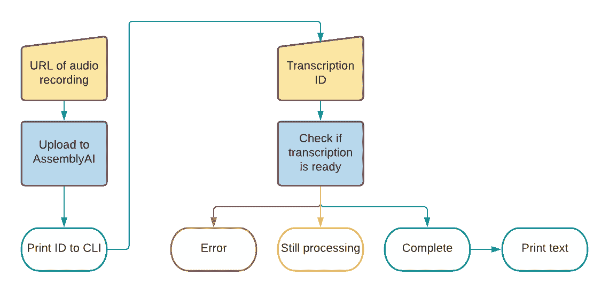

# JavaScript 和 Node.js 语音转文本

> 原文：<https://www.assemblyai.com/blog/getting-started-with-speech-to-text-transcriptions-with-assemblyai-javascript-and-node-js/>

开始使用一项新技术可能会令人望而生畏，但我们将使用 node.js 分解语音到文本的转录，使之变得更容易！

本帖我们就做一个基本的 node.js [命令行界面 app](https://en.wikipedia.org/wiki/Command-line_interface?undefined) (常缩写为 CLI app)。我们首先将一个音频记录的 URL 作为一个 [*参数*](https://en.wikipedia.org/wiki/Command-line_interface#Arguments) 传递给一个上传函数。第二个函数将发送一个 [HTTP 请求](https://en.wikipedia.org/wiki/Hypertext_Transfer_Protocol#Request_message)到 AssemblyAI 语音到文本转录 API。
‍
然后，我们将在命令行上打印 AssemblyAI 的响应以及我们转录的 ID。接下来，我们将把转录 ID 作为参数传递给第二个函数，该函数将获取我们的转录并将其打印到屏幕上！



## 先决条件

*   一个免费的 [AssemblyAI 账户](https://app.assemblyai.com/signup)
*   一个代码编辑器，比如 [VS 代码](https://code.visualstudio.com/?undefined)
*   ‍ [Node.js](https://nodejs.org/?undefined) 和 [npm](https://www.npmjs.com/?undefined)

如果你想看完整的代码项目，可以从这个 [GitHub 库](https://github.com/AssemblyAI/nodejs-getting-started-stt?undefined)获得。

## 获得您的开发环境设置

使用您最喜欢的命令行程序，如终端或 Powershell，在您的计算机上创建一个新目录。我已经调用了我的目录`transcribe`。导航到它并初始化一个新的 Node.js 项目:

```py
mkdir transcribe
cd transcribe
npm init -y
```

在新的`transcribe`目录中创建三个新文件:

‍ *如果使用 Windows:*

```py
New-Item upload.js, download.js, .env
```

*如果使用 macOS 或 Linux:*

```py
touch upload.js && touch download.js && touch .env
```

如果您还没有安装它，我们将需要节点包`dotenv`来管理我们的 AssemblyAI API 密钥。您可以使用以下命令安装它:

```py
npm i dotenv --save
```

我们还将使用 [Fetch API](https://developer.mozilla.org/en-US/docs/Web/API/Fetch_API/Using_Fetch?undefined) 来进行 REST 调用，所以请确保也安装它:

```py
npm i node-fetch --save
```

在代码编辑器中打开`.env`文件，并添加一个环境变量来存储 AssemblyAI API 密钥。您可以在 [AssemblyAI 仪表板](https://app.assemblyai.com/)中找到您的 API 键，并将其作为值添加到上述变量中。

```py
ASSEMBLYAI_API_KEY = "YOUR_API_KEY"
```

想玩我们的语音转文本 API 吗？

现在就开始免费！

[Start Now](https://app.assemblyai.com/signup)

## 将音频文件上传到 AssemblyAI 转录 API

开始之前，将`"type": "module"`添加到您的`package.json`文件中。这将允许您使用 ES 模块，这是我们这个项目所需要的。

在您的代码编辑器中打开我们之前创建的`upload.js`。将以下代码复制并粘贴到该文件中:

```py
import 'dotenv/config';
import fetch from 'node-fetch';
const url = 'https://api.assemblyai.com/v2/transcript';
```

上面的代码将导入我们之前添加的两个包，`dotenv`和`fetch`。我们还将 AssemblyAI API 端点定义为`url`。

运行应用程序时，我们需要将托管音频文件的 URL 作为命令行参数进行传递。下面的代码获取 CLI 参数并将其赋给一个名为`audioUrl`的变量。

```py
let args = process.argv.slice(2);
let audioUrl = args[0];
```

> *如果你想从你的电脑上传一个文件，这个[博客](https://www.assemblyai.com/blog/uploading-files-to-assemblyai-using-node-js-and-javascript/)会带你完成这些步骤。*

AssemblyAI 期待一个带有 [JSON](https://en.wikipedia.org/wiki/JSON?undefined) 主体的 HTTP [POST](https://en.wikipedia.org/wiki/Hypertext_Transfer_Protocol#Request_message) 请求。JSON 将包含我们作为参数传递的音频 URL。接下来我们来定义一下。

```py
const data = {
    "audio_url" : audioUrl
};
```

现在是时候考虑我们的 HTTP 请求了。

我们通过包`node-fetch`使用`fetch`。这个模块将浏览器中的`window.fetch`带到我们的节点应用程序中。

`fetch`需要一些参数，包括我们的 AssemblyAI API key，JSON body，[*header*](https://en.wikipedia.org/wiki/List_of_HTTP_header_fields?undefined)。我们将创建一个名为`params`的 JavaScript 对象来包含这些参数。

```py
const params = {
    headers:{
        "authorization": process.env.ASSEMBLYAI_API_KEY,
        "content-type": "application/json",
    },
    body: JSON.stringify(data),
    method: "POST"
};
```

我们的`upload`函数的最后一步是发出 HTTP 请求并打印对命令行的响应。

```py
fetch(url, params)
  .then(response => response.json())
  .then(data => {
    console.log('Success:', data);
    console.log('ID:', data['id']);
  })
  .catch((error) => {
    console.error('Error:', error);
  });
```

`fetch`支持[承诺](https://developer.mozilla.org/en-US/docs/Web/JavaScript/Reference/Global_Objects/Promise?undefined)，因此我们将发出请求并使用`then`关键字从响应中提取返回的数据，在命令行中显示完整的 JSON 响应和转录 ID。我们将使用`catch`关键字在出错的情况下显示错误。

整个 upload.js 文件应该如下所示:

```py
import 'dotenv/config';
import fetch from 'node-fetch';

const url = 'https://api.assemblyai.com/v2/transcript';

let args = process.argv.slice(2);
let audioUrl = args[0];
const data = {
  "audio_url": audioUrl
};

const params = {
  headers: {
    "authorization": process.env.ASSEMBLYAI_API_KEY,
    "content-type": "application/json",
  },
  body: JSON.stringify(data),
  method: "POST"
};

fetch(url, params)
  .then(response => response.json())
  .then(data => {
    console.log('Success:', data);
    console.log('ID:', data['id']);
  })
  .catch((error) => {
    console.error('Error:', error);
  });
```

## 尝试一下

在命令行中，键入以下内容(记住，您需要与代码文件位于同一个目录中)。您可以使用下面提供的 URL 或您选择的一个，只要确保您可以首先在浏览器中播放它。

```py
node upload.js https://s3-us-west-2.amazonaws.com/blog.assemblyai.com/audio/8-7-2018-post/7510.mp3 
```

如果一切顺利，您应该看到从 AssemblyAI 返回的整个 JSON 对象被打印到屏幕上。这也将包括在末尾单独打印的转录 ID。

## 从汇编下载一份抄本

在这个应用程序中，我们将向 AssemblyAI 端点发出一个请求，以检查我们的记录是否完成。

AssemblyAI 还支持 [webhooks](https://docs.assemblyai.com/all-guides/getting-webhooks-when-transcriptions-are-done?undefined) ，这意味着一旦转录完成，AssemblyAI 将向您的应用程序发出 POST 请求。

在您的代码编辑器中打开我们之前创建的`download.js`文件。

就像在`upload.js`中一样，我们需要导入`dotenv`和`fetch`，以及来自命令行的参数。

```py
import 'dotenv/config';
import fetch from 'node-fetch';
let args = process.argv.slice(2);
let id = args[0];
const url = `https://api.assemblyai.com/v2/transcript/${id}`;
```

注意，这次我们从命令行获取 ID 作为参数，然后使用[字符串文字](https://developer.mozilla.org/en-US/docs/Web/JavaScript/Reference/Template_literals?undefined)将 ID 添加到 AssemblyAI 端点以检索转录。我们将需要再次设置`fetch`的参数，只是这一次我们是在做一个 GET 请求，所以不会有任何主体数据。

```py
const params = {
  headers: {
    "authorization": process.env.ASSEMBLYAI_API_KEY,
    "content-type": "application/json",
  }, 
  method: "GET"
};
```

这是代码与上传代码略有不同的地方。转录可能需要一些时间，所以当我们从 AssemblyAI 得到响应时，我们需要检查音频文件是否已经被处理。

我们可以通过检查响应的“状态”来确定这一点。如果 AssemblyAI 说转录仍然在“排队”或“处理中”,那么我们需要稍后再试。如果状态为“已完成”,转录文本将包含在回复中。让我们写一个函数来处理这个问题。

```py
function print(data) {
  switch (data.status) {
    case 'queued':
    case 'processing':
      console.log('AssemblyAI is still transcribing your audio, please try again in a few minutes!');
      break;
    case 'completed':
      console.log(`Success: ${data}`);
      console.log(`Text: ${data.text}`);
      break;
    default:
      console.log(`Something went wrong :-( : ${data.status}`);
      break;
  }
}
```

这里我们使用一个简单的[开关](https://www.w3schools.com/js/js_switch.asp?undefined)语句来测试状态是`queued`、`processing`还是`completed`。如果状态是别的，我们就假设出了问题。最后，我们可以使用`fetch`进行 API 调用。

```py
fetch(url, params)
  .then(response => response.json())
  .then(data => {
    print(data);
  })
  .catch((error) => {
    console.error(`Error: ${error}`);
  });
```

整个`download.js`文件应该如下:

```py
import 'dotenv/config';
import fetch from 'node-fetch';

let args = process.argv.slice(2);
let id = args[0];
const url = `https://api.assemblyai.com/v2/transcript/${id}`;

const params = {
  headers: {
    "authorization": process.env.ASSEMBLYAI_API_KEY,
    "content-type": "application/json",
  },
  method: 'GET'
};

function print(data) {
  switch (data.status) {
    case 'queued':
    case 'processing':
      console.log('AssemblyAI is still transcribing your audio, please try again in a few minutes!');
      break;
    case 'completed':
      console.log(`Success: ${data}`);
      console.log(`Text: ${data.text}`);
      break;
    default:
      console.log(`Something went wrong :-( : ${data.status}`);
      break;
  }
}

fetch(url, params)
  .then(response => response.json())
  .then(data => {
    print(data);
  })
  .catch((error) => {
    console.error(`Error: ${error}`);
  });
```

是时候测试一下了！

在命令行中，使用从命令行中的 upload 函数返回的转录 ID，编写以下代码并按 enter 键

```py
node download.js TRANSCRIPTION_ID 
```

如果您的转录状态是`completed`，文本应该打印在命令行上。

## 接下来呢？

您已经成功地编写了一个命令行应用程序，将一个音频文件 URL 上传到 AssemblyAI，然后下载完成的转录并将其打印在屏幕上。