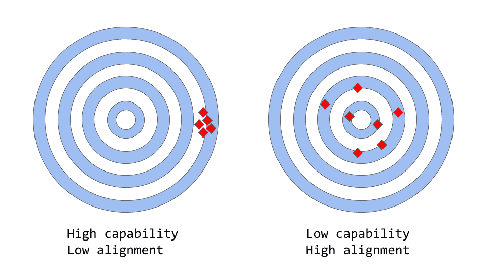
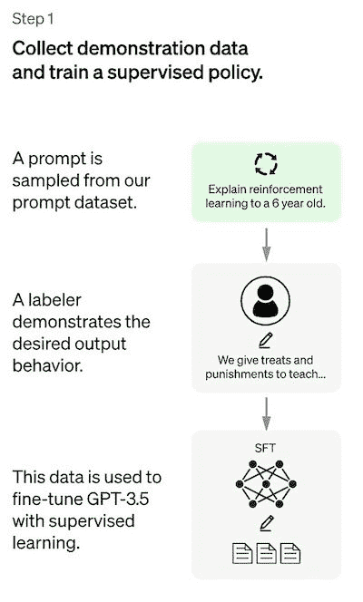
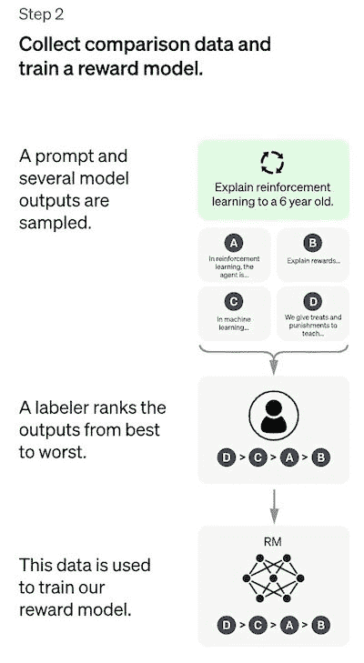
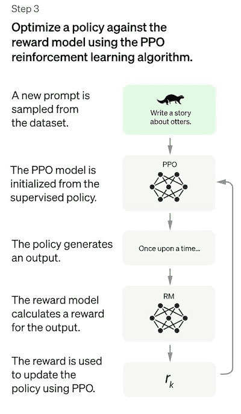

# ChatGPT 实际上是如何工作的

> 原文：<https://www.assemblyai.com/blog/how-chatgpt-actually-works/>

ChatGPT 是 OpenAI 的最新语言模型，代表了对其前身 GPT-3 的重大改进。与许多大型语言模型类似，ChatGPT 能够生成各种风格的文本，用于不同的目的，但具有更高的精度、细节和一致性。它代表了 OpenAI 大型语言模型系列中的下一代，它的设计非常注重交互式对话。

创造者使用了监督学习和强化学习的组合来微调 ChatGPT，**，但正是强化学习组件使 ChatGPT 独一无二**。创作者使用一种称为人类反馈强化学习(RLHF)的特殊技术，在训练循环中使用人类反馈来最小化有害、不真实和/或有偏见的输出。

在了解 RLHF 如何工作以及**了解 ChatGPT 如何使用 RLHF 来克服这些问题**之前，我们将检查 GPT-3 的局限性以及它们如何源于其训练过程。最后，我们将看看这种方法的一些局限性。

## 大型语言模型中的能力与一致性

"alignment vs capability" can be thought of as a more abstract analogue of "accuracy vs precision"

在机器学习的上下文中，术语*能力*指的是模型执行特定任务或一组任务的能力。一个模型的能力通常是通过**来评估的，它优化其目标函数**的能力，目标函数是定义模型目标的数学表达式。例如，用于预测股票市场价格的模型可能有一个衡量模型预测准确性的目标函数。如果该模型能够准确地预测股票价格随时间的变化，则可以认为它具有完成这项任务的高水平能力。

*对齐，*另一方面，关注的是**我们实际上想要模型做什么**与它被训练做什么。它问的问题是“目标函数与我们的意图一致吗？”指的是模型的目标和行为与人类价值观和期望的一致程度。举一个简单具体的例子，假设我们训练一个鸟类分类器来将鸟类分类为“麻雀”或“知更鸟”，我们使用*对数损失*(测量模型的预测概率分布和真实分布之间的差异)作为训练目标，尽管我们的最终目标是高分类精度。该模型可能具有较低的对数损失，即**该模型的能力较高，但在测试集上精度较差**。事实上，[日志损失与分类任务的准确性并不完全相关](https://datascience.stackexchange.com/questions/42599/what-is-the-relationship-between-the-accuracy-and-the-loss-in-deep-learning/42611)。这是一个不一致的例子，模型能够优化培训目标，但与我们的最终目标不一致。

> 像最初的 GPT-3 这样的模型是错位的

大型语言模型，如 GPT-3，在来自互联网的大量文本数据上接受训练**，并能够生成类似人类的文本**，但它们可能不总是产生与人类期望或理想值一致的输出。事实上，他们的目标函数是单词序列(或标记序列)上的概率分布，这允许他们预测序列中的下一个单词是什么(下面有更多细节)。

然而，在实际应用中，**这些模型旨在执行某种形式的有价值的认知工作**，这些模型的训练方式和我们想要使用它们的方式之间存在明显的分歧。尽管从数学上讲，机器计算出的单词序列的统计分布可能是建模语言的非常有效的选择，但我们作为人类，通过选择最适合给定情况的文本序列来生成语言，使用我们的背景知识和常识来指导这一过程。当语言模型用于需要高度信任或可靠性的应用程序(如对话系统或智能个人助理)时，这可能会成为一个问题。

虽然这些基于大量数据训练的强大、复杂的模型在过去几年变得非常强大，但当用于生产系统以使人类生活更轻松时，它们往往达不到这种潜力。大型语言模型中的对齐问题通常表现为:

*   缺乏帮助:没有遵循用户的明确指示。
*   幻觉:模型编造不存在或错误的事实。
*   缺乏可解释性:人类很难理解模型如何得出特定的决策或预测。
*   产生有偏见的或有害的输出:一个基于有偏见的/有害的数据训练的语言模型可能会在其输出中重现，即使它没有被明确指示这样做。

但是，具体来说，这个对齐问题是从哪里产生的呢？是不是语言模型被训练的方式天生就容易出现偏差？

## 语言模型训练策略如何产生错位

`Next-token-prediction`和`masked-language-modeling`是**用于训练语言模型**的核心技术，比如[变形金刚模型](https://en.wikipedia.org/wiki/Transformer_(machine_learning_model))。在第一种方法中，给模型一个单词序列(或“记号”，即单词的一部分)作为输入，并要求它预测序列中的下一个单词。例如，如果给模型输入句子

*“猫坐在”*

它可能预测下一个单词为*【垫子】**【椅子】*或*【地板】*，因为在给定先前上下文的情况下，这些单词出现的概率很高；语言模型实际上能够**估计给定先前序列的每个可能单词**(在其词汇表中)的可能性。

屏蔽语言建模方法是下一个标记预测的一种变体，在这种方法中，输入句子中的一些单词被替换为一个特殊的标记，例如`[MASK]`。然后要求模型预测应该插入的正确单词来代替掩码。例如，如果给模型一个句子

*`[MASK]`坐上了*

作为输入，它可能预测下一个单词为*【猫】**【狗】*，或者*【兔子】*。

这些目标函数的一个优点是，它允许模型**学习语言**的统计结构，例如常见的单词序列和单词使用模式。这通常有助于模型生成更自然和流畅的文本，并且这是每个语言模型的预训练阶段的必要步骤。

然而，这些目标函数也会导致问题，主要是因为模型不能**区分重要误差和不重要误差**。举一个非常简单的例子，如果给模型输入句子:

奥古斯都统治下的罗马帝国

它可能会预测*“begin”*或*“end”*，因为这两个词出现的可能性都很高(事实上，[这两个句子在历史上都是正确的](https://en.wikipedia.org/wiki/Augustus_(title)))，尽管第二个选择暗示了非常不同的含义。

更一般地，这些训练策略可能导致语言模型对于一些更复杂的任务的不一致，因为仅被训练来预测文本序列中的下一个单词(或屏蔽单词)的模型**可能不一定正在学习其含义**的一些更高级的表示。因此，该模型很难推广到需要更深入理解语言的任务或环境。

研究人员和开发人员正在研究各种方法来解决大型语言模型中的对齐问题。ChatGPT 基于原始的 GPT-3 模型，但通过使用人类反馈来进一步训练，以指导学习过程，其特定目标是减轻模型的偏差问题。所使用的特定技术，称为从人类反馈中强化学习，是基于[以前的学术研究](#references)。ChatGPT 代表了**将该技术用于投产车型**的首个案例。

但是 ChatGPT 的创造者到底是如何利用人类的反馈来攻击对齐问题的呢？

## 来自人类反馈的强化学习

该方法总体上由三个不同的步骤组成:

1.  有监督的微调步骤:预训练的语言模型在由标记器管理的相对少量的演示数据上进行微调，以学习有监督的[策略](https://www.baeldung.com/cs/ml-policy-reinforcement-learning)(**SFT 模型**)从选择的提示列表中生成输出。这代表基线模型。
2.  “模仿人类偏好”步骤:贴标机被要求对相对大量的 SFT 模型输出进行投票，这种方式创建了一个由*比较数据*组成的新数据集。在这个数据集上训练新的模型。这被称为**奖励模型(RM)** 。
3.  最近政策优化(PPO)步骤:奖励模型用于进一步微调和改进 SFT 模型。这一步的结果就是所谓的**策略模型**。

步骤 1 只发生一次，而步骤 2 和 3 可以不断迭代:在当前最佳策略模型上收集更多的比较数据，用于训练新的奖励模型，然后训练新的策略。

现在让我们深入了解每一步的细节！

注意:本文的其余部分基于 [InstructGPT 论文](https://arxiv.org/pdf/2203.02155.pdf)的内容。根据 OpenAI 的说法，ChatGPT 已经接受了*“使用与 InstructGPT 相同的方法，但在数据收集设置方面略有不同”* ( [来源](https://openai.com/blog/chatgpt/))。不幸的是，ChatGPT 的准确定量报告尚未公开。

### 步骤 1:监督微调(SFT)模型

第一步是收集示范数据，以便训练一个受监督的政策模型，称为 SFT 模型。

*   数据收集:选择一系列提示，并要求一组人工贴标机**写下预期的输出响应**。对于 ChatGPT，使用了两种不同的提示来源:一些直接来自贴标机或开发人员，一些来自 OpenAI 的 API 请求(即来自他们的 GPT-3 客户)。由于整个过程缓慢且昂贵，因此结果是一个相对小的、高质量的精选数据集(大约 12-15k 个数据点)，该数据集将用于微调预训练的语言模型。
*   模型的选择:ChatGPT 的开发者没有对最初的 GPT-3 模型进行微调，而是选择了所谓的 [GPT-3.5 系列](https://beta.openai.com/docs/model-index-for-researchers)中的预训练模型。据推测，使用的基线模型是最新的一个`text-davinci-003`，一个 GPT-3 模型，主要在编程代码上进行了微调。

因此，非常有趣的是，为了创建一个像 ChatGPT 一样的通用聊天机器人，开发人员决定在“代码模型”而不是纯文本模型的基础上**进行微调。**

Figure adapted from [source](https://openai.com/blog/chatgpt/)

由于该步骤的数据量有限，在该过程之后获得的 SFT 模型很可能输出仍然(在概率上)不是很受用户关注的文本，并且通常遭受未对准的影响，如在以上部分中解释的那样。这里的问题是**监督学习步骤遭受高的可扩展性成本**。

为了克服这个问题，现在的策略是让标签员对 SFT 模型的不同输出进行排名，以创建一个奖励模型，而不是要求人类标签员创建一个更大的精选数据集，这是一个缓慢而昂贵的过程——让我们在下一节中更详细地解释这一点。

### 第二步:奖励模型

目标是直接从数据中学习目标函数(奖励模型)**。该函数的目的是给 SFT 模型输出打分，与这些输出对人类的期望程度成比例。在实践中，这将强烈地反映出特定组的人类贴标机的具体偏好和他们同意遵循的共同准则。最终，这个过程将从数据中提取一个自动系统，这个系统被认为是模仿人类偏好的**。****

**它是这样工作的:**

*   **选择一个提示列表，SFT 模型为每个提示生成多个输出(4 到 9 之间的任何值)。**
*   **贴标机从最好到最差排列输出。结果是一个新的带标签的数据集，其中排名是标签。该数据集的大小比用于 SFT 模型的精选数据集大约大 10 倍。**
*   **这些新数据用于训练奖励模型(RM)。该模型将 SFT 模型的几个输出作为输入，并按照偏好顺序对它们进行排序。**

**

Figure adapted from [source](https://openai.com/blog/chatgpt/)** 

**对于贴标机来说，对产品进行排序要比从头开始生产容易得多，**这个过程的放大效率要高得多**。在实践中，所选择的提示数量在 30-40k 的数量级，并且包括分级输出的不同组合。**

### **第三步:通过最近政策优化(PPO)微调 SFT 模型**

**[强化学习](https://www.assemblyai.com/blog/reinforcement-learning-with-deep-q-learning-explained/)现在被用于通过优化奖励模型来微调 SFT 政策。所使用的特定算法被称为近似策略优化(PPO ),而微调模型被称为 PPO 模型。**

**ppo 是什么？这种方法的主要特点是:**

*   **PPO 是一种用于在强化学习中训练代理的算法。它被称为“基于策略”的算法，因为**它从当前策略中学习并直接更新当前策略**，而不是像 DQN(深度 Q 网络)这样的“非策略”算法那样从过去的经验中学习。这意味着 PPO 根据代理商采取的行动和获得的回报不断调整当前政策。**
*   **PPO 使用一种[信赖域优化方法](https://optimization.mccormick.northwestern.edu/index.php/Trust-region_methods)来训练策略，这意味着**它将策略的变化限制在与前一个策略**的一定距离内，以确保稳定性。这与其他策略梯度方法形成对比，其他策略梯度方法有时会对策略进行大的更新，这会破坏学习的稳定性。**
*   **PPO 使用一个**值函数来估计给定状态或动作**的预期收益。value 函数用于计算 advantage 函数，它表示预期回报和当前回报之间的差异。然后，通过将当前策略采取的动作与先前策略将采取的动作进行比较，使用优势函数来更新策略。这使得 PPO 能够根据所采取措施的估计值对政策进行更明智的更新。**

**在该步骤中，PPO 模型从 SFT 模型初始化，并且**价值函数从报酬模型**初始化。该环境是一个[土匪环境](https://en.wikipedia.org/wiki/Multi-armed_bandit)，它给出一个随机提示，并期待对该提示的响应。给定提示和响应，它会产生一个奖励(由奖励模型决定)，剧集结束。在每个代币处，从 SFT 模型添加每代币 [KL 惩罚](https://en.wikipedia.org/wiki/Kullback%E2%80%93Leibler_divergence)，以减轻奖励模型的过度优化。** 

**

Figure adapted from [source](https://openai.com/blog/chatgpt/)** 

## **性能赋值**

**因为模型是根据人工标注输入训练的，**评估的核心部分也是基于人工输入**，即通过让标注者对模型输出的质量进行评级来进行。为了避免过度适应参与训练阶段的贴标机的判断，测试集使用来自不在训练数据中表示的被拒绝的 OpenAI 客户的提示。**

**该模型根据三个高级标准进行评估:**

*   **有用性:判断模型遵循用户指令以及推断指令的能力。**
*   **真实性:判断模型在封闭领域任务中产生幻觉(编造事实)的倾向。该模型在 [TruthfulQA 数据集](https://arxiv.org/abs/2109.07958)上进行评估。**
*   **无害:标签员评估模型的输出是否合适，是否诋毁受保护的类，或者是否包含贬损的内容。该模型还在[真实毒性提示](https://allenai.org/data/real-toxicity-prompts)和[乌鸦对](https://aclanthology.org/2020.emnlp-main.154/)数据集上进行了基准测试。**

**该模型还在传统的自然语言处理任务(如问题回答、阅读理解和摘要)上进行零命中率评估(T0 ),在其中一些任务上(T2 ),开发人员观察到与 GPT-3 相比性能有所下降(T3)。这是“校准税”的一个例子，其中基于 RLHF 的校准过程是以某些任务的较低性能为代价的。**

**这些数据集上的性能回归可以通过一种称为**预训练混合**的技巧来大大减少:在通过[梯度下降](https://en.wikipedia.org/wiki/Gradient_descent)训练 PPO 模型期间，梯度更新通过混合 SFT 模型和 PPO 模型的梯度来计算。**

## **方法的缺点**

**正如在 [InstructGPT 论文](https://arxiv.org/pdf/2203.02155.pdf)(据 ChatGPT 的创建者称，chat GPT 基于该论文)中所讨论的，该方法的一个非常明显的局限性是，在将语言模型与人类意图对齐的过程中，用于微调模型的数据受到各种复杂的主观因素的影响，包括:**

*   **生产演示数据的贴标机的偏好。**
*   **设计研究和撰写标签说明的研究人员。**
*   **由开发人员精心制作或由 OpenAI 客户提供的提示选择。**
*   **贴标机偏差既包含在奖励模型训练(通过对输出进行排序)**中，也包含在模型评估**中。**

**特别是，作者指出了一个显而易见的事实，即参与训练过程的标注者和研究人员可能并不代表语言模型的所有潜在最终用户。**

**除了这一明显的“内在”限制，我们还想指出该方法的其他一些可能的缺点、没有明确解决的问题以及一些未解决的问题:**

****缺乏对照研究**:[报告的结果](https://arxiv.org/pdf/2203.02155.pdf)以 SFT 模型为基线，测量最终 PPO 模型的性能。这可能会产生误导:我们如何知道这些改进实际上是由于 RLHF？一个适当的(然而昂贵的)控制研究应该包括投入与训练奖励模型完全相同的贴标机小时数，以创建一个更大的具有高质量演示数据的精选 SFT 数据集。这样就可以客观地衡量 RLHF 方法相对于监督方法的性能改进。简而言之，缺乏这样的控制研究使得一个基本问题完全悬而未决:RLHF 在对齐语言模型方面做得好吗？**

****缺乏比较数据的基础事实**:标签员经常会在模型输出的排序上有分歧。从技术上来说，风险是将一个*高潜在方差*添加到没有任何基础事实的比较数据中。**

****人类的偏好并不是同质的**:RLHF 方法将人类的偏好视为同质和静态的。假设所有人都有相同的价值观显然是牵强附会的，至少在人类知识的大量主题上是如此。[最近的一些研究](https://arxiv.org/pdf/2211.15006.pdf)开始以不同的方式解决这个公开的问题。**

****奖励模型(RM)** 的提示稳定性测试:似乎没有实验研究奖励模型在输入提示变化方面的敏感性。如果两个提示在语法上不同，但在语义上等价，那么 RM 能在模型输出的排序上显示出显著的差异吗？更简单地说，提示的*质量对 RM 有多重要？***

****引线型问题**:在 RL 方法中，模型有时可以学会操纵自己的奖励系统来实现期望的结果，从而导致“过度优化的策略”。这可以推动模型重新创建一些模式，由于某种未知的原因，这些模式使奖励模型得分很高(参见 OpenAI 的[这篇论文中的表 29，这是语言建模中这种行为的一个明确示例)。ChatGPT 用奖励函数中的 KL 惩罚项对此进行了修补。请注意，我们试图优化 RM *输入*(即 PPO 输出)，以改善其*输出*(奖励分数)*，同时约束输入本身不要离某个参考输入*(SFT 输出)太远。在最近的预印本](https://arxiv.org/pdf/2009.01325.pdf)中有更多关于这种方法局限性的细节。**

## **供进一步阅读的精选参考文献**

*   **关于用于 ChatGPT 的 RLHF 方法的最相关的论文是[训练语言模型遵循具有人类反馈的指令](https://arxiv.org/pdf/2203.02155.pdf)，它实际上详细描述了一个称为 InstructGPT 的模型，OpenAI 将其称为 ChatGPT 的“兄弟模型”。**
*   **论文[从人类反馈中学习摘要](https://arxiv.org/pdf/2009.01325.pdf)在文本摘要的上下文中描述了 RLHF。**
*   **[最近策略优化](https://arxiv.org/pdf/1707.06347.pdf):PPO 算法论文。**
*   **[根据人类偏好进行深度强化学习](https://arxiv.org/abs/1706.03741)——是在雅达利游戏的背景下，在 RL 中使用人类反馈的最早(深度学习)论文之一。**
*   **DeepMind 已经在 [Sparrow](https://arxiv.org/pdf/2209.14375.pdf) 和 [GopherCite](https://arxiv.org/abs/2203.11147) 论文中提出了 open ai RLHF 的替代方案。**
*   **Anthropic 有一个针对 RLHF 的开源库(附带论文)。**

 **喜欢这篇文章吗？

关注我们的时事通讯，了解更多类似的内容！

[Follow](https://subscribe.assemblyai.com/)**