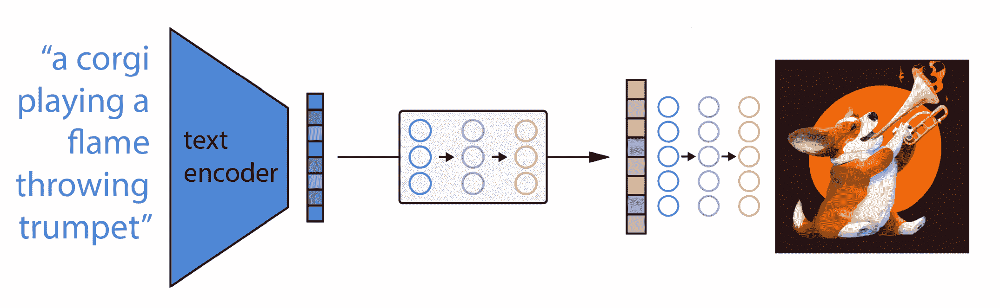
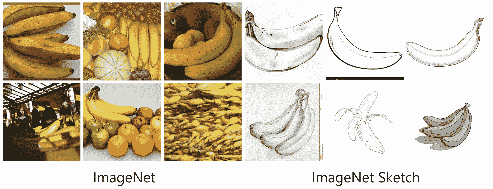
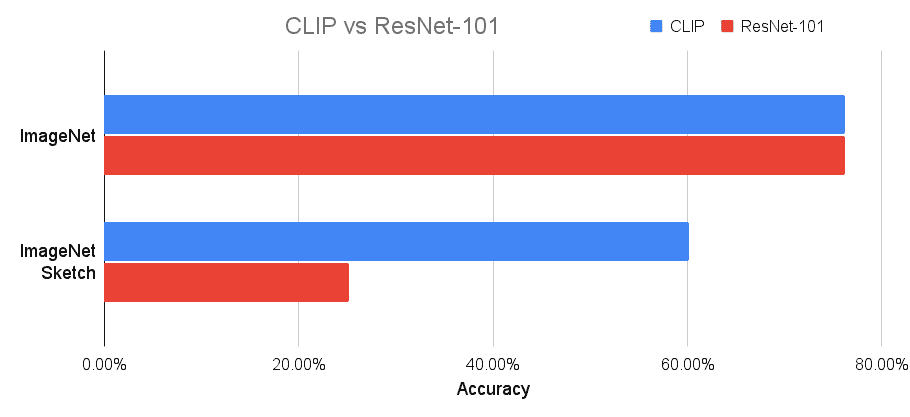
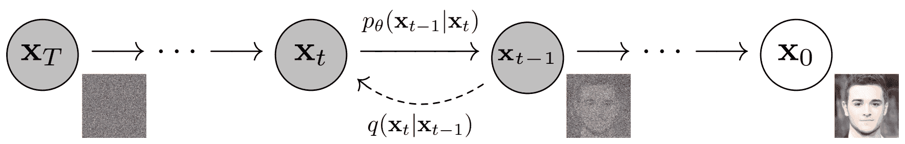
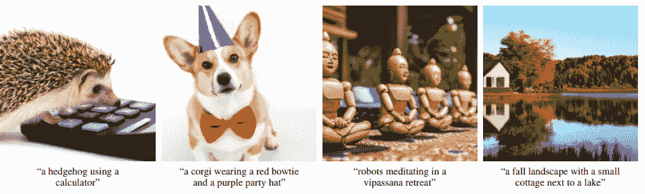
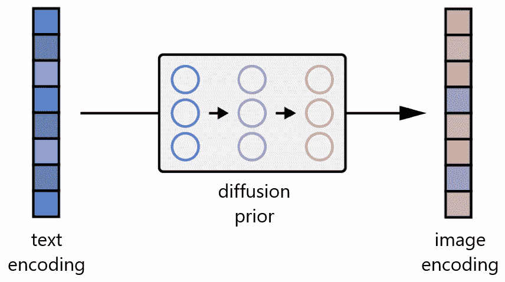

# DALL-E 2 实际上是如何工作的

> 原文：<https://www.assemblyai.com/blog/how-dall-e-2-actually-works/>

OpenAI 的开创性模型 [DALL-E 2](https://openai.com/dall-e-2/) 在月初上市，为图像生成和处理树立了新的标杆。只有简短的文本提示，DALL-E 2 可以**生成全新的图像**，以语义合理的方式组合不同和不相关的对象，就像下面的图像，通过输入提示**“一碗汤，这是通往另一个维度的门户，作为数字艺术】**。

Various images generated by DALL-E 2 given the above prompt ([source](https://openai.com/dall-e-2/)).

DALL-E 2 甚至可以修改现有的图像，创建保持其显著特征的图像变体，并在两个输入图像之间进行插值。DALL-E 2 令人印象深刻的结果让许多人想知道这样一个强大的模型到底是如何工作的。

在这篇文章中，**我们将深入了解 DALL-E 2 是如何创造出像上面这样令人震惊的图像**。将给出大量的背景信息，解释层次将涵盖所有领域，因此这篇文章适合具有不同水平机器学习经验的读者。让我们开始吧！

## DALL-E 2 如何工作:鸟瞰

在深入研究 DALL-E 2 如何工作的细节之前，让我们先对 DALL-E 2 如何生成图像有一个大致的了解。虽然 DALL-E 2 可以执行各种任务，包括上面提到的图像处理和插值，**我们将在本文中重点讨论图像生成的任务**。

A birds-eye view of the DALL-E 2 image generation process (modified from [source](https://arxiv.org/abs/2204.06125)).

在最高水平上，DALL-E 2 的作品非常简单:

1.  首先，文本提示被输入到**文本编码器**中，该编码器被训练成将提示映射到表示空间。
2.  接下来，一个名为**先验**的模型将文本编码映射到一个相应的**图像** **编码**，该编码捕获包含在文本编码中的提示的语义信息。
3.  最后，**图像解码器**随机生成图像，该图像是该语义信息的视觉表现。

从鸟瞰的角度来看，这就是全部！当然，还有很多有趣的实现细节需要讨论，我们将在下面讨论。如果你想要更多的细节，而不是深入本质，或者你更喜欢观看你的内容而不是阅读它，请随时查看我们在这里的 DALL-E 2 视频:

[https://www.youtube.com/embed/F1X4fHzF4mQ?feature=oembed](https://www.youtube.com/embed/F1X4fHzF4mQ?feature=oembed)

## DALL-E 2 的工作原理:详细介绍

现在是时候分别深入上述每个步骤了。让我们从看看 DALL-E 2 如何学习链接相关的文本和视觉抽象开始。

### 步骤 1 -链接文本和视觉语义

输入**“一只泰迪熊在时代广场骑滑板”**后，DALL-E 2 输出如下图:

[source](https://openai.com/dall-e-2/)

DALL-E 2 如何知道“泰迪熊”这样的文本概念是如何在视觉空间中表现出来的？DALL-E 2 中文本语义和它们的视觉表示之间的**链接由另一个名为**剪辑**的 OpenAI 模型学习(**C**ontrastive**L**anguage-**I**mage**P**re-training)。**

CLIP 对数亿张图像及其相关说明进行训练，学习*给定的文本片段与图像的关联程度* 。也就是说，CLIP 不是试图*预测给定图像的标题*，而是学习任何给定标题与图像的*关联方式。这个**对比**而不是**预测**目标允许 CLIP 学习同一抽象对象的文本和视觉表示之间的联系。整个 DALL-E 2 模型取决于 CLIP 从自然语言学习语义的能力，所以让我们看看 CLIP 是如何被训练来理解其内部工作的。*

#### 剪辑训练

训练剪辑的基本原理非常简单:

1.  首先，所有的图像和它们相关的标题通过它们各自的编码器，将所有的对象映射到一个 *m-* 维空间。
2.  然后，计算每个*(图像，文本)*对的余弦相似度。
3.  训练目标是同时**最大化 N 个**正确的**编码图像/字幕对之间的余弦相似度**和**最小化 N 个2 - N 个**不正确的**编码图像/字幕对之间的余弦相似度**。

这一培训过程如下图所示:

<https://www.assemblyai.com/blog/content/media/2022/04/CLIP_training-1.mp4>

Overview of the CLIP training process

其他培训详情

有关 CLIP 训练过程的更多信息，请参见下文。

*   **余弦相似度**
    *   两个向量的余弦相似度就是两个向量的**点积乘以它们的大小**的乘积。它测量向量空间中两个向量之间的角度；并且在机器学习的上下文中，确定两个向量彼此“相似”的程度。如果我们认为向量空间中的每个“方向”都有一个意义，那么两个编码向量之间的余弦相似性度量了向量所表示的概念有多“相似”。
*   **训练数据**
    *   CLIP 在 WebImageText 数据集上进行训练，该数据集由 4 亿对图像及其相应的自然语言字幕组成(不要与基于维基百科的图像文本混淆)
*   **并行性**
    *   CLIP 训练过程的并行性显而易见——所有编码和余弦相似性都可以并行计算。
*   **文本编码器架构**
    *   文本编码器是一个[转换器](https://arxiv.org/abs/1706.03762)
*   **图像编码器架构**
    *   图像编码器是一个[视觉转换器](https://arxiv.org/abs/2010.11929)

#### 剪辑对 DALL-E 2 的意义

CLIP 对 DALL-E 2 很重要，因为**它最终决定了自然语言片段与视觉概念的语义关联程度**，这对于*文本条件*图像生成至关重要。

附加说明

CLIP 的对比目标使其能够以一种仅学习特征映射的卷积模型无法理解的方式理解语义信息。通过对比以零触发方式使用的 CLIP 相对于 ImageNet 训练的 ResNet-101 如何在数据集上执行*，可以很容易地观察到这种差异。特别是，对比这些模型在 [ImageNet](https://image-net.org/) 和 [ImageNet Sketch](https://github.com/HaohanWang/ImageNet-Sketch) 上的对比，很好地揭示了这种差距。* 

CLIP 和经过 ImageNet 训练的 ResNet-101 在 ImageNet 上的表现精度相当，但 CLIP 在 ImageNet Sketch 上的表现明显优于 ResNet-101。尽管 CLIP 以零拍摄方式使用，并且没有使用 130 万张 ImageNet 图像中的任何一张进行训练，但情况确实如此。

这个结果很重要，因为它表明 CLIP 学习了对象的文本描述和它们相应的视觉表现之间的**语义链接。CLIP 不是依赖图像实例的特定细节(如香蕉的黄色)来识别它们，而是学习香蕉*的语义“柏拉图式理想”，从而更好地识别香蕉的草图。理解文本描述和视觉特征可以映射到同一个“柏拉图理想”的事实对于文本条件图像生成是至关重要的，这就是为什么 CLIP 对 DALL-E 2 范式如此重要。***

### *步骤 2 -从视觉语义生成图像*

*训练后，剪辑模型被冻结，DALL-E 2 进入下一个任务——学习*反转*剪辑刚刚学习的图像编码映射。CLIP 学习一种表示空间，在这种空间中很容易确定文本和视觉编码的相关性，但我们的兴趣在于图像的**生成**。因此，我们必须学会如何利用表征空间来完成这项任务。*

*具体来说，OpenAI 采用了它以前的另一个模型 [GLIDE](https://arxiv.org/abs/2112.10741) 的修改版本来执行这个图像生成。滑动模型学习*反转*图像编码过程，以便随机解码剪辑图像嵌入。*

*

An image of a Corgi playing a flamethrowing trumpet passed through CLIP's image encoder. GLIDE then uses this encoding to generate a new image that maintains the salient features of the original. (modified from [source](https://arxiv.org/abs/2204.06125))* 

*如上图所示，应该注意的是，我们的目标是**而不是**构建一个自动编码器，并*精确地*重建一幅嵌入后的图像，而是生成一幅**保留了原始图像**嵌入后的显著特征的图像。为了执行这个图像生成，GLIDE 使用了一个**扩散模型**。*

#### *什么是扩散模型？*

*扩散模型是一项受热力学启发的发明，近年来越来越受欢迎[1](https://arxiv.org/abs/1503.03585)[2](https://arxiv.org/abs/1907.05600)。扩散模型通过*逆转逐渐的噪声过程*来学习生成数据。如下图所示，加噪过程被视为一个参数化的马尔可夫链，它逐渐向图像添加噪声以破坏图像，最终(渐进地)产生纯高斯噪声。扩散模型学会沿着这条链向后导航，通过一系列时间步长逐渐去除噪声，以逆转这一过程。*

*

Diffusion Model schematic ([source](https://arxiv.org/pdf/2006.11239.pdf)).* 

*如果扩散模型在训练后被“切成两半”,那么它可以用于通过随机采样高斯噪声来生成图像，然后对其去噪以生成照片般逼真的图像。有些人可能会认为这种技术很容易让人联想到用[自动编码器](https://www.assemblyai.com/blog/introduction-to-variational-autoencoders-using-keras/)生成数据，而扩散模型和自动编码器实际上是[相关的](https://benanne.github.io/2022/01/31/diffusion.html)。*

 *想了解更多关于扩散模型的知识吗？

查看我们的*机器学习扩散模型介绍*文章！

[Check it Out](https://www.assemblyai.com/blog/diffusion-models-for-machine-learning-introduction/)*

#### *滑行训练*

*虽然 GLIDE 不是第一个扩散模型，但它的重要贡献在于对它们进行了修改，以允许**文本条件图像生成**。特别是，人们会注意到扩散模型*从随机采样的高斯噪声开始*。起初还不清楚如何定制这个过程来生成特定于*的*图像。如果在人脸数据集上训练扩散模型，它将可靠地生成人脸的照片级真实感图像；但是如果有人想生成一张具有特定特征的脸，比如棕色眼睛或金色头发，该怎么办呢？*

*GLIDE 通过**用额外的文本信息**增加训练过程来扩展扩散模型的核心概念，最终导致文本条件图像生成。让我们来看看 GLIDE 的培训流程:*

*<https://www.assemblyai.com/blog/content/media/2022/04/openshot_project.mp4>

*

*GLIDE training process.*

 *其他培训详情

关于滑行训练过程的更多信息可以在下面找到。

*   **上采样**
    *   通过反向扩散过程生成的图像是 64 x 64，因此作者也以类似的方式训练基于文本的上采样模型，以使生成的数据达到 1，024 x 1，024。
*   **消融扩散模型**
    *   OpenAI 首先通过其[烧蚀扩散模型](https://arxiv.org/abs/2105.05233) (ADM)解决了这个问题，该模型最初只包括类别调节。OpenAI 用 GLIDE 扩展了这个概念，以**概括扩散模型条件，使其包括一般自然语言**。
    *   ADM 最初是为了将扩散模型生成真实感图像的能力与文本条件模型以语义上合理的方式合并不相关对象的能力相结合而创建的。
    *   ADM 论文中还包括一项消融研究，旨在探索优化扩散模型架构的主题(因此**消融了**扩散模型)。这种探索的细节超出了本文的范围，但是感兴趣的读者应该参考链接的文章以获得更多的细节。* 

*这里有一些用 GLIDE 生成的图片的例子。作者指出，在照片真实感和字幕相似性方面，GLIDE 比 DALL-E (1)表现得更好。*

*

Examples of images generated by GLIDE ([source](https://arxiv.org/pdf/2112.10741.pdf)).* 

***DALL-E 2 使用了一种改进的滑动模型**，它以两种方式结合了投影剪辑文本嵌入。第一种方法是将剪辑文本嵌入添加到 GLIDE 的现有时间步长嵌入中，第二种方法是创建四个额外的上下文标记，这些标记连接到 GLIDE 文本编码器的输出序列中。*

#### *滑翔对 DALL-E 2 的意义*

*GLIDE 对 DALL-E 2 很重要，因为它允许作者通过在表示空间中调整**图像编码**来轻松地将 GLIDE 的文本条件真实感图像生成功能移植到 DALL-E 2。因此，DALL-E 2 的改进 GLIDE 学习**根据剪辑图像编码**生成语义一致的图像。同样重要的是要注意，反向扩散过程是随机的，因此通过修改的滑动模型多次输入*相同的*图像编码矢量，可以容易地产生变化。*

### *步骤 3 -从文本语义到相应的视觉语义的映射*

*虽然改进的 GLIDE 模型成功地生成了反映图像编码所捕获的语义的图像，但是我们如何实际着手*找到*这些编码表示呢？换句话说，我们如何将提示中的文本条件信息注入到图像生成过程中呢？*

*回想一下，除了我们的*图像*编码器，CLIP 还学习了一个*文本*编码器。DALL-E 2 使用了另一种模型，作者称之为之前的**，以便将**从图像标题**的文本编码**映射到它们对应图像的** **图像编码**。DALL-E 2 的作者对先验的自回归模型和扩散模型都进行了实验，但最终发现它们产生了相当的性能。鉴于扩散模型的计算效率更高，它被选为 DALL-E 2 的先验模型。***

*

Prior mapping from a text encoding to its corresponding image encoding (modified from [source](https://arxiv.org/abs/2204.06125)).* 

#### *前期培训*

*DALL-E 2 中的扩散先验由一个只有解码器的变换器组成。它通过因果注意力面具对有序的序列进行操作*

1.  *标记化的文本/标题。*
2.  *这些标记的片段文本编码。*
3.  *扩散时间步长的编码。*
4.  *噪声图像通过剪辑图像编码器。*
5.  *最终编码，其来自 Transformer 的输出用于预测无噪声剪辑图像编码。*

 *其他培训详情

关于先前培训过程的更多信息可在下面找到。

*   **字幕条件**
    *   扩散先验不仅取决于字幕的剪辑文本嵌入，还取决于字幕本身。前者是后者的确定性函数，因此这种双重条件是完全允许的。
*   **无分类器引导**
    *   为了提高样本质量，通过丢弃文本条件信息，在 10%的时间内使用无分类器指导随机进行采样。
*   **双样本生成**
    *   为了提高采样期间的质量，利用先验生成两个图像嵌入，并且选择具有较高点积的图像嵌入和文本嵌入。不清楚为什么作者在这里使用点积而不是余弦相似度。
*   我们为什么需要先验知识？
    *   作者指出，训练这样的先验知识对于字幕到图像模型来说并不是绝对必要的。一种选择是只以标题本身为条件。这将简单地产生模型滑翔，作者在论文中对两者进行了全面的分析比较。另一种选择是将剪辑文本嵌入馈送到解码器中，而不是使用先验来从其生成剪辑图像嵌入，然后使用它。作者通过实验发现，前者产生了合理的结果，尽管结果不如后者好。最终，使用先验**提高了图像多样性**。* 

### *第四步——把所有东西放在一起*

*至此，我们已经拥有了 DALL-E 2 的所有功能组件，只需要将它们链接起来就可以生成文本条件图像了:*

1.  *首先，剪辑文本编码器将图像描述映射到**表示空间**。*
2.  *然后扩散先验从剪辑文本编码映射到**对应的剪辑图像编码**。*
3.  *最后，修改的滑动生成模型经由反向扩散从表示空间映射到图像空间，**生成传达输入字幕内的语义信息**的许多可能图像之一。*

*

High-level overview of the DALL-E 2 image-generation process (modified from [source](https://arxiv.org/abs/2204.06125)).*  *喜欢这篇文章吗？

关注我们的时事通讯，了解更多类似的内容！

[Follow](https://assemblyai.us17.list-manage.com/subscribe?u=cb9db7b18b274c2d402a56c5f&id=2116bf7c68)*

## *摘要*

*在本文中，我们介绍了世界上首屈一指的基于文本的图像生成模型是如何工作的。DALL-E 2 可以在给定文本提示的情况下生成语义上似乎真实的照片级图像，可以生成具有特定艺术风格的图像，可以生成以不同方式表示的相同显著特征的变体，并且可以修改现有图像。*

*虽然有很多关于 DALL-E 2 及其对深度学习和整个世界的重要性的讨论，但我们提请您注意 DALL-E 2 开发过程中的 3 个关键要点*

1.  *首先，DALL-E 2 展示了深度学习中[扩散模型](https://www.assemblyai.com/blog/diffusion-models-for-machine-learning-introduction/) 的**威力，DALL-E 2 中之前的*和*图像生成子模型都是基于扩散的。虽然扩散模型在过去几年才得到广泛使用，但它已经证明了自己的价值，那些关注深度学习研究的人应该会在未来看到更多这样的模型。***
2.  *第二点是强调使用自然语言作为训练 **最先进的深度学习模型**的手段的必要性和**力量。这一点并非起源于 DALL-E 2(特别是 CLIP 之前演示过的)，但尽管如此，重要的是要认识到 DALL-E 2 的强大最终源于互联网上绝对*的海量*配对自然语言/图像数据。使用这样的数据不仅消除了与手工标注数据集的费力和艰苦过程相关的发展瓶颈；但是这种数据的嘈杂、不精确的性质更好地反映了深度学习模型必须鲁棒的真实世界数据。***
3.  *最后，DALL-E 2 **重申了 Transformers** 在网络规模数据集上训练的模型中的至高地位，因为它们具有令人印象深刻的并行性。*

## *参考*

1.  *[使用非平衡热力学的深度无监督学习](https://arxiv.org/abs/1503.03585)*
2.  *[通过估计数据分布的梯度生成模型](https://arxiv.org/abs/1907.05600)*
3.  *[带剪辑潜在时间的分层文本条件图像生成](https://arxiv.org/pdf/2204.06125.pdf)*
4.  *[扩散模型在图像合成上击败 GANs](https://arxiv.org/abs/2105.05233)*
5.  *[去噪扩散概率模型](https://arxiv.org/pdf/2006.11239.pdf)*
6.  *[从自然语言监督中学习可转移的视觉模型](https://arxiv.org/pdf/2103.00020.pdf)*
7.  *[GLIDE:使用文本引导扩散模型实现真实感图像生成和编辑](https://arxiv.org/pdf/2112.10741.pdf)*