# 如何用 Python 构建带语音邮件的一次性手机

> 原文：<https://www.assemblyai.com/blog/how-to-build-a-burner-phone-with-voicemail-in-python/>

## 概观

你接到许多垃圾电话吗？随着自动呼叫的兴起，垃圾电话越来越多。让我们反击吧，在本教程中，我将向你展示如何制作一次性手机，用 [Twilio](https://twilio.com/) 记录来电，并用 [AssemblyAI](https://assemblyai.com) 转录来电。Twilio 是一个通信 API，它支持通过电话进行通信。AssemblyAI 是一个快速、自动的语音转文本 API，被 Nordic API 评为 2020 年顶级公共 API。你可以在这里找到[的源代码](https://github.com/ytang07/assembly_twilio_transcription?undefined)。

## 介绍

今天我们将使用 Python 来构建一次性手机。什么是一次性手机？这是一部手机，你可以用它代替你真正的手机，然后扔掉它。您可以使用 Twilio 让您提供的免费号码进行跟进。在本教程中，我们将从 Twilio 提供一个号码，使用 [Python Flask](https://flask.palletsprojects.com/en/2.0.x/?undefined) 创建一个函数来接听电话并记录它们，以编程方式更新我们号码的 webhook 端点，进行一些示例电话呼叫，下载我们的. mp3 文件，并使用 AssemblyAI 转录这些. mp3 文件。最后，我们还将比较使用 Twilio 内置转录和 assembly ai[语音转文本 API](https://assemblyai.com) 转录的准确性。

## 步骤:

1.  注册一个 Twilio 帐户
2.  复制您的凭据
3.  从 Twilio 提供电话号码
4.  创建一个烧瓶端点来记录声音
5.  获取 ngrok 并运行它，将您的 Flask 端点暴露给 web
6.  用新的 webhook 端点更新 Twilio 提供的电话号码
7.  打几个电话
8.  检查并下载录像
9.  获取汇编 api 密钥
10.  通过汇编转录它们
11.  特维利奥和阿帕莱的转录比较

## 注册一个 Twilio 帐户

在 twilio.com 注册一个 Twilio 账户，获得你的*账户 sid* 和*认证令牌*。我已经在你的控制台上圈出了它们应该在的位置(并屏蔽了我的帐户 sid)。

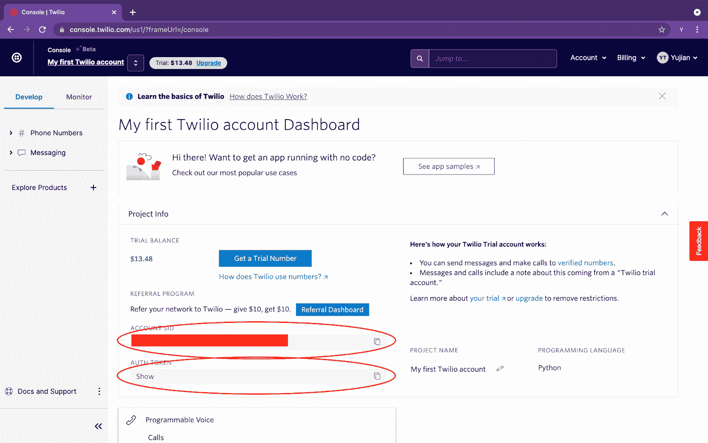

Where to find your Twilio credentials

## 复制您的凭据

复制您的凭证，将它们保存在您的环境变量中，或者保存在您正在使用的文件夹中的 configure.py 文件中。

```py
acct_id = '<your account sid>'
twilio_auth_key = '<your twilio auth token>'
```

## 从 Twilio 提供电话号码

现在让我们使用 Python 通过他们的 REST API 从 Twilio 编程提供一个电话号码。我们将列出 20 个本地号码，然后从中选择一个。

```py
from configure import acct_id, twilio_auth_key
from twilio.rest import Client

client = Client(acct_id, twilio_auth_key)

US_avail_phone_numbers = client.available_phone_numbers('US').fetch()

# lists 20 available local numbers with an area code of your choice
list_20 = US_avail_phone_numbers.local.list(area_code='<your area code>', limit=20)
for num in list_20:
   # only list the number if it has voice capability
   # they all should
   if num.capabilities['voice'] == True:
       print(num.phone_number)
_number = input("Which phone number do you want?")

# request your new number
new_number = client.incoming_phone_numbers.create(
   phone_number= _number)

print("You've activated your new number", new_number.phone_number) 
```

完成后，我们的终端输出应该如下所示:

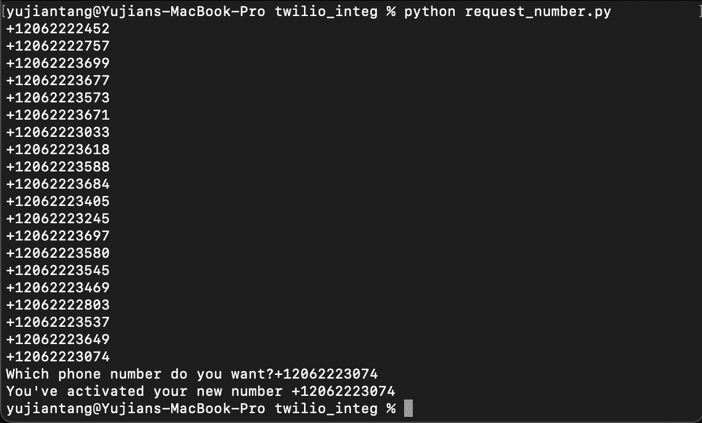

Picking a Burner Phone Number

## 创建一个烧瓶端点来记录声音

如果您还没有下载 Python Flask，您可以使用

```py
pip install flask
```

你 ****仔细阅读这个区块和下一个区块**** 是非常重要的。我们将使用 Python Flask 创建一个端点。我们的端点将记录一个来电*和*通过 Twilio 转录它(稍后我们将看到一个比较)。

```py
from flask import Flask
from twilio.twiml.voice_response import VoiceResponse

app = Flask(__name__)

@app.route("/voice", methods=["GET", "POST"])
def voice():
   """Read a message aloud"""
   resp = VoiceResponse()
   resp.say("Please leave a message")
   resp.record(timeout=10, transcribe=True)
   resp.hangup()
   return(str(resp))

if __name__ == "__main__":
   app.run(debug=True)
```

‍Now:我们在终端中运行这个命令，应该会看到如下输出:

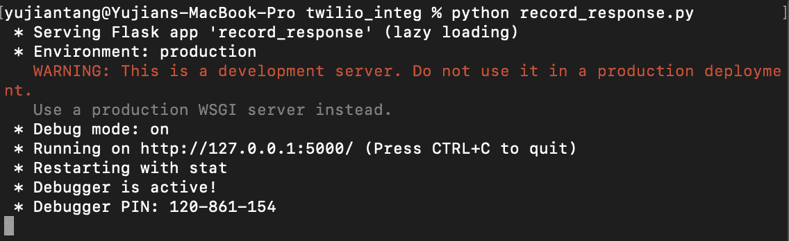

Start your Flask Application

## 将您的烧瓶端点暴露在网络上

在我们的 flask 应用程序在我们的终端上启动并运行之后，我们还需要下载并运行 ngrok。你可以[在这里](https://ngrok.com/download?undefined)下载 ngrok。下载 ngrok 并复制到我们的工作文件夹后，我们将打开 ****第二个终端**** 并运行

```py
./ngrok http 5000
```

注意,“5000”可以替换为运行 Python Flask 应用程序的任何端口。正如你在上面看到的，我们的运行在端口 5000 上。Ngrok 应该公开并返回一个我们可以触及的端点。我们需要跟踪 https 转发链接，这将是我们更新的 webhook URL，以便 Twilio 在我们调用时访问。

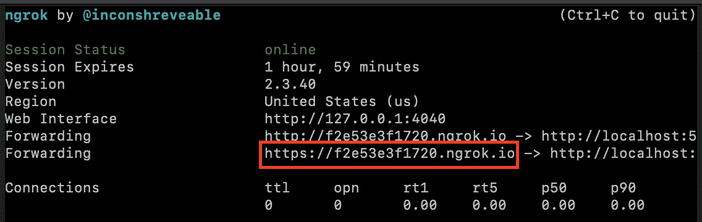

ngrok

## 用新的 webhook 端点更新 Twilio 提供的电话号码

好了，现在我们有了一个可以记录电话的应用程序，让我们通过他们的 Python REST API 来更新 Twilio 上的 webhook。

```py
from twilio.rest import Client
from configure import twilio_auth_key, acct_id

client = Client(acct_id, twilio_auth_key)

phone_numbers = client.incoming_phone_numbers.list()

for record in phone_numbers:
   print(record.sid)

_sid = input("What phone number SID do you want to update?")
_url = input("What do you want to update the webhook URL to?")

updated_phone_number = client.incoming_phone_numbers(_sid).update(voice_url=_url)

print("Voice URL updated to", updated_phone_number.voice_url)
```

当我们运行这个时，我们应该在终端中得到这个输出。请注意，我在 ngrok 提供的 URL 末尾添加了“/voice ”,这是因为我在上面的 Flask 应用程序中将“/voice”定义为端点。

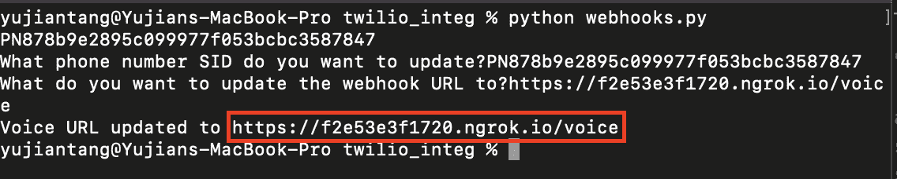

Updating Phone Number Webhooks in Twilio

## 打几个电话

这里没有代码可写，但是给你的新一次性电话号码打几个电话。如果一切设置正确，应该会听到一个女声说“请留言”。为了这个教程，我打了 3 个电话，留了 3 条信息。

我留言是:

“这是第三次也是最后一次录音，我将用来测试转录服务。所以，是的，我应该是一个牛仔”

“这是转录的测试录音。莎莉在海边卖贝壳

和

"这是一个用 Twilio 和 AssemblyAI 录制转录的测试调用. "

## 检查并下载录像

现在，让我们在 Twilio 上查看我们的录音并下载它们。

```py
from configure import acct_id, twilio_auth_key
from twilio.rest import Client
import requests

twilio_url = "https://api.twilio.com"
client = Client(acct_id, twilio_auth_key)
recordings = client.recordings.list(limit=20)
for record in recordings:
   print(record.sid)

_rid = input("Which recording ID would you like?")

request_url = twilio_url + "/2010-04-01/Accounts/" + acct_id + "/Recordings/" + _rid + ".mp3"
response = requests.get(request_url)
with open(_rid+'.mp3', 'wb') as f:
   f.write(response.content)

print("File saved to", _rid+".mp3")
```

完成后，终端中的输出应该如下所示:

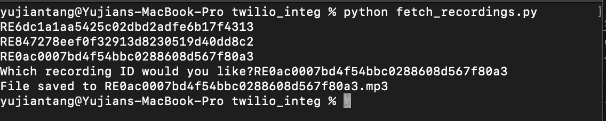

Fetching recordings from Twilio

我运行了三次来下载所有三个记录。您也可以执行下面的代码来一次下载所有的文件。

```py
from configure import acct_id, twilio_auth_key
from twilio.rest import Client
import requests

twilio_url = "https://api.twilio.com"
client = Client(acct_id, twilio_auth_key)
recordings = client.recordings.list(limit=20)
for record in recordings:
    _rid = record.sid
    request_url = twilio_url + "/2010-04-01/Accounts/" + acct_id + "/Recordings/" + _rid + ".mp3"
    response = requests.get(request_url)
    with open(_rid+'.mp3', 'wb') as f:
        f.write(response.content)
    print("File saved to", _rid+".mp3")
```

### 获取汇编 api 密钥

转到 [AssemblyAI](https://assemblyai.com) 获取 API 密钥。您将看到我用红色圈出的 API 密钥:

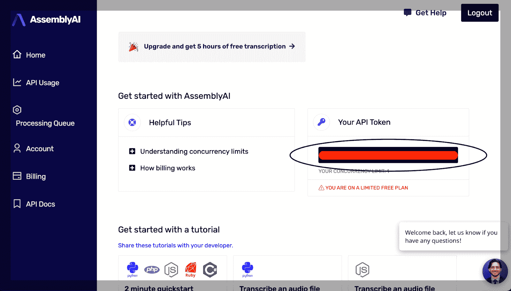

Where to find your AssemblyAI API key

将这一行添加到 configure.py 文件中

```py
assembly_auth_key = '<your AssemblyAI API Token here>'
```

## 通过汇编转录它们

现在我们将使用 AssemblyAI 的 API 来转录我们拥有的. mp3 文件。我们将在 AssemblyAI 的主题检测功能启用的情况下转录我们的文件。主题检测用于检测转录文本中的主题。如果我们检测到文本包含我们正在寻找的一个或多个主题，主题检测对于自动执行一些操作是很有用的。我们要做的是将我们的. mp3 文件上传到 AssemblyAI 的上传端点，然后通过 AssemblyAI 转录端点在启用主题检测的情况下转录它。我们将以. json 文件的形式下载我们的脚本。

```py
from configure import assembly_auth_key
import requests
import json
from time import sleep

transcript_endpoint = "https://api.assemblyai.com/v2/transcript"
upload_endpoint = 'https://api.assemblyai.com/v2/upload'
headers = {
   "authorization": assembly_auth_key,
   "content-type": "application/json"
}
CHUNK_SIZE = 5242880

def read_file(location):
   with open(location, 'rb') as _file:
       while True:
           data = _file.read(CHUNK_SIZE)
           if not data:
               break
           yield data

location = input("Which file do you want to transcribe?")

upload_response = requests.post(
   upload_endpoint,
   headers=headers, data=read_file(location)
)
audio_url = upload_response.json()['upload_url']
print('Uploaded to', audio_url)
transcript_request = {
   'audio_url': audio_url,
   'iab_categories': 'True'
}

transcript_response = requests.post(transcript_endpoint, json=transcript_request, headers=headers)
transcript_id = transcript_response.json()['id']
polling_endpoint = transcript_endpoint + "/" + transcript_id
print("Transcribing at", polling_endpoint)
polling_response = requests.get(polling_endpoint, headers=headers)
while polling_response.json()['status'] != 'completed':
   sleep(5)
   print("Transcript processing ...")
   try:
       polling_response = requests.get(polling_endpoint, headers=headers)
   except:
       print("Expected to wait 30 percent of the length of your video")
       print("After wait time is up, call poll with id", transcript_id)
categories_filename = transcript_id + '_categories.json'
with open(categories_filename, 'w') as f:
   f.write(json.dumps(polling_response.json()['iab_categories_result']))
print('Categories saved to', categories_filename)
```

‍When:我们完成了，转录一个文件的请求应该是这样的:

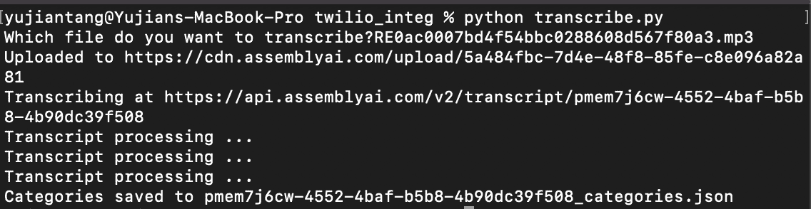

Upload and Transcribe your mp3 files via AssemblyAI

## 比较

我意识到，我们显然不能像使用 AssemblyAI 的 API 那样使用 Twilio 的内置转录来进行主题检测，但我们仍然可以比较它们的转录准确性。为此，我们将构建两个新的脚本。首先，从 Twilio 那里取回我们所有的抄本。第二，打印我们在 AssemblyAI 的记录。

我们的 Twilio 脚本将调用客户端，获取我们帐户上的所有副本(我们现在应该只有 3 份)并打印出来:

```py
from twilio.rest import Client
from configure import twilio_auth_key, acct_id

client = Client(acct_id, twilio_auth_key)

transcriptions = client.transcriptions.list()

for record in transcriptions:
   _tid = record.sid
   transcript = client.transcriptions(_tid).fetch()
   print(transcript.transcription_text)
```

我们的 AssemblyAI 脚本将获取我们下载的 JSON 并打印出文本。我手动加载了 JSON 文件名。

```py
import json

files = ['pmo31a8t2-7778-4e20-bf0d-baff7fbaf72f_categories.json',
'pmojwgqta-8cc3-4a6c-a881-c8b83e3a9cce_categories.json',
'pmem7j6cw-4552-4baf-b5b8-4b90dc39f508_categories.json']
for _file in files:
   f = open(_file,'r')
   json_obj = json.load(f)
   text = json_obj['results'][0]['text']
   print(text)
```

在并排比较中:

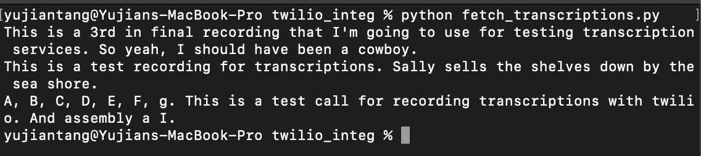

Twilio transcriptions

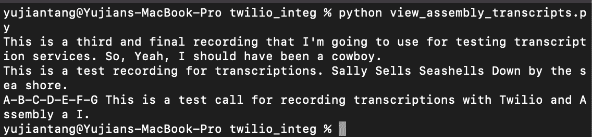

AssemblyAI transcriptions

我们可以看到，AssemblyAI 的转录比 Twilio 的内置转录服务更准确，即使是在如此短的消息中。我们还可以比较 AssemblyAI 的[定价和 Twilio](https://www.assemblyai.com/pricing) 内置转录的[定价，并看到 AssemblyAI 的成本比⅓低同样多(0.015 美元对 0.05 美元)。](https://www.twilio.com/voice/pricing/us?undefined)

## 清理

最后，当你把你的一次性电话号码给了那些讨厌的不断索要电话号码的服务后，你可以删除它。

```py
from configure import acct_id, twilio_auth_key
from twilio.rest import Client

client = Client(acct_id, twilio_auth_key)

phone_numbers = client.incoming_phone_numbers.list()

for record in phone_numbers:
   print(record.sid)

_del = input("Which phone number SID would you like to delete?")

client.incoming_phone_numbers(_del).delete()
```

它应该像这样运行:

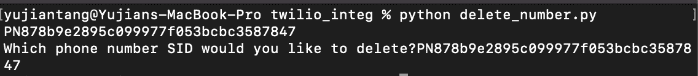

Deleting your Twilio provisioned phone number

## 包扎

在本教程中，我们了解了如何使用 Python 以编程方式从 Twilio 获取号码，设置 Flask 应用程序来响应和记录电话呼叫，用 AssemblyAI 转录我们的电话呼叫，并在完成后删除我们的号码。

有关 AssemblyAI 的更多信息，请查看我们的[博客，获取教程和更新](https://assemblyai.com/blog)。在 Twitter 上关注我们 [@assemblyai](https://twitter.com/AssemblyAI?undefined) 获取更新，关注作者、[@于坚 _ 唐](https://twitter.com/yujian_tang?undefined)获取更多教程。