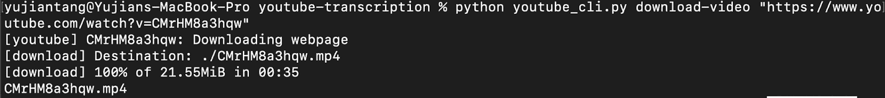
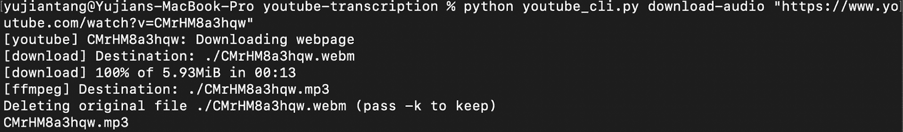
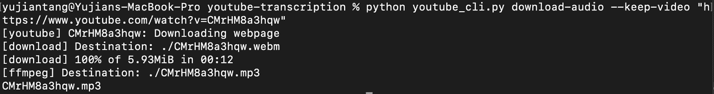

# 如何用 Python 构建 YouTube 下载器

> 原文：<https://www.assemblyai.com/blog/how-to-build-a-youtube-downloader-in-python/>

你曾经想从 YouTube 视频下载音频吗？在本教程中，我将向你展示如何建立自己的免费 YouTube 视频下载应用程序。你可以在这里找到源代码

## 先决条件

我们需要下载/配置什么库/软件？

*   YouTube-dl(python 库)
*   FFmpeg
*   单击(python 库)

在我们能够构建我们的 YouTube 视频和音频下载器之前，我们必须下载并配置我们的库。由于 youtube-dl 和 click 都是 Python 库，我们可以用 pip 同时安装这两个库:

```py
pip install youtube-dl click
```

‍After:这两个库已经安装完毕，我们将要安装 FFmpeg、FFprobe 和 FFplay。ffmpeg。FFmpeg 是一个用于处理视频、音频和其他多媒体文件的开源免费软件。我们将结合 youtube-dl 使用它来将我们下载的视频转换成音频文件。这一部分对于 Windows 和 OSX 用户是不同的。首先，我们将从[https://ffbinaries.com/downloads](https://ffbinaries.com/downloads?undefined)下载二进制文件

如果你是 Windows 用户，你需要做的是下载二进制文件并解压。您将看到我们需要的三个 ffbinaries，ffmpeg，ffprobe 和 ffplay 的可执行文件。将每个可执行文件复制到一个文件夹中，并确保您知道该文件夹在哪里。出于本教程的目的，我将它复制到我从运行 python 程序的同一个文件夹*。稍后，我们将在发送给 youtube_dl 的请求中添加一个选项，告诉它在哪里可以找到该程序。*

如果您是 OSX 用户，您会希望访问该站点并下载二进制文件，然后将下载位置添加到 PATH 变量中。像这样:

```py
1\. Run

sudo cp ./ffmpeg ./ffplay ./ffprobe /usr/local/bin

2\. Open up ~/.zshrc with whatever text editor you’d like, I just run 

vim ~/.zshrc

3\. Add the line 

PATH=”/usr/local/bin:$PATH”
```

## YouTube 下载应用程序创建

我们将创建两个命令，一个只下载音频，一个下载视频。在我们开始创建实际命令之前，我们必须初始化我们的 CLI。一个重要的注意事项，*你所有的命令都应该在 API()和 main()的定义之间。*

```py
import click

@click.group()
def apis():
   """A CLI for getting transcriptions of YouTube videos"""
def main():
   apis(prog_name='apis')

if __name__ == '__main__':
   main()
```

## YouTube 视频下载应用程序代码

我们需要做的第一件事是创建一个下载视频函数，它将从我们传递给它的链接中下载 YouTube 视频，作为一个. mp4 文件。完成后，它看起来应该是这样的:



我们的 YouTube 下载视频功能将指定视频的格式(mp4)和一个输出模板，告诉 youtube-dl 它希望文件保存的方式。我们将把文件名设置为视频的 YouTube id，这是完全可选的，我这样做是因为我发现在某些设置中，文件的标题会变得很长很麻烦，尤其是如果其中有空格的话。然后我们将调用 youtube-dl 来保存文件，并让函数将文件名返回给我们。

```py
import youtube_dl

@click.argument('link')
@apis.command()
def download_video(link):
   ydl_opts = {
       'format': 'mp4',
       'outtmpl': "./%(id)s.%(ext)s",
   }
   _id = link.strip()
   meta = youtube_dl.YoutubeDL(ydl_opts).extract_info(_id)
   save_location = meta['id'] + ".mp4"
   print(save_location)
   return save_location
```

‍The 我们需要做的另一个功能是从 YouTube 下载音频功能，它将从 YouTube 链接下载音频，我们把它作为一个. mp3 文件。完成后，它看起来应该是这样的:



或者，如果您决定保留视频:



和我们的 YouTube 下载视频功能一样，我们的 YouTube 下载音频功能也会指定一些选项给 youtube-dl。这次我们需要指定的额外选项是告诉 youtube-dl 在处理后使用 FFmpeg 转换视频文件，以及是否保留视频。

```py
@click.argument('link')
@click.option('-k', '--keep-video', is_flag=True, help="Pass this to keep the video")
@apis.command()
def download_audio(link, keep_video):
   ydl_opts = {
       'format': 'bestaudio/best',
       'postprocessors': [{
           'key': 'FFmpegExtractAudio',
           'preferredcodec': 'mp3',
           'preferredquality': '192',
       }],
       'ffmpeg-location': './',
       'outtmpl': "./%(id)s.%(ext)s",
       'keepvideo': 'True' if keep_video else 'False'
   }
   _id = link.strip()
   meta = youtube_dl.YoutubeDL(ydl_opts).extract_info(_id)
   save_location = meta['id'] + ".mp3"
   print(save_location)
   return save_location
```

‍That's it。我们完了！就这么简单。不要再使用充斥着大量广告的粗略网站来下载你的 youtube 视频或音频！看看如何将它扩展成一个命令行界面，它会给你 YouTube 视频的脚本。可以在推特 [@assemblyai](https://twitter.com/AssemblyAI?undefined) 关注 AssemblyAI 更新，也可以关注我[@于坚 _ 唐](https://twitter.com/yujian_tang?undefined)