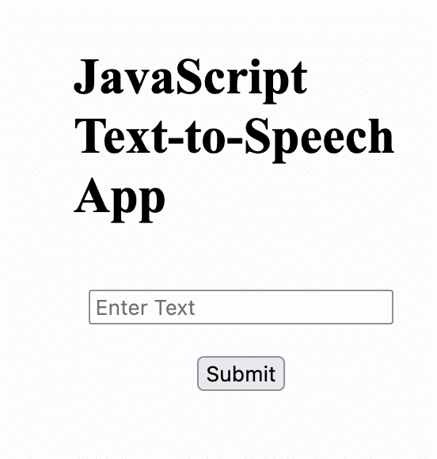

# JavaScript 文本到语音转换——简单的方法

> 原文：<https://www.assemblyai.com/blog/javascript-text-to-speech-easy-way/>

构建应用程序时，出于可访问性、便利性或其他原因，您可能希望实现文本到语音的功能。在本教程中，我们将学习如何使用 JavaScript 的内置 [Web 语音 API](https://developer.mozilla.org/en-US/docs/Web/API/Web_Speech_API) 构建一个非常简单的 **JavaScript 文本到语音转换应用**。

为了您的方便，我们已经提供了这个教程应用程序的代码，供您在 [Replit](https://replit.com/@stefanrows/JavaScript-Text-to-Speech#script.js) 时使用，或者从 [Github](https://github.com/stefanrows/javascript-text-to-speech-aai) 中克隆。你也可以点击这里查看应用[的现场版。](https://javascript-text-to-speech.stefanrows.repl.co/)

## 步骤 1 -设置应用程序

首先，我们使用一个名为`index.html`的简单 HTML 文件和一个名为`script.js`的 JavaScript 文件建立了一个非常基本的应用程序。

我们还将使用一个名为`style.css`的 CSS 文件来添加一些边距和居中，但是如果你想包含这个样式文件，这完全取决于你。

HTML 文件`index.html`定义了我们的应用程序的结构，我们将使用 JavaScript 文件为其添加功能。我们添加一个`<h1>`元素作为应用程序的标题，一个``字段，我们将在其中输入我们想要说的文本，以及一个``，我们将使用它来提交这个输入文本。我们最终将所有这些对象包装在一个`<form>`中。记住，输入和按钮还没有任何功能——我们将在稍后使用 JavaScript 添加这些功能。

在包含 HTML 文件元数据的`<head>`元素内部，我们导入了`style.css`。这告诉我们的应用程序根据`style.css`的内容来设计自己的风格。在`<body>`元素的底部，我们导入我们的`script.js`文件。这告诉我们的应用程序存储应用程序功能的 JavaScript 文件的名称。

```py
<!DOCTYPE html>
<html>
  <head>
    <meta charset="utf-8" />
    <meta name="viewport" content="width=device-width" />
    <title>JavaScript Text-to-Speech App</title>
    <link href="style.css" rel="stylesheet" type="text/css" />
  </head>

  <body>
    <div class="wrapper">
      <h1>JavaScript Text-to-Speech App</h1>
      <form id="form">
        
        Submit
      </form>
    </div>
    <script src="script.js"></script>
  </body>
</html> 
```

index.html

现在我们已经完成了`index.html`文件，我们可以继续创建`script.js` JavaScript 文件。

由于我们将`script.js`文件导入到上面的`index.html`文件中，我们可以通过简单地向[发送一个警告](https://www.w3schools.com/jsref/met_win_alert.asp)来测试它的功能。

为了给我们的代码添加警告，我们将下面的代码行添加到我们的`script.js`文件中。确保保存文件并刷新浏览器，您现在应该会看到一个弹出的小窗口，显示文本“它工作了！”。

```py
alert("It works!") 
```

script.js

如果一切顺利，您应该会看到这样的内容:



Our App

## 步骤 2 -检查浏览器兼容性

为了创建我们的 JavaScript 文本到语音转换应用程序，我们将利用 JavaScript 的内置 Web 语音 API。由于这个 API 并不兼容所有的浏览器，我们需要检查兼容性。我们可以用两种方法中的一种来执行这种检查。

第一种方法是在[caniuse.com](https://caniuse.com/?search=web%20speech%20api)上检查我们的操作系统和版本。

第二种方法是在我们的代码内部执行检查，这可以通过一个简单的条件语句来实现:

```py
'speechSynthesis' in window ? console.log("Web Speech API supported!") : console.log("Web Speech API not supported :-(") 
```

script.js

这是一个简写的 if/else 语句，相当于以下语句:

```py
if('speechSynthesis' in window){
	console.log("Web Speech API supported!")
} else {
	console.log("Web Speech API not supported :-(")   
} 
```

如果您现在运行应用程序并检查您的浏览器控制台，您应该会看到这些消息之一。您还可以选择通过呈现一个 **HTML** 元素将这些信息传递给用户。

## 步骤 3 -测试 JavaScript 文本到语音转换

接下来，让我们写一些静态代码来测试我们是否能让浏览器和我们说话。

将以下代码添加到`script.js`文件中。

```py
'speechSynthesis' in window ? console.log("Web Speech API supported!") : console.log("Web Speech API not supported :-(")

const synth = window.speechSynthesis
let ourText = "Hey there what's up!!!!"
const utterThis = new SpeechSynthesisUtterance(ourText)

synth.speak(utterThis) 
```

### 代码分解

让我们看一下代码分解，以了解发生了什么:

*   使用`const synth = window.speechSynthesis`,我们将`synth`变量声明为`SpeechSynthesis`对象的实例，这是指向使用 JavaScript 的 Web 语音 API 的入口。这个对象的`speak`方法最终将文本转换成语音。
*   `let ourText = “Hey there what’s up!!!!”`定义了`ourText`变量，它保存了我们想要说出的文本字符串。
*   `const utterThis = new SpeechSynthesisUtterance(ourText)`将`utterThis`变量定义为一个`SpeechSynthesisUtterance`对象，我们将`ourText`传递给它。
*   将所有这些放在一起，我们调用`synth.speak(utterThis)`，它发出`ourText`中的字符串。

**保存**代码并**刷新**你的应用程序运行的浏览器窗口，以便听到一个声音说“**嘿，有什么事吗！！！！**”。

## 步骤 4 -让我们的应用充满活力

我们的代码目前让我们很好地理解了我们的应用程序的文本到语音方面是如何工作的，但是应用程序在这一点上只将我们用`ourText`定义的静态文本转换成语音。我们希望在使用该应用程序时，能够动态地改变将哪些文本转换为语音。现在让我们利用一个`<form>`来做这件事。

```py
const textInputField = document.querySelector("#text-input")
const form = document.querySelector("#form")
const utterThis = new SpeechSynthesisUtterance()
const synth = window.speechSynthesis
let ourText = ""

const checkBrowserCompatibility = () => {
  "speechSynthesis" in window
    ? console.log("Web Speech API supported!")
    : console.log("Web Speech API not supported :-(")
}

checkBrowserCompatibility()

form.onsubmit = (event) => {
  event.preventDefault()
  ourText = textInputField.value
  utterThis.text = ourText
  synth.speak(utterThis)
  textInputField.value = ""
} 
```

### 代码分解

*   首先，我们添加了`const textInputField = document.querySelector("#text-input")`变量，它允许我们访问在 JavaScript 代码的`index.html`文件中定义的``标签的值。我们通过 id 选择``字段:`#text-input`。
*   其次，我们添加了`const form = document.querySelector("#form")`变量，它通过 id `#form`选择我们的表单，这样我们可以稍后使用`onsubmit`函数提交`<form>`。
*   我们将`ourText`初始化为空字符串，而不是静态句子。
*   我们将浏览器兼容性逻辑包装在一个名为`checkBrowserCompatibility`的函数中，然后立即调用这个函数。

最后，我们创建一个在提交表单时执行的`onsubmit`处理程序。这个处理程序做几件事:

*   `event.preventDefault()`防止浏览器在提交表单后重新加载。
*   `ourText = textInputField.value`将我们的`ourText`字符串设置为我们在应用程序的“input”字段中输入的内容。
*   `utterThis.text = ourText`将要朗读的文本设置为`ourText`的值。
*   `synth.speak(utterThis)`说出我们的文本字符串。
*   提交表单后，将输入字段的值重置为空字符串。

## 步骤 5 -测试我们的 JavaScript 文本到语音转换应用程序

要测试我们的 JavaScript 文本到语音转换应用程序，只需在输入字段中输入一些文本，然后点击“Submit ”,就可以听到文本被转换成语音。

### 附加功能

使用 Web Speech API 时，有许多属性可以修改。例如:

*   [语言](https://developer.mozilla.org/en-US/docs/Web/API/SpeechSynthesisUtterance/lang)
*   [音高](https://developer.mozilla.org/en-US/docs/Web/API/SpeechSynthesisUtterance/pitch)
*   [利率](https://developer.mozilla.org/en-US/docs/Web/API/SpeechSynthesisUtterance/rate)
*   [正文](https://developer.mozilla.org/en-US/docs/Web/API/SpeechSynthesisUtterance/text)
*   [声音](https://developer.mozilla.org/en-US/docs/Web/API/SpeechSynthesisUtterance/voice)
*   [体积](https://developer.mozilla.org/en-US/docs/Web/API/SpeechSynthesisUtterance/volume)

您可以尝试使用这些属性来定制您需要的应用程序。

## 结论

这个简单的例子概述了如何使用 Web Speech API 进行 JavaScript 文本到语音转换。

虽然文本到语音对于可访问性、便利性和其他目的是有用的，但是有许多相反的功能(即语音到文本)是有用的。我们已经使用 AssemblyAI 的语音转文本 API 构建了几个示例项目，那些想了解更多信息的人可以查看一下。

[Give AssemblyAI's Speech-to-Text API a try](https://app.assemblyai.com/signup)

其中一些是:

*   [使用 React 挂钩进行 React 语音识别](https://www.assemblyai.com/blog/react-speech-recognition-with-react-hooks/)
*   [如何使用 JavaScript 将语音转换成文本](https://www.assemblyai.com/blog/voice-to-text-javascript/)