# 假人用中间管

> 原文：<https://www.assemblyai.com/blog/mediapipe-for-dummies/>

今天，大量潜在的机器学习应用依赖于几个基本的基线机器学习任务。例如，手势导航和手语检测器都依赖于程序识别和跟踪人手的能力。鉴于构建类似手部跟踪模型的东西既耗时又耗费资源，开发瓶颈存在于创建*所有依赖手部跟踪的*应用程序的过程中。为了解决这个问题，谷歌发明了 [**MediaPipe**](https://google.github.io/mediapipe/) 。

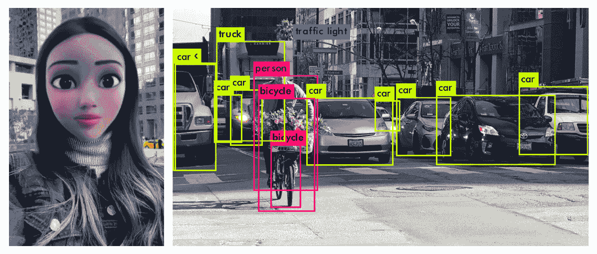

Examples of Artificial Intelligence applications - A Disney-character selfie filter (left, [source](https://thetab.com/uk/2020/12/07/cartoon-filter-snapchat-instagram-tiktok-how-to-185263)) and vehicular object detection (right, [source](https://viso.ai/deep-learning/yolov3-overview/))

MediaPipe 为手跟踪等常见任务提供了基石机器学习模型，因此消除了许多机器学习应用程序存在的相同的发展瓶颈。这些模型，以及它们过于易用的 API，反过来简化了开发过程，缩短了许多依赖计算机视觉的应用程序的项目生命周期。

在本教程中，**我们将学习如何使用 MediaPipe 的一些 Python API**只用几行代码来完成基本的计算机视觉任务，包括面部跟踪和姿势提取。我们甚至会看到这些数据是如何被用来驱动像[搅拌机](https://www.blender.org/)中的面部动作捕捉这样的工具的！让我们开始吧。

<https://www.assemblyai.com/blog/content/media/2022/04/faces_crop-1.mp4>


Facial motion capture data in the Blender 3D animation software

## 介绍

MediaPipe 是 Google 的一个项目，它为直播和流媒体提供“开源、跨平台、可定制的 ML 解决方案”。换句话说，MediaPipe 提供了对各种强大的机器学习模型的访问**，这些模型是考虑到移动设备的硬件限制而构建的**。这些模型包括:

*   **解剖模型**
    *   手跟踪
    *   姿态跟踪
    *   面部网格跟踪
    *   Holstic 跟踪(3 个以上组合)
*   **分割模型**
    *   序列分割
    *   头发分割
*   **对象模型**
    *   2D 目标检测/跟踪
    *   三维物体检测和姿态估计

现在让我们看看如何在 Python 中使用这些 API！

## 入门指南

在我们开始使用 MediaPipe 本身之前，我们需要执行一些初步的安装/导入。如果你只是想跟着做，而不是必须这样做，你可以打开这个 [Colab 笔记本](https://colab.research.google.com/drive/1JrbV8PzQLrBZcxWYLDHvaClYHbmu6X52?usp=sharing)并继续到[的下一部分](https://www.assemblyai.com/blog/mediapipe-for-dummies/#face-mesh-and-motion-capture-with-mediapipe)。

### 装置

MediaPipe 适用于 C++、Android 等；但是，在本教程中，我们将只使用 Python。要安装 MediaPipe for Python，只需将它安装到您想要的环境中:

```py
pip install mediapipe
```

如果你想完全按照这个教程来做，你可以跳过上面直接安装 MediaPipe 的步骤，而是从[关联的 GitHub](https://github.com/AssemblyAI-Examples/mediapipe-python) 中的需求文件中选择`pip install`。为此，导航到要克隆项目文件夹的目录，并在命令提示符/终端中执行以下命令:

**窗户**

```py
git clone https://github.com/AssemblyAI-Examples/mediapipe-python.git
cd mediapipe-python
python3 -m venv mp_env
mp_env\Scripts\activate.bat
pip install -r requirements.txt
```

**类 UNIX 系统**

```py
git clone https://github.com/AssemblyAI-Examples/mediapipe-python.git
cd mediapipe-python
python3 -m venv mp_env
source mp_env/bin/activate
pip install -r requirements.txt
```

然后，打开`notebook.ipynb` Jupyter 笔记本，跟着代码走，(注意，`mp_env`虚拟环境需要作为内核添加到 Jupyter 中)。

### 进口

接下来，我们用一些 Python 导入和变量声明来完成设置:

```py
import cv2
import mediapipe as mp
import urllib.request
import numpy as np
import pickle
import matplotlib as mpl
import matplotlib.pyplot as plt
from matplotlib import animation
import PyQt5
from PIL import Image
from IPython.display import Video
import nb_helpers

mp_drawing = mp.solutions.drawing_utils
mp_drawing_styles = mp.solutions.drawing_styles
mp_holistic = mp.solutions.holistic
mp_pose = mp.solutions.pose
mp_face_mesh = mp.solutions.face_mesh
```

## 使用 MediaPipe 进行面部网格和运动捕捉

为了开始使用 MediaPipe，我们将首先探索它的 Face Mesh API，并了解它如何作为后端来支持 Blender 中的面部动作捕捉等应用程序。

### 图像获取

首先，使用以下命令获取图像:

```py
face_url = "https://1vw4gb3u6ymm1ev2sp2nlcxf-wpengine.netdna-ssl.com/wp-content/uploads/shutterstock_149962697-946x658.jpg"
urllib.request.urlretrieve(face_url, "face_image.jpg")

img = Image.open('face_image.jpg')
display(img)
```

这将下载下图作为`face_image.jpg`


让我们看看如何使用 MediaPipe 来分析这个图像！

### 人脸网格处理

我们将使用 MediaPipe 的`FaceMesh`对象来提取对应于图像中面部表面的 3D 网格。

```py
# Define image filename and drawing specifications
file = 'face_image.jpg'
drawing_spec = mp_drawing.DrawingSpec(thickness=1, circle_radius=1)

# Create a face mesh object
with mp_face_mesh.FaceMesh(
        static_image_mode=True,
        max_num_faces=1,
        refine_landmarks=True,
        min_detection_confidence=0.5) as face_mesh:

    # Read image file with cv2 and process with face_mesh
    image = cv2.imread(file)
    results = face_mesh.process(cv2.cvtColor(image, cv2.COLOR_BGR2RGB))

# Define boolean corresponding to whether or not a face was detected in the image
face_found = bool(results.multi_face_landmarks)
```

其他详细信息

`FaceMesh`的参数提供了在处理我们的图像时会用到的附加信息。

*   `static_mode=True`指定我们将使用该对象处理静态图像(与视频流相反)。
*   `max_num_faces=1`指定`FaceMesh`最多检测一张脸。
*   `refine_landmarks=True`应用注意力网格模型来细化眼睛和嘴唇周围的界标坐标，并输出虹膜周围的附加界标。
*   最后，`min_detection_confidence=0.5`为返回识别的面部所需的检测置信度设置下限。该值对应于一个概率，因此其值必须在[0.0，1.0]内。

用 OpenCV ( `cv2`)读取图像会产生 BGR 颜色通道，因此图像在被`face_mesh.process()`处理之前首先被转换成 RGB

请注意，下面这条线是魔法发生的地方:

```py
results = face_mesh.process(cv2.cvtColor(image, cv2.COLOR_BGR2RGB)) 
```

所有的处理都是用一行简单的代码完成的。经过处理后，我们得到了高度精确的结果，不需要任何数据收集、数据准备、模型定义、模型调整、模型测试等。这就是 MediaPipe 的价值——它提供了对几个非常强大的机器学习模型的轻松访问，这些模型产生易于解析的结果。现在让我们来看看我们能用这些结果做些什么。

### 绘图面网格镶嵌

我们可以使用 MediaPipe 的[绘图工具](https://github.com/google/mediapipe/blob/master/mediapipe/python/solutions/drawing_utils.py)在我们的图像上可视化我们的结果。

```py
if face_found:
    # Create a copy of the image
    annotated_image = image.copy()

    # Draw landmarks on face
    mp_drawing.draw_landmarks(
        image=annotated_image,
        landmark_list=results.multi_face_landmarks[0],
        connections=mp_face_mesh.FACEMESH_TESSELATION,
        landmark_drawing_spec=None,
        connection_drawing_spec=mp_drawing_styles
            .get_default_face_mesh_tesselation_style())

    # Save image
    cv2.imwrite('face_tesselation_only.png', annotated_image)

# Open image
img = Image.open('face_tesselation_only.png')
display(img)
```

其他详细信息

`draw_landmarks()`的参数提供了显示镶嵌所需的附加信息。

*   `image=annotated_image`指定我们想要将镶嵌图映射到的图像。
*   `landmark_list=results.multi_face_landmarks[0]`指定将要绘制到图像上的地标的位置数据。`results.multi_face_landmarks`是包含媒体管道`NormalizedLandmarkList`的列表，每个面一个。由于我们的图像只有一个面，我们通过指定它的索引(`[0]`)来访问`results.multi_face_landmarks`的唯一的`NormalizedLandmarkList`元素，并最终将这个列表设置为`landmark_list`参数。
*   `NormalizedLandmarkList` s 是*有序的*列表，`mp_face_mesh.FACEMESH_TESSELATION`对象是一个冻结的集合，定义了这些列表中的点如何连接。我们指定这些与`connections=mp_face_mesh.FACEMESH_TESSELATION`的联系。
*   `landmark_drawing_spec=drawing_spec`使用我们在上面设置的绘图规范，在每个地标处绘制一个绿色小圆圈。
*   最后，`connection_drawing_spec=mp_drawing_styles .get_default_face_mesh_tesselation_style()`对界标之间的连接使用默认的绘图规范。

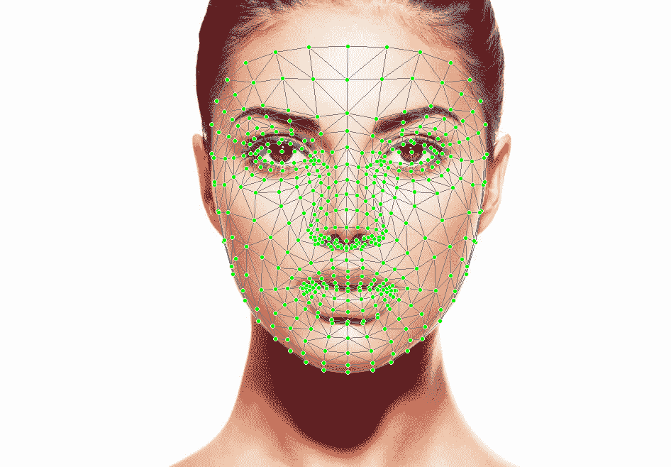

Face image with MediaPipe Face Mesh drawn on top

### 绘制人脸网格轮廓和虹膜

我们的`results`对象不仅仅包含面部镶嵌信息。脸部的轮廓和虹膜也可以被识别，并且可以被分别绘制。现在让我们在原始图像上绘制两者:

```py
if face_found:
    # Create a copy of the image
    annotated_image = image.copy()

    # For each face in the image (only one in this case)
    for face_landmarks in results.multi_face_landmarks:

        # Draw the facial contours of the face onto the image
        mp_drawing.draw_landmarks(
            image=annotated_image,
            landmark_list=face_landmarks,
            connections=mp_face_mesh.FACEMESH_CONTOURS,
            landmark_drawing_spec=None,
            connection_drawing_spec=mp_drawing_styles
                .get_default_face_mesh_contours_style())

        # Draw the iris location boxes of the face onto the image
        mp_drawing.draw_landmarks(
            image=annotated_image,
            landmark_list=face_landmarks,
            connections=mp_face_mesh.FACEMESH_IRISES,
            landmark_drawing_spec=None,
            connection_drawing_spec=mp_drawing_styles
                .get_default_face_mesh_iris_connections_style())

	# Save the image
    cv2.imwrite('face_contours_and_irises.png', annotated_image)
```

此代码的细节与上面的镶嵌代码非常相似，所以请参见上面部分中的“附加细节”下拉列表以了解更多信息。

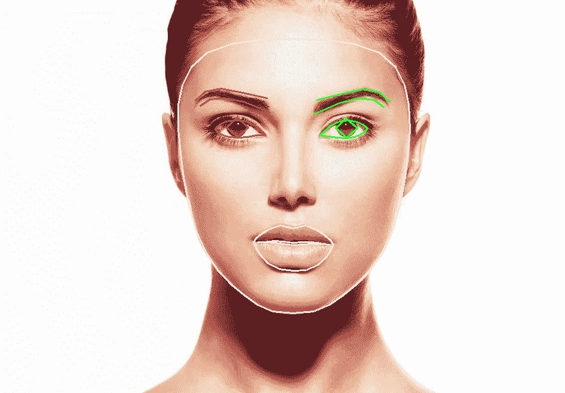

### 使用混合器进行面部网格运动捕捉

简单地将我们的结果绘制到图像上当然很好，但是如果我们真的想用这些数据做些什么呢？除了处理图像，MediaPipe 还可以处理视频，以获取时序 XYZ 空间面部网格数据。然后我们可以有效地导出这些数据，可以使用 MediaPipe 作为“后端”来计算[动作捕捉](https://en.wikipedia.org/wiki/Motion_capture)数据。 [BlendArMocap](https://github.com/cgtinker/BlendArMocap) ，一个为 [Blender](https://www.blender.org/) 3D 图形和动画软件开发的开源项目，就是这么做的。

以下是使用 BlendArMocap 导入 Blender 的 3D 面部网格数据的几个视图:

<https://www.assemblyai.com/blog/content/media/2022/04/faces_crop-2.mp4>


Facial tracking data imported into Blender

这个数据可以用来驱动一个“装备”，它定义(在这种情况下)一个人形解剖结构。从这里，可以将角色模型映射到装备上，以便在 3D 中制作角色模型的动画。

<https://www.assemblyai.com/blog/content/media/2022/04/face_blender.mp4>


Blender rig driver by MediaPipe facial tracking data

很难轻描淡写这个过程有多令人印象深刻 -一系列 2D 图像数据，它只是许多 RGB 值的数组，经过处理，人脸被自动识别。然后识别面部的显著特征，并随时间进行跟踪，在每一帧提取 3D 数据。然后，这些数据被用于制作角色运动的动画，以进行可能具有照片真实感的渲染，这种渲染可以结合光线跟踪、VFX 等技术。

整个过程由 MediaPipe 和 OpenCV 提供支持。

虽然使用像 BlendArMocap 这样的开源工具很棒，但一些用户可能出于自己的目的想要处理视频和原始数据。现在让我们来看看如何做到这一点:

## 基于 MediaPipe 的姿态检测和分割

MediaPipe 的姿势检测类似于人脸网格，除了它不出所料地识别人的姿势而不是人脸。现在让我们来探索一下这种能力。

### 姿态处理和绘制

首先，与之前一样，我们下载将用于处理的图像:

```py
img_url = "https://static.turbosquid.com/Preview/2015/11/10__11_56_36/anthonystanding23dmetry3dhuman01.jpg5e774d4d-9b9e-456d-9d7b-fc4d741cf940Large.jpg"
urllib.request.urlretrieve(img_url, "pose.jpg")

img = Image.open('pose.jpg')
display(img)
```

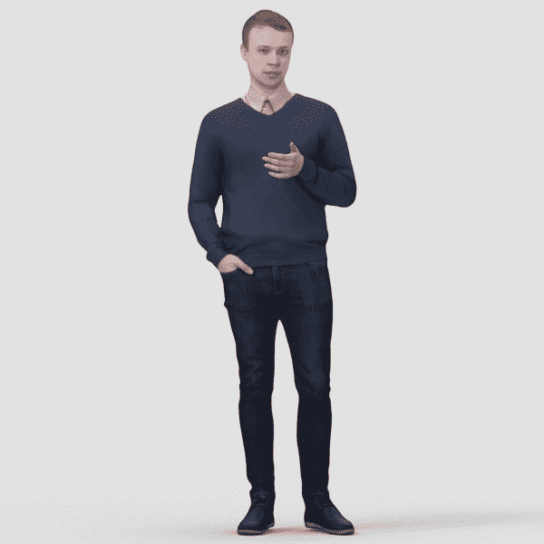

我们可以再次用 MediaPipe 对象处理这个图像，这次使用一个`Pose`实例，并在图像上绘制检测到的姿态。这一步的细节实际上与面网格的情况是同构的，所以要获得更深入的解释，请参见上一节。

```py
# Specify the image filename
file = 'pose.jpg'

# Create a MediaPipe `Pose` object
with mp_pose.Pose(static_image_mode=True, 
		  model_complexity=2,
                  enable_segmentation=True) as pose:

    # Read the file in and get dims
    image = cv2.imread(file)

    # Convert the BGR image to RGB and then process with the `Pose` object.
    results = pose.process(cv2.cvtColor(image, cv2.COLOR_BGR2RGB))

# Copy the iamge
annotated_image = image.copy()

# Draw pose, left and right hands, and face landmarks on the image with drawing specification defaults.
mp_drawing.draw_landmarks(annotated_image, 
                          results.pose_landmarks, 
                          mp_pose.POSE_CONNECTIONS,
                          landmark_drawing_spec=mp_drawing_styles.get_default_pose_landmarks_style())

# Save image with drawing
filename = "pose_wireframe.png"
cv2.imwrite(filename, annotated_image)

# Open image
display(Image.open(filename))
```

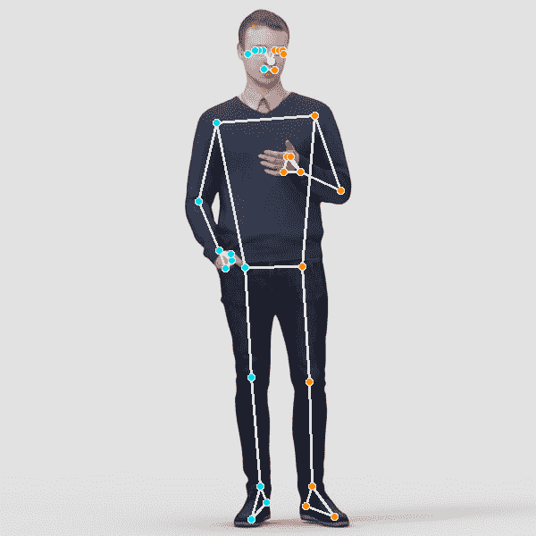

### 图象分割法

我们的结果中包括分割图像所需的信息。图像中的每个像素都被赋予一个位于已识别姿态的对象内的概率。我们只需要设置一个概率阈值，并隔离高于该阈值的所有像素，以隔离该人。让我们现在这样做——我们将用绿色屏幕替换背景。

```py
# Copy the image
segmented_image = image.copy()

# Probability threshold in [0, 1] that says how "tight" to make the segmentation. Greater value => tighter.
tightness = .3

# Stack the segmentation mask for 3 RGB channels, and then create a filter for which pixels to keep
condition = np.stack((results.segmentation_mask,) * 3, axis=-1) > tightness

# Creates a black background image
bg_image = np.zeros(image.shape, dtype=np.uint8)

# Can change the color of this background by specifying (0-255) RGB values. We choose green-screen green.
bg_image[:] = [4, 244, 4]

# For every pixel location, display the corresponding pixel from the original imgae if the condition in our filter is met (i.e. the probability of being part of the object is above the inclusiogn threshold), or else display corresponding pixel from the background array (i.e. green)
segmented_image = np.where(condition, segmented_image, bg_image)

filename = "pose_green_screen.png"
cv2.imwrite(filename, segmented_image)
display(Image.open(filename))
```

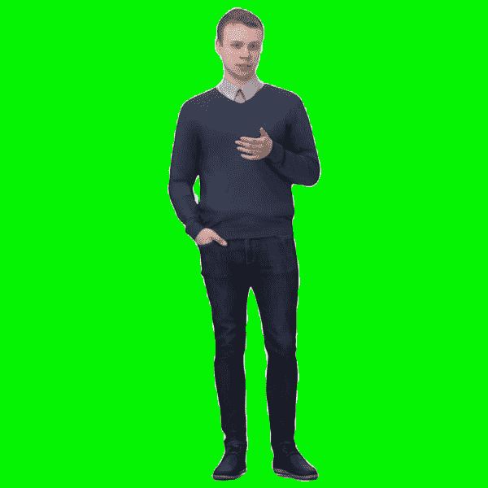

## 从 MediaPipe 导出原始数据

从 MediaPipe 导出原始 XYZ 数据非常容易，但是我们需要一些额外的信息来以一种可理解的方式绘制数据。

特别是，理解 **MediaPipe 以一致有序的方式存储地标**是很重要的。也就是说，`mp.solutions.pose.PoseLandmark`指定了`results.pose_landmarks`(图像处理后的输出)中的哪个 XYZ 坐标对应于哪个身体标志(鼻子、右肘等)。).注意，列表中身体标志的顺序是任意的*，但是*在每次运行的 MediaPipe 中是一致的。您可以通过`nb_helpers.poselandmarks_list`访问更易读的解剖标志有序列表。

MediaPipe 的`POSE_CONNECTIONS`对象是一个包含元组的冻结集，这些元组定义了**这些地标如何相互映射**。例如，元组`(0, 4)`在`POSE_CONNECTIONS`中，表示`results.pose_landmarks`中的第 0 个和第 4 个空间点相互连接(分别对应于`mp.solutions.pose.PoseLandmark`中的“鼻子”和“左 _ 外 _ 眼”——第 0 个和第 4 个身体地标)。让我们打印出一些这样的联系，使这个想法具体化:

```py
poselandmarks_list = nb_helpers.poselandmarks_list

num = 0
for i in mp_holistic.POSE_CONNECTIONS:
    if num < 5:
        print(poselandmarks_list[i[0]], '-->', poselandmarks_list[i[1]])
    else:
        break
    num += 1
```

```py
LEFT_WRIST --> LEFT_THUMB
RIGHT_WRIST --> RIGHT_INDEX
RIGHT_PINKY --> RIGHT_INDEX
LEFT_EYE_OUTER --> LEFT_EAR
RIGHT_ELBOW --> RIGHT_WRIST
```

理解了这一点，我们就可以处理原始的 MediaPipe 空间数据了。让我们将上面的姿势数据保存为一个 NumPy 数组，然后显示它

```py
# Create a 3x33 array to store XYZ data for 33 landmarks
data = np.empty((3, len(mp_holistic.PoseLandmark)))

# Store the XYZ data for each landmark
landmarks = results.pose_world_landmarks.landmark
for i in range(len(mp_holistic.PoseLandmark)):
    data[:, i] = (landmarks[i].x, landmarks[i].y, landmarks[i].z)   

# Plot the data
fig = plt.figure()
fig.set_size_inches(5, 5, True)
ax = fig.add_subplot(projection='3d')

nb_helpers.plot_data(data, ax)
nb_helpers.scale_axes(ax)

# Save a rotation animation of the data
filename = 'pose_rotation.mp4'
nb_helpers.rotate_and_save(fig, ax, filename, save=True)
```

其他详细信息

*   `nb_helpers.plot_data()`函数简单地绘制出每个标志点，然后遍历`POSE_CONNECTIONS`在相关点之间绘制直线。数据还会旋转，以便更好地为 PyPlot 绘图定位。
*   `nb_helpers.scale_axes()`功能缩放轴，以沿不同轴绘制单位长度相等的数据。
*   最后，`nb_helpers.rotate_and_save()`函数创建一个旋转动画，并将其保存为`.mp4`，这样我们就可以观察我们的数据。

所有这些函数都可以在 [GitHub](https://github.com/AssemblyAI-Examples/mediapipe-python/blob/main/nb_helpers.py) 上的`nb_helpers.py`文件中找到，但是它们实现的细节不在本文的讨论范围之内，所以省略了细节。

<https://www.assemblyai.com/blog/content/media/2022/04/pose_rotation.mp4>


我们看到，我们已经成功地绘制了原始 MediaPipe 空间数据，并创建了一个动画来观察它。您可以将数据 NumPy 数组保存为下游任务所需的任何导出格式。

## 在 MediaPipe 中处理视频数据

我们将深入探讨的 MediaPipe 的最后一个方面是如何处理**视频数据**。我们将特别处理保存的视频文件，但同样的原则也适用于实时摄像机数据。****

我们将使用 MediaPipe 提取一个人行走的时序姿态:

```py
# Download the necessary video
url = 'https://github.com/AssemblyAI-Examples/mediapipe-python/blob/main/walking.mp4?raw=true'
urllib.request.urlretrieve(url, 'walking.mp4') 

# Specify the video filename and create a `Pose` object as before
file = 'walking.mp4'
with mp_pose.Pose(min_detection_confidence=0.5, min_tracking_confidence=0.5) as pose:

	# Create VideoCapture object
    cap = cv2.VideoCapture(file)

	# Raise error if file cannot be opened
    if cap.isOpened() == False:
        print("Error opening video stream or file")
        raise TypeError

	# Get the number of frames in the video
    length = int(cap.get(cv2.CAP_PROP_FRAME_COUNT))

    # Create a NumPy array to store the pose data as before
    # The shape is 3x33x144 - 3D XYZ data for 33 landmarks across 144 frames
    data = np.empty((3, len(poselandmarks_list), length))    

	# For each image in the video, extract the spatial pose data and save it in the appropriate spot in the `data` array 
    frame_num = 0
    while cap.isOpened():
        ret, image = cap.read()
        if not ret:
            break

        image = cv2.cvtColor(cv2.flip(image, 1), cv2.COLOR_BGR2RGB)
        results = pose.process(image)

        landmarks = results.pose_world_landmarks.landmark
        for i in range(len(mp_pose.PoseLandmark)):
            data[:, i, frame_num] = (landmarks[i].x, landmarks[i].y, landmarks[i].z)  

        frame_num += 1

    # Close the video file
    cap.release()
```

数据的形状是横跨 144 帧的 33 个解剖位置的三维 XYZ 数据。同样，我们绘制数据并制作动画，除了在这个例子中，我们用另一个辅助函数来制作动画。我们还绘制了原始视频。注意，绘制的数据看起来是镜像的——这是因为姿态检测对由视频帧捕获的图像起作用，

```py
fig = plt.figure()
fig.set_size_inches(5, 5, True)
ax = fig.add_subplot(projection='3d')

anim = nb_helpers.time_animate(data, fig, ax)

# Save
anim.save('walking_wireframe.mp4', fps=30, extra_args=['-vcodec', 'libx264'], dpi=300)
```

<https://www.assemblyai.com/blog/content/media/2022/04/walkingosp-2.mp4>


## Python 的更多 MediaPipe 解决方案

到目前为止，我们已经使用 Python 查看了 MediaPipe 的面部网格和姿态检测功能。我们已经看到了如何通过在图像上显示地标或将空间数据封装在 NumPy 数组中来直接使用 MediaPipe，或者如何通过在它的*顶部*构建的工具来间接使用 MediaPipe，例如使用`BlendArMocap`将运动捕捉数据传输到 Blender。虽然我们只探索了两种 MediaPipe 解决方案，但它还有更多解决方案。

### 人脸检测

如果你的应用不需要人脸*网格*而只需要人脸检测，你可以使用 [MediaPipe 人脸检测](https://google.github.io/mediapipe/solutions/face_detection)。该解决方案可以识别人脸，并在人脸网格的一小部分时间内返回 6 个标志。它甚至适用于多张脸！如果您需要低延迟的人脸检测，这是您的解决方案。

### 手跟踪

虽然 MediaPipe Pose 只提供了一个带有两个标志的手的粗略模型，只是为了测量方向， [MediaPipe Hands](https://google.github.io/mediapipe/solutions/hands) 提供了一个更详细的手模型。双手识别*二十一个* 3D 地标，甚至可以为多只手工作。这个解决方案有大量的应用，包括像[手语识别](https://www.sicara.ai/blog/sign-language-recognition-using-mediapipe)这样的无障碍解决方案。

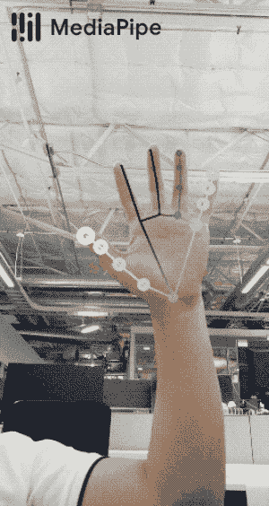

Hand Tracking with MediaPipe (darker points are further away)

### 整体跟踪

[MediaPipe 整体](https://google.github.io/mediapipe/solutions/holistic)是最重的解剖型 MediaPipe 模型，将手、姿势和面部网格结合成**一个**解决方案。虽然肯定不是一个轻量级的解决方案，但整体提供了一个人在给定时间的非常详细的快照。就像之前的面部网格一样，整体可以用于低成本的运动捕捉。

下面你可以看到通过`BlendArMocap`制作的全身装备动画。我几乎不能被认为是一个搅拌机初学者，因此没有足够的技巧来平滑身体动画。即使这样，头部/面部运动，尤其是手部运动看起来非常自然，对于仅在带有简单网络摄像头的笔记本电脑上工作来说，这是令人印象深刻的结果。

<https://www.assemblyai.com/blog/content/media/2022/04/holistic_blender.mp4>


如上所述，您最终可以使用这些 2D 视频数据来驱动 3D 角色模型。这是某人在笔记本电脑上使用 Blender 累计 4 小时的结果:

<https://www.assemblyai.com/blog/content/media/2022/03/0001-0250.mp4>


虽然肯定不是完美的，但是结果可以作为改进的基线。MediaPipe 中的腿部跟踪可能很挑剔，您可能已经从上面从行走的人的视频中提取姿势信息的例子中注意到了。由此产生的误差会在模型中传播，所以对于那些有兴趣进一步研究这个概念的人来说，专注于解决这个问题是一个很好的起点。请注意，BlendArMocap 是一个**开源**项目，因此可以探索这种改进(尽管真正的力量最终来自于 MediaPipe，因此受到了 media pipe/硬件的瓶颈限制)。

### 自拍分割

[MediaPipe 自拍分割](https://google.github.io/mediapipe/solutions/selfie_segmentation)分割图像/视频中最前面的人，允许如下图所示的虚拟背景或变焦背景。该解决方案适用于智能手机和笔记本电脑。

<https://www.assemblyai.com/blog/content/media/2022/04/selfie_seg-2.mp4>


Selfie Segmentation with MediaPipe

### Objectron

[MediaPipe Objectron](https://google.github.io/mediapipe/solutions/objectron) 是一款实时 3D 物体检测解决方案，适用于日常物体，可以在移动平台上运行。Objectron 既能检测物体，又能估计它们的姿态。

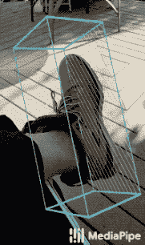

Object Tracking with MediaPipe

## 非 Python 媒体管道解决方案

如前所述，MediaPipe 有许多其他解决方案，在 Android、iOS、C++、JavaScript 和 [Coral](https://www.assemblyai.com/blog/pytorch-vs-tensorflow-in-2022/#tensorflow-1) 上有不同的可用性。

### 彩虹女神

[MediaPipe Iris](https://google.github.io/mediapipe/solutions/iris) 是一种用于精确虹膜估计的解决方案，仅用一个摄像头就能跟踪虹膜、瞳孔和眼睛轮廓标志。由于可变的光线条件和遮挡，这项任务通常很难完成，尤其是在智能手机这样的有限计算环境中。MediaPipe Iris 提供了克服这些障碍的解决方案。


Iris detection with MediaPipe

### 头发分割

[MediaPipe 头发分割](https://google.github.io/mediapipe/solutions/hair_segmentation)就像自拍分割一样，只不过它只分割一个人的头发。这种解决方案可用于支持 SnapChat Lens 等增强现实应用。


Hair Segmentation with MediaPipe

### 目标检测

[MediaPipe 对象检测](https://google.github.io/mediapipe/solutions/object_detection)类似于 Objectron，除了面部不做姿态估计，而是只识别边界框。这种解决方案更加轻量级，因此对于不需要对象姿态的应用程序是首选。

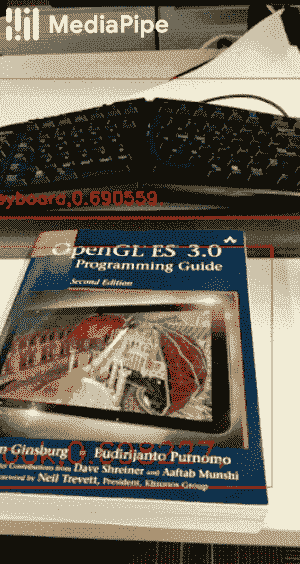

Object Detection with MediaPipe

### 盒子跟踪

[媒体管道框跟踪](https://google.github.io/mediapipe/solutions/box_tracking)类似于对象检测，除了它提供了更强大的边界框功能。框跟踪记录带有时间戳的边界框。


Box Tracking with MediaPipe

### 即时运动跟踪

[MediaPipe 即时运动跟踪](https://google.github.io/mediapipe/solutions/instant_motion_tracking)对于增强现实应用很有价值，低成本 VFX 的用途也很明显。运动跟踪实际上是建立在盒子跟踪之上的。

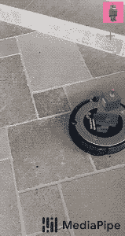

Instant Motion Tracking with MediaPipe - [source](https://google.github.io/mediapipe/solutions/instant_motion_tracking)

### 刀

[MediaPipe KNIFT](https://google.github.io/mediapipe/solutions/knift) ，或关键点神经不变特征变换，是一种基于模板的特征匹配解决方案。能够从不同的角度理解空间关系是一个困难的问题，也是各种应用的基础。KNIFT 是解决这一问题的通用解决方案，对光照、方向和缩放的变化具有鲁棒性。


Results of MediaPipe's KNIFT - [source](https://google.github.io/mediapipe/solutions/knift)

### 自动滑动

[auto slip](https://google.github.io/mediapipe/solutions/autoflip)是一个简单的解决方案，允许将视频智能裁剪为任意纵横比。

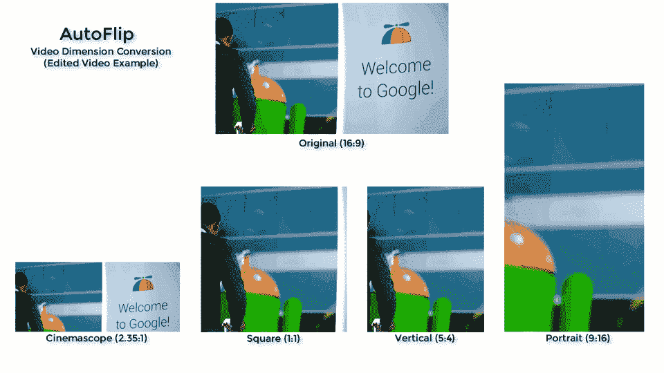

Results of MediaPipe's AutoFlip - [source](https://google.github.io/mediapipe/solutions/autoflip)

## 最后的话

MediaPipe 是一个非常强大的工具，可以帮助开发基于大量机器学习功能的应用程序。MediaPipe 极其简单的 API 提供了对几种先进(SOTA)模型的访问，这些模型是专门针对移动计算的硬件限制而构建的。

虽然 MediaPipe 为计算机视觉和视觉智能提供了许多出色的解决方案，但今天有许多应用程序依赖于*音频智能*。AssemblyAI 易于使用的 API 提供了对一系列音频智能 SOTA 模型的访问，就像 MediaPipe 提供了对 SOTA 视觉智能模型的访问一样。获取下面的 API 令牌，免费访问大量用于情感分析、实体检测、PII 编辑等的音频智能解决方案。

[Get a Free API Token](https://app.assemblyai.com/signup)