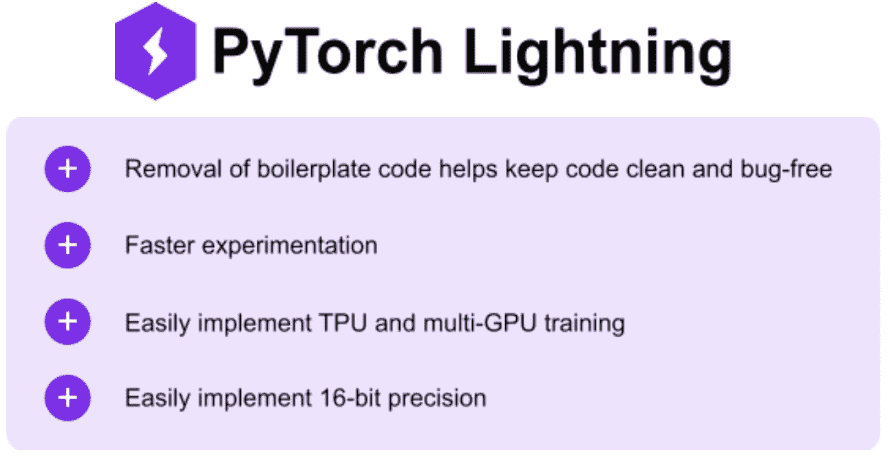
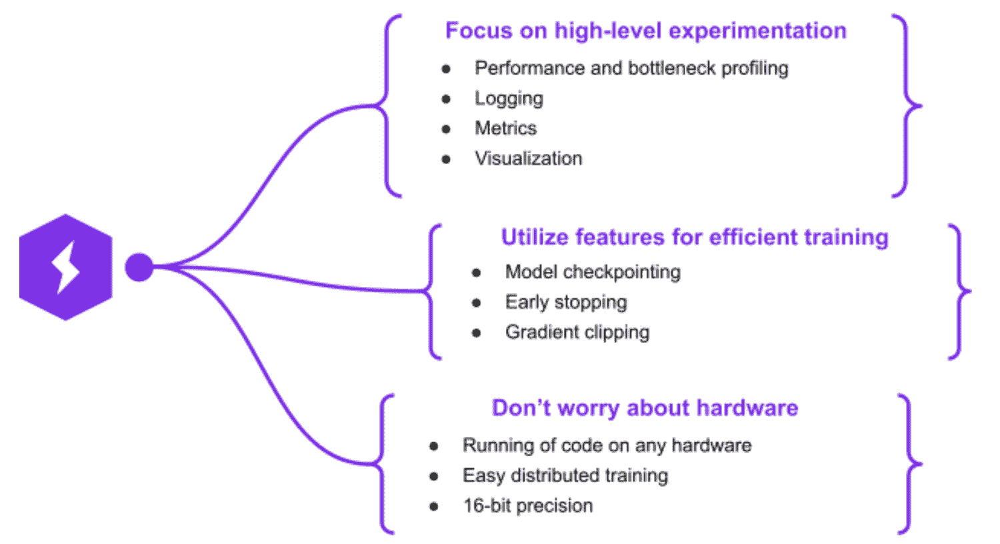
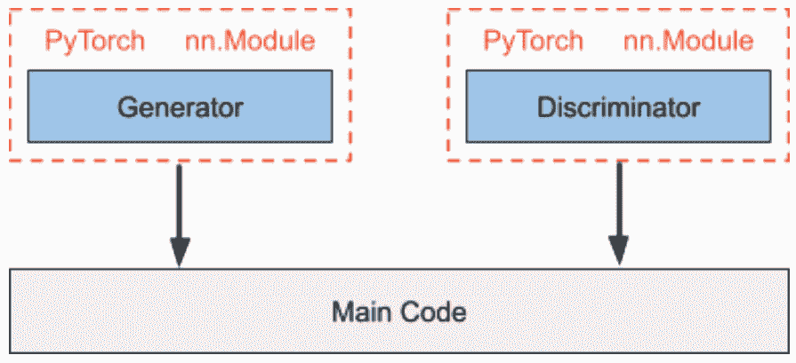
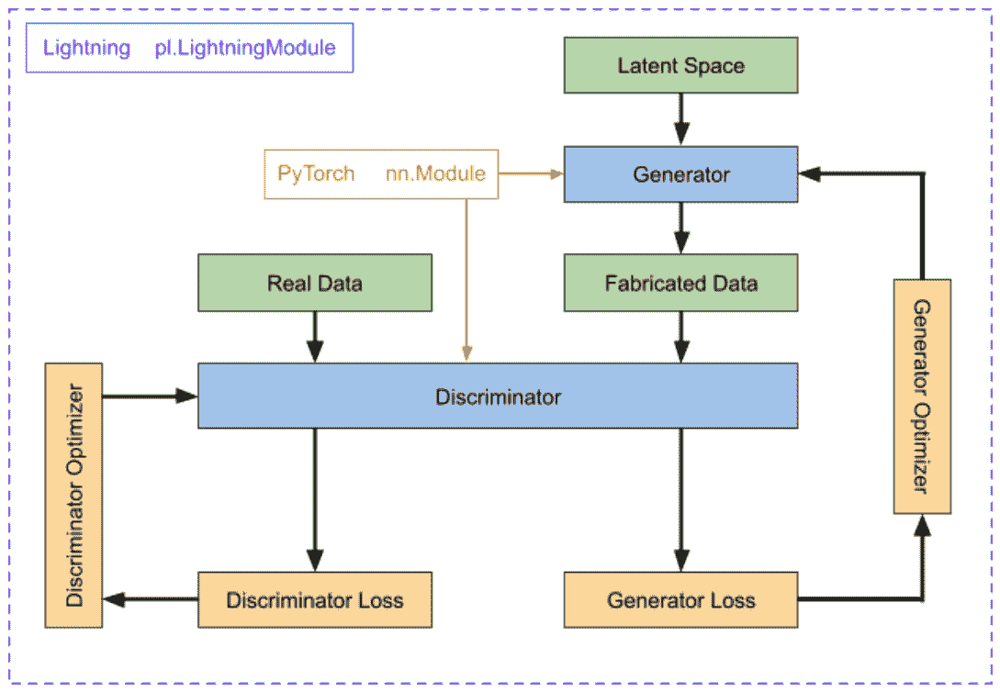
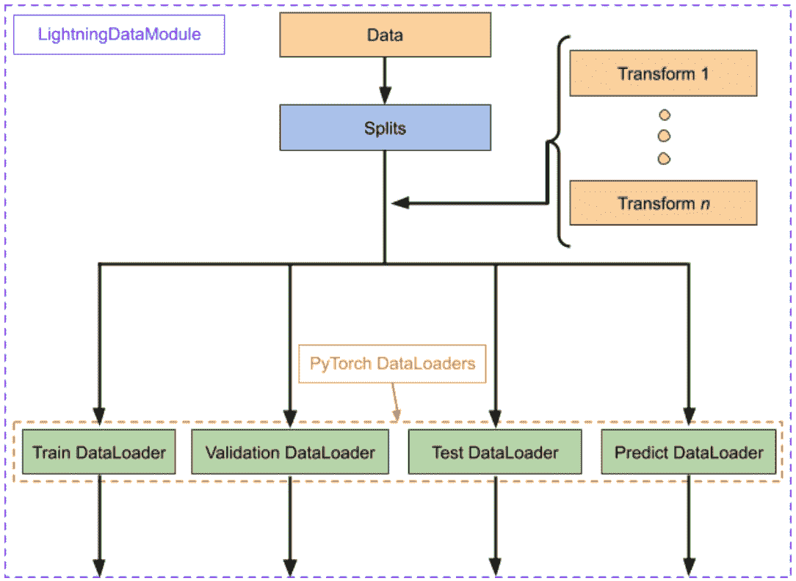
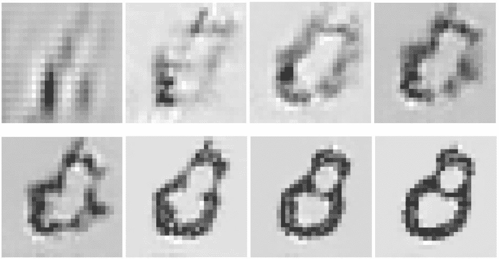
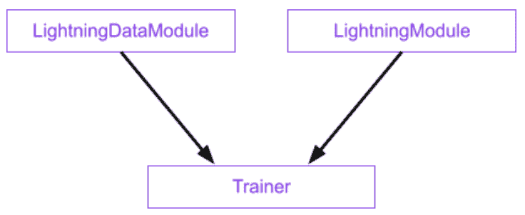
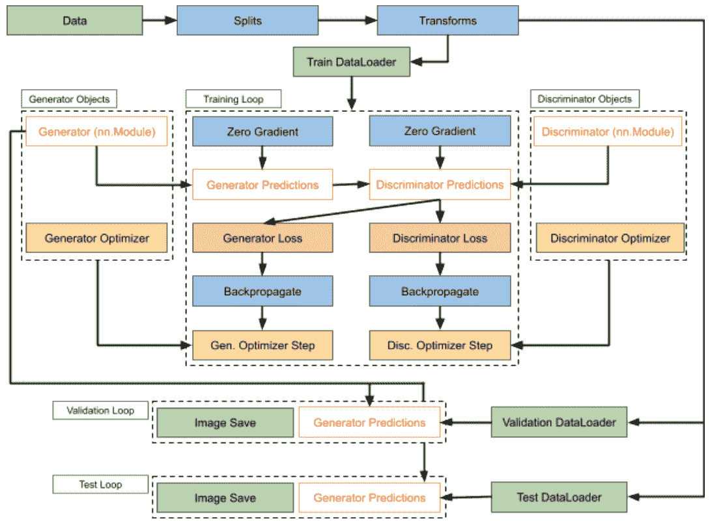

# 假人用 PyTorch 闪电-教程和概述

> 原文：<https://www.assemblyai.com/blog/pytorch-lightning-for-dummies/>

当训练深度学习模型时，有许多独立于实验/训练代码的标准“样板”代码。PyTorch Lightning 将这些样板代码抽象化，从而使实验和分布式培训更加容易。

在本教程中，我们将探索闪电和普通 PyTorch 之间的差异，了解闪电的工作流程，然后建立和训练一个模型来查看闪电的行动。我们开始吧！

## Pytorch 闪电是什么？

[PyTorch](https://pytorch.org/) 是一个灵活且流行的深度学习框架，使得构建和训练标准的深度学习模型变得轻而易举；然而，随着模型复杂性的增长，开发过程会很快变得混乱。从实施多 GPU 训练到消除标准训练循环中的错误，这些困难会阻碍建模过程，进而影响项目时间表。削减细节，专注于高层次的作品不是很好吗？

进入: [PyTorch 闪电](https://www.pytorchlightning.ai/)。Lightning 是 PyTorch 的一个**高级框架**，它抽象出了实现细节，因此您可以专注于构建优秀的模型，而不必浪费时间在琐碎的细节上。好处多多:

Benefits of PyTorch Lightning

## 如何安装 PyTorch 闪电

首先，我们需要安装闪电。打开命令提示符或终端，如果需要，激活 virtualenv/conda 环境。使用以下命令之一安装 PyTorch:

点

| pip 安装 pytorch-lightning |

康达

| 康达安装 pytorch-lightning -c 康达-forge |

## 闪电 vs 香草

PyTorch 闪电是建立在普通(香草)PyTorch 之上的。Lightning 的目的是提供一个研究框架，允许进行**快速实验**和**可伸缩性**，这是通过去除样板文件和硬件参考代码的 OOP 方法实现的。这种方法产生了一系列的好处。

How PyTorch Lightning compares to PyTorch

## PyTorch 闪电工作流程

Lightning 最大的好处之一是它的易用性，这源于它本质上是一个与硬件无关的样本 PyTorch 包装器。这实际上意味着代码**与 vanilla PyTorch 的**完全相同，但是它是以方便的面向对象的方式进行转换的，这使得用户可以专注于训练过程的重要组成部分。这种差异主要体现在 **PyTorch 型号**和 **Lightning 模块**之间的差异上。

### PyTorch 模块

PyTorch `nn.Module`类是 PyTorch 中神经网络的基类，所有的设计都是从这个基类派生出来的。虽然一个模块可能以嵌套的方式包含其他模块，但通常不会这样做。

考虑训练生成性对抗网络(GAN)的情况。在这样的网络中，生成器创建*伪造的*数据，旨在模拟一组*真实的*数据，鉴别器试图区分真实数据和伪造数据。

在 vanilla PyTorch 中，定义和训练这样一个系统的典型方式是通过子类化`nn.Module`来创建生成器和鉴别器类，然后在主代码中实例化和调用它们，在主代码中，您已经手动定义了向前传递、损失计算、向后传递和优化器步骤。

### 闪电模块

相比之下，`LightningModule`定义了一个完整的深度学习**生态系统**。继续训练 GAN 的例子，我们有生成器和鉴别器模型、损失函数、训练/测试/验证函数和优化器。整个*系统*被**闪电模块**封装。

值得注意的是，`LightningModule`并没有在普通 PyTorch 代码的基础上构建*抽象*,而是简单地用一种更有效和更干净的方式组织。

### 闪电模块组件

lightning 模块由六个组件组成，这六个组件完整地定义了系统:

*   模型或模型系统
*   优化程序
*   火车环线
*   验证循环
*   测试循环
*   预测循环

只有这些组件中的每一个的基本特征在其各自的类别/功能中被定义。这种样板文件的去除使得代码更加整洁，并且降低了犯小错误的可能性；然而，训练的任何部分(例如向后传球)都可以被忽略以保持灵活性。

现在我们对 Lightning 工作流有了更好的了解，让我们深入到一个突出 Lightning 的强大和简单的例子中去吧！

## 用 PyTorch 闪电建造 GAN

我们将使用闪电构建一个 GAN，然后将其与香草 PyTorch 进行比较，突出闪电使我们的生活更加轻松的地方。首先，简单回顾一下 GANs(或介绍给外行人)。

### 生成对抗网络

深度学习是各种任务不可或缺的工具。在 AssemblyAI，我们利用它的功能，如[实体检测](https://www.assemblyai.com/blog/introducing-entity-detection-detect-named-entities-in-audio-video/)、[情感分析](https://www.assemblyai.com/blog/what-is-sentiment-analysis/)、情感检测、翻译和摘要。深度学习擅长的许多任务都涉及到*处理*数据以提取一些有用的信息，但如果我们想要*生成*数据呢？

[GANs](https://papers.nips.cc/paper/2014/hash/5ca3e9b122f61f8f06494c97b1afccf3-Abstract.html) 允许通过学习反映特定输入数据集分布的分布来生成数据(因此“生成”)。一旦了解了分布，就可以生成与输入数据相似但不同的数据，以至于人类不可能察觉到差异。你能说出下面哪些名人的图片是捏造的吗？

如果你猜“全部”，你就答对了！

GANs 的力量源于这样一个事实，即两个深度学习模型，生成器和鉴别器，在零和游戏中相互对抗(因此是“敌对的”)。随着生成器在制造更有说服力的数据方面变得更好，鉴别器学习变得更擅长微分；随着鉴别者在检测伪造数据时变得越来越有辨识力，生成器学会制造更有说服力的伪造品。

### 甘为闪电中的手写数字

我们将使用规范的 [MNIST 数据集](http://yann.lecun.com/exdb/mnist/)在 Lightning 中构建一个能够再现手写数字的 GAN。首先，我们需要下载并处理这些数据。Lightning 再次以`LightningDataModules`的形式为这个过程提供了一个结构化的框架。

### 闪电数据模块

一个`LightningDataModule`仅仅是 PyTorch `DataLoaders`的集合，带有以可再现的方式准备数据所需的相应转换和下载/处理步骤。它封装了 PyTorch 中处理数据所需的所有步骤:

*   下载并标记
*   清理并保存到磁盘
*   在数据集中加载
*   应用变换
*   包装在数据加载器中

重要的是，一个`LightningDataModule`是**可共享的**和**可重用的**。也就是说，它集中了所有的数据准备任务，以拥有一个自包含的对象，该对象可以通过相同的拆分和转换*精确地*复制数据集。

让我们创造我们的 MNIST。首先，我们用一些相关的参数进行初始化，并创建我们将用来处理原始数据的转换对象。最后，我们创建一个字典，稍后我们将把它传递到我们的`DataLoaders`中。

| 类 类类类类 (pl。LightningDataModule):  def_ _ init _ _(self，data_dir= )。/data" ，batch_size=128，num _ workers = int(OS . CPU _ count()/2)):  super()。_ _ init _ _()  self . data _ dir = data _ dir  self . batch _ size = batch _ sizeself . num _ workers = num _ workers
  self . transform = transforms。撰写([  变换。ToTensor()，  变换。正常化(( 0.1 ，)，( 0.3 ，)  】】)   self . dl _ dict = { |

接下来，我们定义`prepare_data()`函数。它定义了如何下载和标记数据。Lightning 确保用单个进程调用该方法，以避免损坏数据。在这里，我们只需下载我们的训练和测试集。

| defprepare _ data【self】:  数据集。MNIST(self.data_dir，train= True ，download =True)  数据集。MNIST(self.data_dir，train= 假 ，download= 真 ) |

接下来是`setup()`函数。它定义了您可能想要在每个 GPU 上执行的数据操作。使用它来定义数据集，例如拆分/转换数据或构建词汇表。在我们的例子中，我们将使用在类`__init__()`函数中定义的转换，将数据分成训练集、验证集和测试集。

| defsetup(self，stage = None):  #验证数据不是 GAN 严格必需的，但为了完整性添加了  ifstage = =【fit】MNIST(self.data_dir，train= True ，transform = self . transform)  self . Mn ist _ train，self . Mn ist _ val = random _ split(Mn ist _ full，[ 55000 ，5000)MNIST(self.data_dir，train =False，transform=self.transform) |

最后，我们定义培训、验证、测试和预测`DataLoaders`。通常在`setup()`中定义的数据集被简单地包装在`DataLoader`对象中。请注意，鉴于 gan 不寻常的评估协议，其验证数据并非真正必要，但为了完整性，此处添加了`val_dataloader()`。此外，我们在这里没有定义预测`DataLoader`，但是过程是相同的。

| ##对于数据加载器，通常只需将设置中定义的数据集  deftrain _ data loader:  returndata loader(self . mnist _ train，* * self . dl _ dict)  * * self . dl _ dict) deftest _ data loader【self】:  returndata loader |

### 建造闪电模块

回想一下，Lightning 工作流中的中心对象是`LightningModule`，它封装了整个模型生态系统。既然我们已经完成了定义我们的`LightningDataModule`对象，我们可以构建我们的`LightningModule`。在我们的例子中，这个生态系统包括两个模型——生成器和鉴别器。我们现在来定义它们，注意这个过程和 vanilla PyTorch 是一样的。

### 构建鉴别器

首先，我们将把我们的鉴别器构造成一个`nn.Module`。我们将使用一个简单的 CNN，它有两个卷积层，后面是一个完全连接的网络，用于将 28x28 单通道数字图像映射到分类预测。请记住，鉴别器的目的是将图像分类为*真的*或*假的*，因此我们只需要一个输出节点，相比之下，通常为 MNIST 构建的数字分类网络需要十个输出节点。

| 类 判别器 (nn)。模块): 【def】【init __ _ _ _ _ init _()# simple CNN自我。conv1 = nn。conv 2d((t41)、、kernel _ size =)tconv 2d((t58)，，kernel _ size =)2d()  自我。fc1 = nn。线性(【320】，)【self . fc 2 = nn。线性(【50】，【1】) |

接下来，我们定义鉴别器的正向传递。我们使用内核大小为 2 的 max poolings，后跟 ReLU 用于卷积层，并使用 sigmoid 用于最终激活

| defforward(self，x):  x = f . relu(f . max _ pool 2d(self . con v1(x)，2)  x = f . relu(f . max _ pool 2d(self . con v2 _ drop(self . con v2(self 320)  x = f . relu(self . fc1(x))  x = f . dropout(x，training = self . training)  x = self . fc2(x)  |

### 建造发电机

类似地，我们将生成器构造为一个`nn.Module`。我们从一个*潜在空间*输入数据点，这些数据点馈入一个线性层，为我们提供足够的节点来创建 7x7 的图像和 64 个特征地图。然后，我们使用转置卷积进行可学习的上采样，最终通过最终的卷积层将数据压缩为 28×28 的单通道图像(即数字图像)。

| 类 发电机 (nn)。模块): 【def】【init __ _ _ _ _ init _(  self . Lin 1 = nn。线性(latent_dim、【7】*)2d 转换(【64】、【32】、、【stride= 【T】2d 转换(【32】，【16】，，【stride= 【T】conv 2d(【16】，，kernel _ size =) |

同样，我们定义了向前传球。

| defforward(self，x):  # Pass 将潜在空间输入到线性图层中并重塑  x = self . lin1(x)  x = f . relu(x)  #转置卷积到 16x16 (64 特征图)  x = self . ct1(x)  x = f . relu(x)   #转置卷积到 34x 34(34) |

### 定义 GAN

现在我们已经有了传统的 PyTorch `nn.Module`模型，我们可以制造我们的`LightningModule`。这就是我们将看到闪电方法与普通 PyTorch 方法的不同之处。

### 初始化

首先，我们定义我们的初始化函数，输入我们的潜在维度以及 Adam 优化器的学习率和 betas。`save_parameters()`允许我们将这些参数存储在`self.hparams`属性下(也存储在模型检查点中),以便在训练后更容易地重新实例化。最后，我们在我们的生态系统中初始化生成器和鉴别器模型，并生成我们可以用来监控进展的潜在空间点。这些点将为我们提供一组一致的数据，以跟踪生成器在学习时如何从同一组潜在点映射到图像。

| 甘 (pl。lightning module):  # #初始化。定义潜 dim，学习率，和 Adam betas  def_ _ init _ _(self，latent_dim=100，lr=0.0002，b1=0.5，b2=0.999，batch _ size = 128):  超()。_ _ init _ _()  self . save _ hyperparameters()    self . Generator = Generator(latent _ dim = self . hparams . latent _ dim)  self . Discriminator = Discriminator()    self . validation _ z |

### 正向传递和损失函数

接下来，我们定义 GAN 的正向传递和损耗函数。注意使用`self.generator(z)`比`self.generator.forward(z)`更好，因为当`self.generator(z)`被调用时，正向传递只是调用逻辑的一个组成部分。

我们将以两种不同的方式使用损耗函数——一种作为鉴频器损耗，一种作为发电机损耗。第一种方法是以规范的方式更新鉴别器作为分类器，输入带有适当标签的真实和生成的图像。第二种方法是使用来自生成图像上的鉴别器的损失*来更新生成器。也就是说，鉴别器在检测伪图像方面越好，生成器更新得越多。稍后将详细介绍。*

| def 前进 (自我，z):  返回【z】    def对抗性 _ 损失 |

### 训练步骤

接下来是定义在 GAN 的训练步骤中会发生什么。如果我们正在训练生成器，我们生成图像，然后通过鉴别器获得对它们的预测。当我们计算损失时，重要的是我们在这里使用了*欺骗性的*标签。也就是说，尽管图像是伪造的，我们*在损失函数中将它们标记为真实的。这是因为我们*希望*它们被归类为真的，所以当生成的图像被(正确地)归类为假的时候，欺骗性的标签会导致更大的损失。我们还记录了一些要在 TensorBoard 中查看的虚构图像，并输出相关值。*

训练鉴别器没有特别的细节。以一种非常简单的方式，我们计算真实图像和伪图像(具有真实标签)的损失，并将其平均为鉴别器损失。我们再次输出相关参数。

| deftraining _ step(self，batch，batch_idx，optimizer _ idx):  real _ imgs，_ = batch    #样噪  z = torch self . hparams . latent _ dim) ifoptimizer _ idx = =:  self . generated _ imgs = self(z)# log 采样图像  sample _ imgs = self . generated _ imgs[:6】  grid = torch vision . utils . make _ grid(sample _ imgs)  self . logger . experiment . add _ image(【generated _ images】  tqdm _ dict = {【g _ loss】:g _ loss }  output = ordered dict({【loss】:g _ loss，【progress _ bar】:tqdm _ dict， 【日志】:tqdm _ dict })  返回 输出    #列车鉴别器  ifoptimizer _ idx = = detach())  fake _ loss = self . adversarial _ loss(fake _ preds，torch . zeros(real _ imgs . size(0)、 1 ))  d_loss =(真实 _ 损失+虚假 _ 损失)//2  tqdm _ dict = {【d _ 损失】:d _ 损失}  输出= ordered dict({【损失】:d _ 损失， |

### 配置优化器

现在，我们可以使用保存在`self.hparams`中的学习率和 betas 来配置 Adam 优化器。我们为生成器和鉴别器分别配置了一个优化器。

| defconfigure _ optimizer【self】:  lr = self . hparams . lr  B1 = self . hparams . B1  B2 = self . hparams . B2  |

### 纪元结束

最后，我们定义了`on_epoch_end()`方法。这不是绝对必要的，但是我们在这里使用它来记录图像，以便我们可以观察跨时代的训练进度。每当训练、测试或验证时期结束时，都会调用它。请注意，每个训练、测试、验证和预测案例都有自己的`epoch_end()`函数，以防您不想全面执行这样的函数！

| defon _ epoch _ end【self】:  # log 采样图像  sample _ imgs = self(self . validation _ z)  grid = torch vision . utils . make _ grid(sample _ imgs) |

### 程序代码

现在我们可以编写主程序代码来利用我们上面定义的所有组件，这只需要几行简单的闪电。

### 闪电训练器

回想一下上面的内容，`LightningModule`不是 PyTorch 之上的抽象层，而只是代码的重组。闪电中的抽象来自训练师职业。训练者类的使用非常简单，并且有很多好处，包括:

*   覆盖任何自动化组件的能力
*   硬件参考的省略
*   样板代码的删除
*   通过顶级人工智能实验室的贡献者，纳入了最佳实践

出于我们的目的，我们只需要传入一个最大训练时期数的值。

| 培训师= pl。驯兽师(max _ epochs =20) |

### 甘培训

我们已经定义了上面的`LightningDataModule`和`LightningModule`，并实例化了将在我们的 LightningModule 上操作的训练器。现在我们需要做的就是实例化我们的`LightningDataModule`和`LightningModule`，并把它们传递给训练者！

| DM = MNISTDataModule()  model = GAN()  trainer . fit(model，dm) |

### 结果

回想一下，我们在整个培训中使用*相同的*潜在空间点作为验证。这意味着我们可以在整个训练过程中比较同一个点是如何从潜在空间映射到数字图像的。下面我们选择了一个这样的点，并随着训练的进行显示了通过生成器的输出图像。相当不错的成绩！

## PyTorch 闪电 vs 香草

对于体验过香草 PyTorch 的用户来说，Lightning 的好处肯定是显而易见的。Lightning 提供了自动化的便利性和覆盖的灵活性，利用方便的类来确保可再现性。此外，缺少硬件参考以及省略手动反向传播和优化步骤使得分布式培训变得轻而易举。

在我们的 GAN 例子中，这些差异中的许多是显而易见的。在定义了(可重用和可共享)`LightningDataModule`对象并将我们的培训生态系统封装在一个`LightningModule`中之后，我们的主要代码如下所示:

另一方面，训练一个 GAN 就像上面展示的一样简单，就像这样:

很容易看出这样的工作流如何无法扩展到更复杂的深度学习生态系统。

## 最后的话

PyTorch Lightning 为深度学习实验和工程可扩展模型提供了一个强大而灵活的框架。我们已经看到了它的面向对象的方法如何将代码划分成有效的组件，并避免训练杂乱或分散在许多不同文件中的代码。PyTorch 的最小使用非常简单，覆盖自动化过程的能力允许用户在模型变得更加复杂时保持控制。

寻找更多这样的帖子？

订阅我们的时事通讯！

[Subscribe Now](https://assemblyai.us17.list-manage.com/subscribe?u=cb9db7b18b274c2d402a56c5f&id=2116bf7c68)