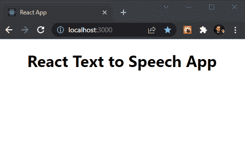
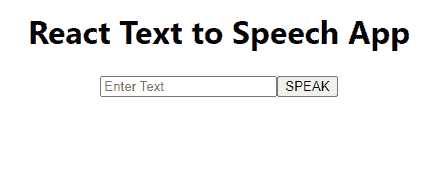

# 反应文本到语音-简化！

> 原文：<https://www.assemblyai.com/blog/react-text-to-speech-simplified/>

在我们的[上一篇 React 教程](https://www.assemblyai.com/blog/react-speech-recognition-with-react-hooks/)中，我们使用 React 和 AssemblyAI API 构建了一个语音转文本应用。但是你知道吗，我们也可以创建一个反过来工作的应用程序？在本教程中，我们将利用 [Web 语音 API](https://developer.mozilla.org/en-US/docs/Web/API/Web_Speech_API) 构建一个简单的 React 文本到语音应用程序。

佐料

*   反应^17.0.2
*   反应钩

和往常一样，您可以从 [Github](https://github.com/stefanrows/react-text-to-speech-aai) 中克隆本文的项目库，并在您的本地机器上使用它。或者，你可以在这里观看并尝试应用程序[的现场版本，或者在](https://react-text-to-speech-app.stefanrows.repl.co/) [Replit](https://replit.com/@stefanrows/React-Text-to-Speech-App#src/App.jsx) 上获得你自己的副本。

## 步骤 1 -创建我们的 React 文本到语音应用程序

为了让事情顺利进行，我们首先创建一个全新的 React 应用程序。打开终端，输入以下命令:

```py
npx create-react-app@latest react-text-to-speech-aai
cd react-text-to-speech-aai
```

接下来，在您喜欢的代码编辑器中打开 React 应用程序代码。我们使用 VSCode，它可以从终端打开(如果您使用 Linux 或 macOS ),方法是:

```py
code .
```

最后，输入以下命令启动应用程序:

```py
npm start
```

## 步骤 2 -基本清理

在我们开始编写代码之前，我们首先需要删除`App.js`中的 React 示例代码，只留下下面的代码:

```py
import "./App.css"

function App() {
  return (
    <div className='App'>
      <h1>React Text to Speech App</h1>
    </div>
  )
}

export default App
```

App.js

现在打开你的网络浏览器(我们在这个例子中使用 Chrome)并打开 [localhost:3000](http://localhost:3000/) 。您应该会看到类似这样的内容:



## 步骤 3 -设置 Web 语音 API

为了让 Web Speech API 读取我们的文本，我们需要利用[*speechsynthesisatinterance()*](https://developer.mozilla.org/en-US/docs/Web/API/SpeechSynthesisUtterance/SpeechSynthesisUtterance)构造函数，它将包含我们的语音数据和应用程序应该如何处理它的信息。

让我们先实现代码，然后检查代码分解以了解发生了什么:

```py
import "./App.css"
import { useEffect } from "react"

function App() {
  const msg = new SpeechSynthesisUtterance()
  msg.text = "Hello World"

  useEffect(() => {
    window.speechSynthesis.speak(msg)
  }, [msg])

  return (
    <div className='App'>
      <h1>React Text to Speech App</h1>
    </div>
  )
}

export default App 
```

### 代码分解

*   首先，我们导入`useEffect`钩子。
*   用`const msg = new *SpeechSynthesisUtterance*()`我们定义了一个新的变量，它初始化了***speechsynthesisatinterance**对象*的一个实例。
*   将`msg.text`设置为“Hello World”会存储我们希望 Web Speech API 为我们读出的文本。
*   最后，`window.speechSynthesis.speak(msg)`是朗读存储在`msg.text`变量中的文本的函数。我们把整个东西包在一个`useEffect`钩子里，以防止它无限循环。

确保 React 应用程序正在运行，并刷新运行应用程序的浏览器窗口。现在你应该会听到用机器人的声音说的“*你好，世界*”。

## 步骤 4 -获取动态输入

到目前为止，要更改 React 文本到语音转换应用程序朗读的文本，我们必须手动更改代码中的字符串`msg.text` ，并每次刷新应用程序。

既然这不实际，那就让我们修改一下代码，让它更有动态性。

要做到这一点，我们只需创建一个`**<**input>`字段，允许我们输入任何我们想要读出的文本。我们还需要一个``来提交我们的请求。我们将利用 **[反应钩](https://reactjs.org/docs/hooks-intro.html)** 进行说明。

让我们再添加一些代码，然后查看下面的代码分解，以了解发生了什么:

```py
import "./App.css"
import { useState } from "react"

function App() {
  const [ourText, setOurText] = useState("")
  const msg = new SpeechSynthesisUtterance()

  const speechHandler = (msg) => {
    msg.text = ourText
    window.speechSynthesis.speak(msg)
  }

  return (
    <div className='App'>
      <h1>React Text to Speech App</h1>
       setOurText(e.target.value)}
      />
       speechHandler(msg)}>SPEAK
    </div>
  )
}

export default App 
```

我们的应用程序现在看起来像这样:



### 代码分解

*   首先，我们用`import { useState } from 'react'`导入[反应状态钩子](https://reactjs.org/docs/hooks-state.html)
*   然后我们初始化我们的状态变量，它将存储我们想要朗读的文本，在我们的组件中有`const [ourText, setOurText] = useState("")`
*   在这之后，我们创建了将变量`msg`作为参数的`speechHandler`函数。然后我们将`msg.text = ourText`和`window.speechSynthesis.speak(msg)`一起放入这个函数中。当我们按下**扬声器**按钮时，这个方法就会执行。
*   然后我们给我们的 **HTML** 添加一个``字段，并赋予它一些属性:`type='text', value={ourText}`、`placeholder='Enter Text'`和`onChange={(e) => setOurText(e.target.value)}`。属性`onChange`调用我们的匿名函数，并最终将变量`ourText`设置为我们输入的任何文本字符串。
*   最后，我们将一个``添加到我们的 **HTML** 中，并将`speechHandler(msg)`函数传递给它。

## 步骤 5 -测试我们的应用

现在一切就绪，让我们测试我们的应用程序。确保 React 应用程序正在运行，并刷新应用程序的浏览器窗口。

输入一些文本，然后按下**朗读**按钮。你现在应该会听到一个机器人的声音为你朗读你的文本。

## 带 React 的语音转文本

在本教程中，我们学习了如何使用 React 创建一个文本到语音的应用程序。如果您想做相反的事情，也就是说您想在 React 应用程序中实现**语音转文本**，您可以利用 AssemblyAI [语音转文本 API](https://www.assemblyai.com/blog/the-top-free-speech-to-text-apis-and-open-source-engines/) 。我们已经在[这篇文章](https://www.assemblyai.com/blog/react-speech-recognition-with-react-hooks/)中介绍了如何做到这一点。

[Get Started with AssemblyAI for Free](https://app.assemblyai.com/signup)

如果你想用简单的 JavaScript 实现语音转文本，我们还为你准备了一个指南。