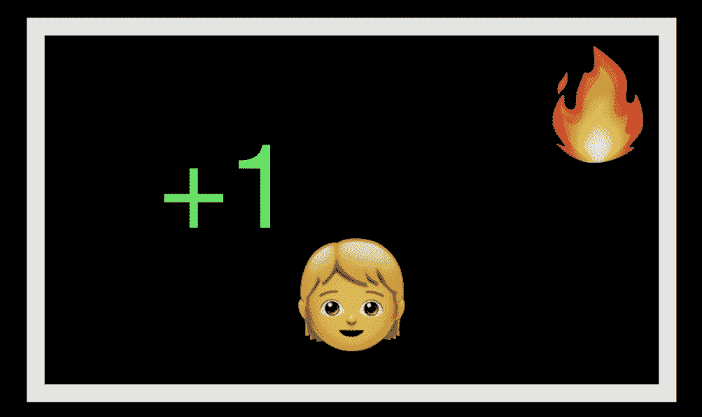
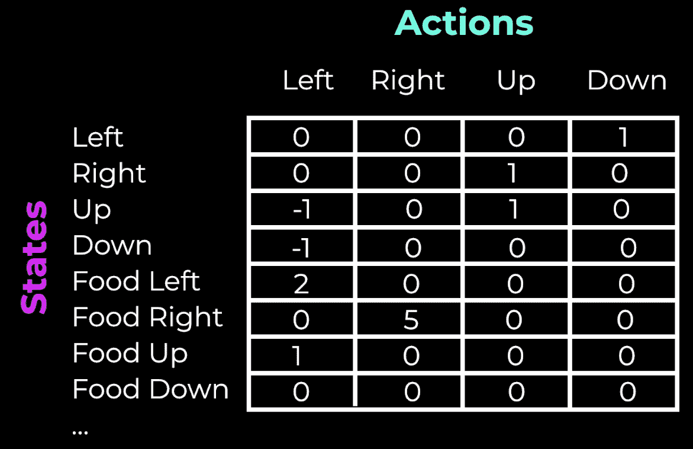
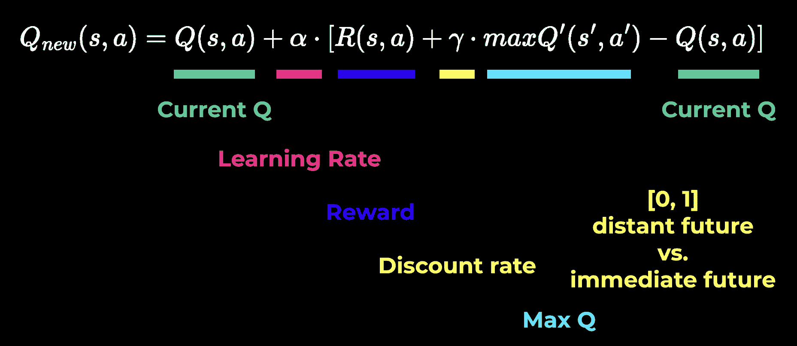
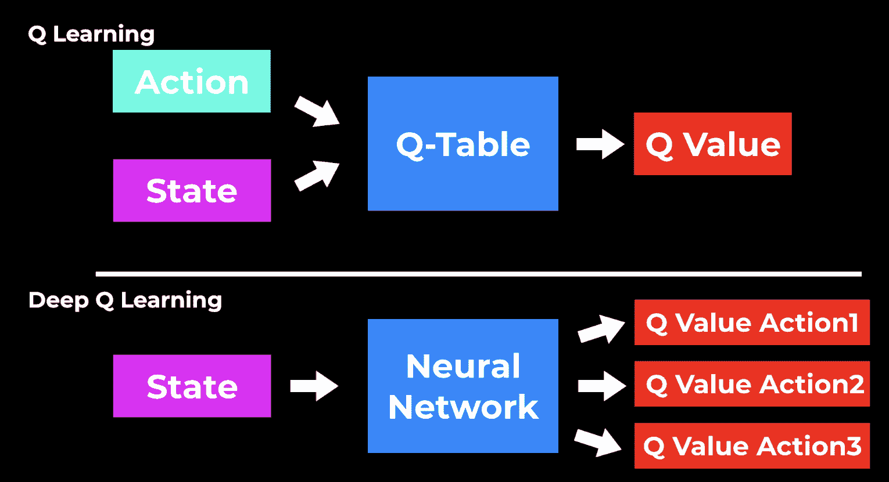

# 使用(深度)Q 学习的强化学习解释

> 原文：<https://www.assemblyai.com/blog/reinforcement-learning-with-deep-q-learning-explained/>

在本教程中，我们学习强化学习和(深度)Q 学习。

在之前的两个视频中，我们解释了[监督](https://www.assemblyai.com/blog/supervised-machine-learning-for-beginners/)和[非监督](https://www.assemblyai.com/blog/unsupervised-machine-learning-for-beginners/)学习的概念。强化学习是机器学习领域的第三类。

这一领域近年来变得非常受欢迎，尤其是在视频游戏中，人工智能学习玩像国际象棋、贪吃蛇或越狱这样的游戏。

我们将涵盖:

*   什么是强化学习
*   什么是状态/行动/奖励
*   什么是 Q 学习
*   Q 学习的一个例子
*   基于神经网络的深度 Q 学习

如果你想看，你可以在这里看这个教程的视频版本:

[https://www.youtube.com/embed/kEGAMppyWkQ?feature=oembed](https://www.youtube.com/embed/kEGAMppyWkQ?feature=oembed)

## 理念和定义

RL 背后的想法是，软件代理通过与环境交互来学习，然后接受执行动作的奖励或惩罚。通过这种方法，代理可以教会自己变得更好并改进其行为，以最大化其预期回报。

强化学习的概念来自于我们的自然经验。想象你是个孩子，第一次看到壁炉。你喜欢温暖的天气。它是正的，所以你得到正的回报。

Learning in an environment

比方说，你伸出你的手，试着触摸火。现在你的手*太*热了，所以很疼，留给你一个负面的奖励(或惩罚)。从这次经历中你可以了解到，火(**环境**)可以是好的也可以是坏的(**奖励/惩罚**)，这取决于你如何与它互动(你的**行动**)。

这正是强化学习的工作原理。这是通过奖励和惩罚从环境中的行为中学习的计算方法。

## q 学习

这种方法的一个具体实现是 **Q 学习算法**。这是一种基于所谓 Q 表的基于值的方法。

对于每个状态下的每个行为， **Q 表计算最大预期未来奖励。有了这些信息，我们就可以选择奖励最高的行动。**

让我们看一个具体的例子来说明这一点。

假设我们想教一个人工智能如何玩贪吃蛇游戏。在这个游戏中，蛇试图在不撞到墙或自己的情况下够到并吃掉食物。我们可以在 Q 表中列出动作和状态。柱子将是蛇可以做的四种可能的动作，向左、*向右*、*向上*和*向下*。并且状态可以是当前方向，所以也是*左*、*右*、*上*、*下*。这是几排。

我们可以添加更多的状态来描述当前的情况。例如，我们可以描述食物的位置，并添加状态*食物在蛇的左边*、*右边*、*向上*，或*向下*。

Q-Table

我们可以通过添加更多的信息来建立状态，例如关于墙的信息，但是为了简单起见，我们在这里把它省略了。我们添加的状态信息越多，我们拥有的关于环境的信息就越多，但是我们的系统也会变得越复杂。

定义好行和列后，每个单元格的值将是给定状态和行为的最大预期未来回报。我们称之为 **Q 值**。

到目前为止一切顺利。但是我们如何计算 Q 值呢？

## q 学习算法

有趣的部分来了。我们不以固定的方式实现 Q 值计算。相反，我们用迭代的方法改进 Q 表。这就是所谓的培训或学习过程。

Q 学习算法是这样工作的:

1.  初始化所有 Q 值，例如用零初始化
2.  基于当前最佳 Q 值在当前状态 *s* 中选择一个动作 *a*
3.  执行此动作 *a* 并观察结果(新状态*s’*)。
4.  测量此动作后的奖励
5.  用称为**贝尔曼方程**的更新公式更新 Q。

重复第 2 步到第 5 步，直到学习不再进步，我们应该最终得到一个有用的 Q 表。然后，您可以将 Q 表视为一个“备忘单”,它总是告诉您给定状态的最佳操作。

但你可能想知道，当我们所有的值都是 0 时，我们如何在开始时选择最佳行动？

### 勘探与开发的权衡

这就是**勘探与开发权衡**发挥作用的地方。开始时，我们随机选择动作，以便代理可以探索环境。但是，我们得到的训练步骤越多，我们就越减少随机探索，而是使用开发，所以代理利用它所拥有的信息。

这种权衡在计算中由通常称为**ε(ɛ)参数**的参数控制。

### 报酬

如何衡量回报取决于我们自己。我们应该为游戏想出一个好的奖励系统。在贪吃蛇游戏的情况下，如果蛇吃了一个苹果，我们可以给予 10 分的奖励，如果蛇死了，我们可以给予-10 分的奖励，其他正常移动为 0。

现在有了所有这些元素，我们就可以检验贝尔曼方程了:

这里的想法是像这样更新我们的 Q 值:

Bellman equation

贴现率是一个介于 0 和 1 之间的值，它决定了相对于近期的回报，代理人对**远期回报的关注程度。**

现在我们得到了所有我们需要的信息，这样我们就可以通过使用这种迭代学习的方法得出一个好的 Q 表！

## 深度学习

深度 Q 学习利用了 Q 学习的思想，并更进一步。不使用 Q 表，**我们使用一个神经网络**，它获取一个状态，并基于该状态近似每个动作的 Q 值。

Q-Learning vs Deep Q-Learning

我们这样做是因为使用一个经典的 Q 表不太具有可伸缩性。它可能对简单的游戏有效，但是在一个有几十种可能的动作和游戏状态的更复杂的游戏中，Q 表将很快变得复杂，并且不再能有效地解决。

所以现在我们**使用深度神经网络获取状态作为输入，并为每个动作**产生不同的 Q 值。然后，我们再次选择具有最高 Q 值的动作。学习过程仍然与迭代更新方法相同，但是我们不是更新 Q 表，而是更新神经网络中的权重，从而提高输出。

这就是深度 Q 学习的工作原理！

## 最后的话

我希望这篇文章能给你一个简单的强化学习的介绍。如果你喜欢它，请确保也在我们的 YouTube 频道上观看相应的视频，并在 Twitter 上分享这篇文章！

寻找更多这样的内容？

订阅我们的时事通讯。

[Subscribe here](https://assemblyai.us17.list-manage.com/subscribe)

## 资源

*   [https://www . freecodecamp . org/news/diving-deep-into-reinforcement-learning-with-q-learning-c 18d 0 db 58 EFE/](https://www.freecodecamp.org/news/diving-deeper-into-reinforcement-learning-with-q-learning-c18d0db58efe/)
*   [https://www . freecodecamp . org/news/an-introduction-to-deep-q-learning-let-play-doom-54d 02d 8017 D8](https://www.freecodecamp.org/news/an-introduction-to-deep-q-learning-lets-play-doom-54d02d8017d8)