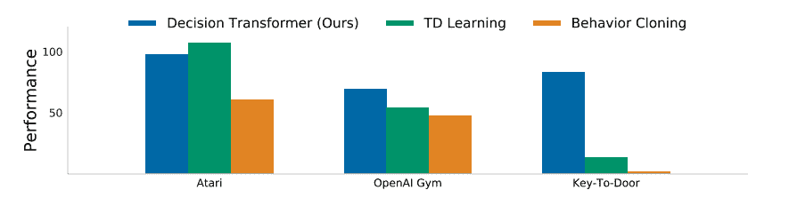
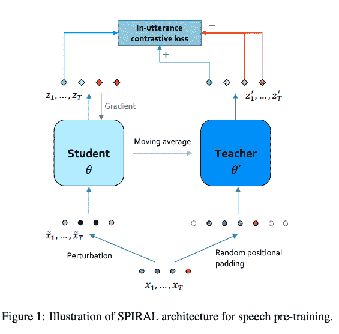

# 审查-决策转换器和螺旋

> 原文：<https://www.assemblyai.com/blog/review-decision-transformer-spiral/>

本周深度学习的论文点评有 *[决策变压器:通过序列建模的强化学习](https://arxiv.org/pdf/2106.01345.pdf)* 和*[螺旋:用于语音预训练的自监督扰动不变表征学习](https://arxiv.org/pdf/2201.10207.pdf)*

## 决策转换器:通过序列建模的强化学习

### 这篇论文有什么令人兴奋的地方

传统上，使用时间差异(TD)学习来解决强化学习(RL)。[决策转换器](https://arxiv.org/pdf/2106.01345.pdf)将 RL 作为一个序列建模任务，目标是在给定当前和过去的状态、行动和奖励以及当前时间步的预期未来奖励的情况下，对下一个行动进行建模。这种方法训练代理人在给定其所有历史和要求其实现的目标(未来累积奖励)的情况下识别要采取的最佳行动。

[Photo Credit](https://arxiv.org/pdf/2106.01345.pdf)

### 主要发现

作者通过对从专家和普通策略中收集的轨迹进行训练，评估了 Atari 和 OpenAI 健身房基准上的决策转换器(DT)。他们发现，DT 的表现优于行为克隆，并与最先进的 T2 时差学习技术相媲美。此外，作者发现 DT 在涉及长期信用分配的任务中特别有能力。例如，在开门任务中，DT 的表现明显优于两个基线，并且只使用随机展开进行训练。

### 我们的外卖

决策转换器(DT)是将 RL 转换为序列建模问题的第一次成功尝试之一，并且能够实现最先进的性能。

DT 学习的策略通常优于用来生成离线数据的策略，因为它能够将次优轨迹的不同部分“缝合在一起”以找到最优动作。

## 螺旋:用于语音预训练的自监督扰动不变表示学习

### 这篇论文有什么令人兴奋的地方

[SPIRAL](https://arxiv.org/pdf/2201.10207.pdf) ，从 [BYOL](https://arxiv.org/pdf/2006.07733.pdf) 中汲取灵感，提供了一种替代的 [ASR](https://www.assemblyai.com/blog/what-is-asr/) 语音预训练方法，声称与 wav2vec2 相比，基础模型的训练成本降低了 80%，大型模型降低了 65%。

[Photo Credit](https://arxiv.org/pdf/2201.10207.pdf)

### 主要发现

研究人员在模型中使用逐步下采样策略，以减少训练过程中所需的计算量。他们推测这以类似于量化的方式消除了冗余。LL-60k 螺旋模型需要 500k 训练步骤和 232 GPU 天，而标准 wave2vec2 模型需要 1000k 训练步骤和 665.6 GPU 天。他们还通过在 Amazon [CHiME](https://arxiv.org/pdf/1803.10609.pdf) 数据集上评估这两个模型，表明螺旋模型更好地处理了有噪声的输入。

### 我们的外卖

SPIRAL 是一种替代的自我监督学习(SSL)预训练方法，通过积极的下采样，可以节省高达 80%的训练成本，同时仍能达到 wav2vec2 的性能。此外，他们提出的噪声扰动机制可能对其他 SSL 管道有所帮助。