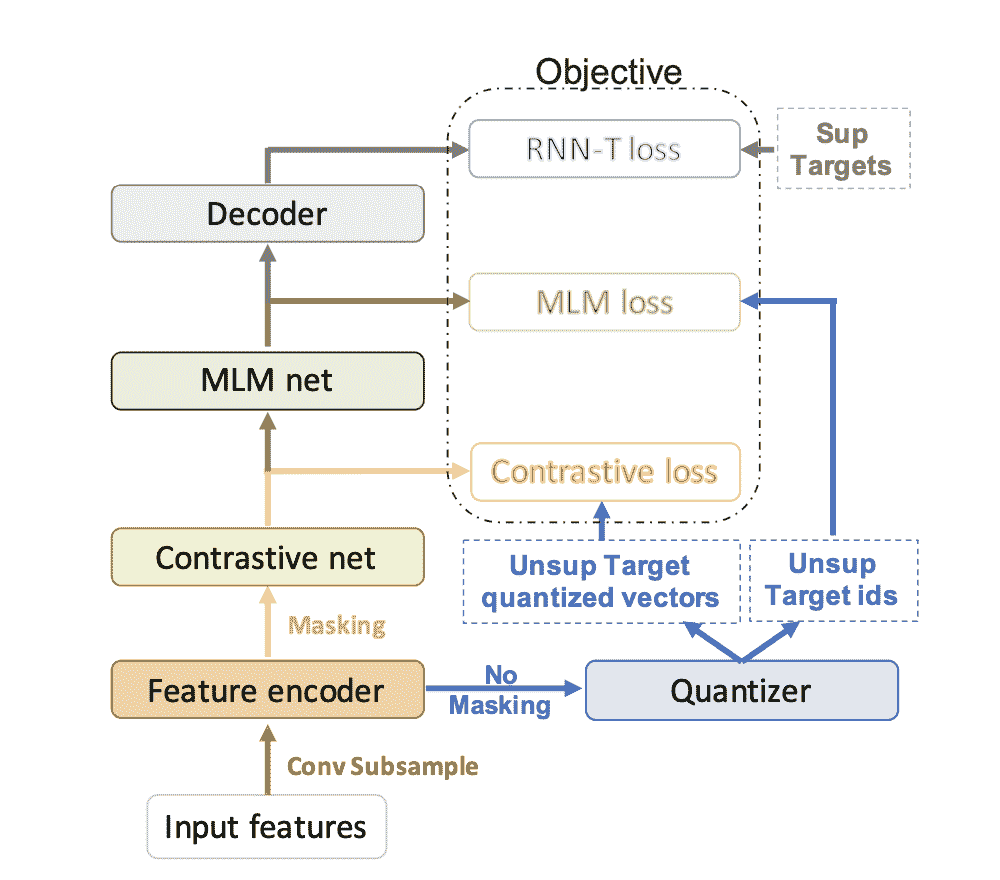
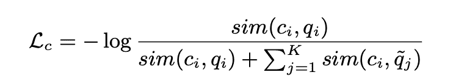
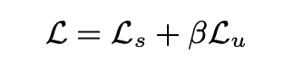
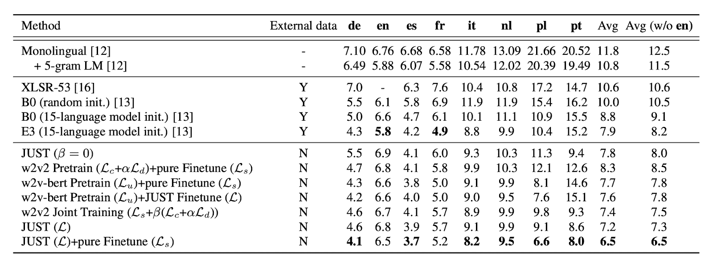

# Review - JUST:用于多语言自动识别的联合非监督和监督训练

> 原文：<https://www.assemblyai.com/blog/review-just/>

本周的深度学习论文综述是 [*JUST -联合无监督和有监督的多语种 ASR 训练*](https://arxiv.org/pdf/2111.08137v1.pdf) *。*

## **这篇论文有什么令人兴奋的地方**

自我监督学习在过去的几年里取得了巨大的进步。三代 Wav2Vec 已经从经验上证明，以对比方式进行的自我监督学习是一种强大的预训练技术，即使在极低资源的数据上也能实现高精度的下游微调。最新的两批 Wav2Vec2.0 通过利用预训练期间的对比和多样性损失打破了 SOTA 基准。

在对比损失中，特征编码器空间中的一定比例的时间步长被掩蔽，目标是在一组干扰项中为每个时间步长识别正确的潜在语音表示。

分集损失用于通过最大化平均 softmax 分布的熵来鼓励每个码本中条目的平等使用，从而增加量化码本表示的使用。

通过在微调期间仅使用 10 分钟的标记数据，上述方法能够在 LibriSpeech 数据集的测试和开发集上实现 7.9 和 8.2 WERs。

由于 Wav2Vec2 方法的实际效率和易于再现性，谷歌研究人员提出了一种新的 Wav2Vec2 启发的预训练技术——称为*只是*——用于多语言 [ASR](https://www.assemblyai.com/blog/what-is-asr/) 。

*JUST* 采用五阶段建模架构，由三个阶段级无监督和有监督损失函数支持。使用对比 MLM(掩蔽语言建模)和 RNN-T 损失，该模型在多语言数据集上对音频-文本对进行联合预训练，然后在特定数据集上进行微调。新的训练方法在低资源语言 ASR 设置中比第一阶段 Wav2Vec2 XLSR(大型)网络产生 32%的性能提高。

## **主要发现**

***的 5 个阶段正好:***

**1。特征编码器- CNN**

基本上，卷积子采样在特征维数和序列长度方面都减少了 4 倍。

**2。量化器**

Gumbel-softmaxed 潜在向量到码本令牌匹配。码本要么是可学习的，要么是不可学习的——作者没有发现性能上的明显差异。

**3。对比网络整合程序块**

多头自关注，深度方向卷积和前馈层。

对比网络从编码器中读取隐藏的潜在特征。对于掩蔽，选择一组随机的特征并用随机向量代替。

对于局部对比级优化，使用对比损失:

**4。** **MLM 网-康福尔街区**

多头自关注，深度方向卷积和前馈层。对比网络向 MLM 网络提供对比上下文向量。MLM 网的输出是高级上下文向量，用于通过线性层进行令牌 id 预测。预测的记号 id 与来自量化器的目标记号 id 通过标准交叉相关损失进行比较。

最终的无监督损失看起来像:

**5。解码器- 2 层 RNN 传感器**

MLM 网络的输出通过 Swish 激活、Batchnorm 层，然后馈送到解码器 RNN-T。解码器的词汇大小基本上是从预训练期间使用的所有语言汇集的统一字素集的大小。

最终的预训练优化目标是无监督损失和有监督损失的组合:

***微调:***

作者提出了两种训练方法:

1.  无监督损失的预训练和无监督损失和有监督损失的微调。
2.  两种情况下的预训练:无监督和有监督损失以及仅使用有监督损失的微调。

正如作者所展示的，第二种方法比第一种方法产生的平均**要好 10%。**

## ****我们的外卖****

**从理论上讲，在纯无监督的训练设置中，多级优化更有直观意义。最重要的是，有监督的 RNN-T 损失与无监督的损失的结合导致更有用的信息提取、更好的概括和更健壮的上下文化标记预测。**

**就其本身而言，RNN-T 在令牌预测方面优于标准 CTC 网络——只要它与自回归预测器和加入器联合训练。如许多研究所示，RNN-T 导致每个令牌更真实的概率，而自回归架构解决了帧相关问题。因此，与 CTC 模型相比，RNN-T 输出中出现断章取义的可能性更低。**

**例如:**

*****CTC***:我*八个*一个苹果。**

*****RNN-T***:我*吃了*一个苹果。**

***报告结果:***

****

**基于实践结果和理论创新方法，JUST 是 Wav2Vec2 架构的巨大飞跃。此外，它利用开源的*MLS* 数据集用于无监督和有监督的训练设置的音频-文本对。MLS(连同附加数据)也用于 Wav2Vec2 预训练，但是仅使用没有标签的语音集。只要*仅通过使用 MLS 数据集进行预训练而使*优于 Wav2Vec2，它在技术上具有相同的数据要求(实际上更少)，因为 *MLS* 由音频和文本对组成。
**