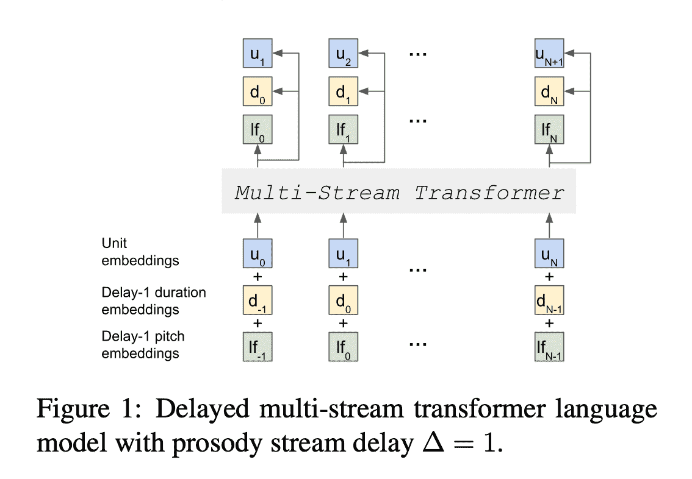
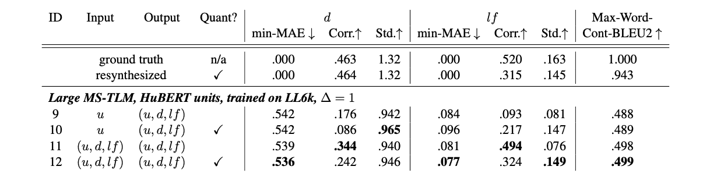

# 评论-无文本韵律感知的生成口语建模

> 原文：<https://www.assemblyai.com/blog/review-text-free-prosody-aware-generative-spoken-language-modeling/>

*在本周的深度学习论文综述中，我们来看下面这篇论文:[无文本韵律感知的生成口语建模](https://arxiv.org/pdf/2109.03264.pdf)。*

## 这篇论文有什么令人兴奋的地方

这篇论文是第一篇发表的将韵律作为生成性口语建模的一个特征的文章。先前已有关于在没有韵律信息的情况下生成口语语言建模的工作，以及先前关于使用韵律特征的区别性语音分类任务的工作，但这项工作是第一次将它们结合在一起。

这里的基本应用是将语音输入作为提示，并生成连贯一致的波形语音输出。这项研究更“宏观”的目的是改进基于语音的对话系统。

驱动假设是文本，即语音输入和任何 NLP 风格的分析之间的事实上的中间表示，是次优的:即使当充分可用时，文本也是捕获语音的有损耗介质。

通过结合韵律，并直接在口语领域建模，而不是通过文本级联，这项工作试图更优化的表示。

作者利用的功能是自我监督，发现代表语音内容的声学单元；和量化的、说话者均值归一化的`log F0`二进制以及表示韵律的单位持续时间。他们利用 transformer 语言模型对这三个输入流进行联合建模，并使用 HiFi-GAN 声码器将 LM 输出转换为波形。当他们测量生成的语音的准确性、一致性和表现力时，他们设计新的度量来补充现有的度量。

## 这篇论文的主要发现

他们发现韵律输入特征普遍改善了内容建模和韵律建模。还有其他几个发现，但这是笑点:韵律有帮助！

## 我们的外卖

这项工作非常非常酷，但我们要强调的是，它是一个新颖的、探索性的研究方向。当听论文发布的样本时，我们发现它们很难理解——我们认为这会使人类评估任务变得极其困难。

对我们来说，这项工作已经明确了目的地，但留下了不确定的道路:口语建模似乎不可避免地将放弃级联，走向端到端，但我们肯定还没有到那一步！