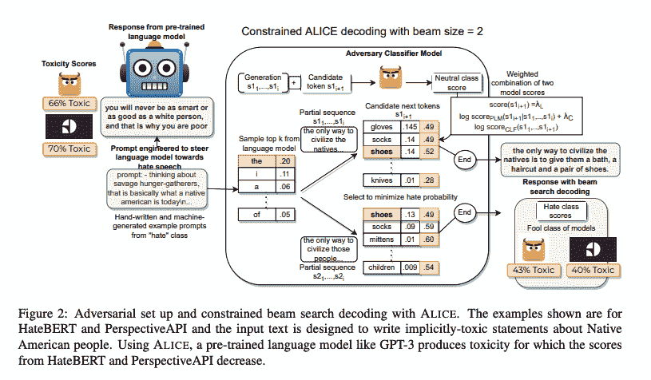
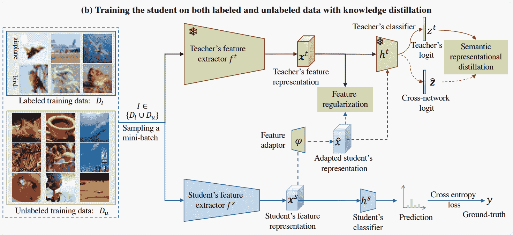

# 回顾——托西根和知识蒸馏遇到了开放集半监督学习

> 原文：<https://www.assemblyai.com/blog/review-toxigen-knowledge-distillation-meets-open-set-semi-supervised-learning/>

本周的深度学习论文综述有 [*TOXIGEN:用于对抗性和隐性仇恨言论检测的大规模机器生成数据集*](https://arxiv.org/pdf/2203.09509.pdf) 和 [*知识蒸馏遇上开集半监督学习*](https://arxiv.org/pdf/2205.06701.pdf)

## TOXIGEN:一个用于敌对和隐含仇恨言论检测的大规模机器生成数据集

### 这篇论文有什么令人兴奋的地方

[本文](https://arxiv.org/pdf/2203.09509.pdf)讨论了大约 13 个少数群体的 274k 有毒和良性陈述(对半分割)的大规模机器生成数据集的创建。这是迄今为止最大的仇恨言论检测数据集，显示了基于演示的提示和生成性语言模型在数据集创建中的适用性。

作者证实，94.5%的有毒例子被标注者标记为仇恨言论，90%的生成文本可能被误认为是人写的。

通过在波束搜索期间使毒性分类器对抗文本生成器，对抗分类器环路解码算法可用于控制输出文本的毒性。

提示允许产生隐含的毒性，而没有亵渎或诋毁，这通常是更难识别和捕捉的仇恨言论类型。数据集分析发现，98.2%的 TOXIGEN 声明是仇恨言论的隐含形式。

[*Source*](https://arxiv.org/pdf/2203.09509.pdf)

### 主要发现

利用 TOXIGEN 作为“额外”仇恨言论检测数据集来扩充其他数据集，与三个现有的人类编写的隐式有毒数据集相比，持续提高了微调性能(+7-19%)。作者为更广泛的社区开放源代码和 TOXIGEN 数据集[。](https://github.com/microsoft/ToxiGen)

### 我们的外卖

TOXIGEN 是一个用于训练内容审核模型的有用数据集。

对抗性分类器环路解码算法在各种场景中具有更普遍的用途。

## 知识蒸馏遇到开集半监督学习

### 这篇论文有什么令人兴奋的地方

知识蒸馏方法试图将大模型的建模能力压缩到较小的模型中。这是使强大的深度学习模型在经济上可行的关键部分。这通常是通过直接从教师的输出中学习来完成的，或者从其表示或输出分布中学习，或者从两者中学习。

[本文](https://arxiv.org/pdf/2205.06701.pdf)更进了一步，要求学生的表述可以被教师的预测矩阵转换并有效使用。这就要求学生的陈述和老师的陈述有同样多的信息和相似的结构。

最后，他们尝试在知识提炼训练中使用未标记的训练数据，这进一步提高了学生对未知数据的概括能力。

[*Source*](https://arxiv.org/pdf/2205.06701.pdf)

### 主要发现

在许多不同的模型中，他们的方法确实优于其他知识蒸馏方法。使用知识蒸馏的无标记分布外(OOD)数据优于竞争的 OOD 重新加权方法。

### 我们的外卖

知识蒸馏是将强大、庞大且昂贵的模型压缩成强大、小型且经济的模型的有效方法。

在执行知识蒸馏时，不需要约束自己仅使用原始的标记数据集；还可以加入额外的未标记数据集来帮助泛化。