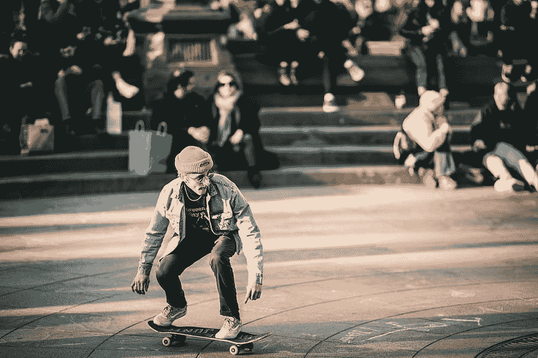
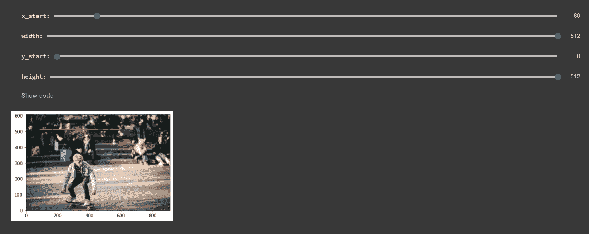
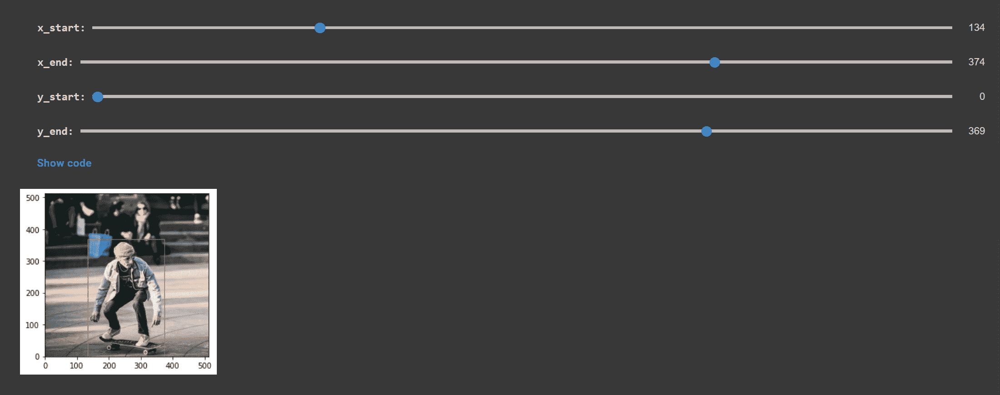
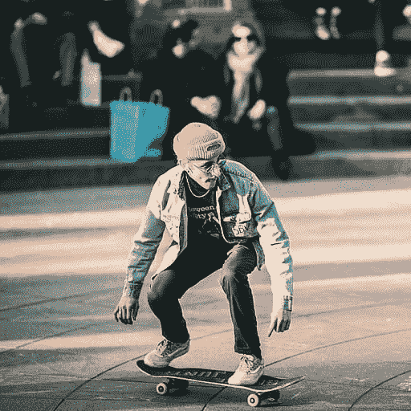
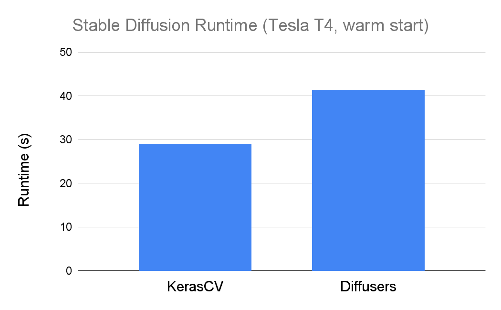

# Keras 中的稳定扩散-简单教程

> 原文：<https://www.assemblyai.com/blog/stable-diffusion-in-keras-a-simple-tutorial/>

今年早些时候发布了稳定扩散，为世界提供了强大的文本到图像的能力。自从它发布以来，许多不同的项目都是从它衍生出来的，这使得用几个简单的词来生成像下面这样的图像变得前所未有的容易。


(Image from the Stable Diffusion [Discord](https://discord.gg/stablediffusion))

[稳定扩散](https://www.assemblyai.com/blog/how-to-run-stable-diffusion-locally-to-generate-images/)已经集成到 [Keras](https://keras.io/) 中，允许用户在少至**三**行代码中生成新颖的图像。最近，通过**修补**修改图像的能力也被整合到稳定扩散的 Keras 实现中。

在这篇文章中，我们将看看如何在 Keras 中使用稳定的扩散**生成**和**修复**图像。我们提供了一个完整的 **Colab** 笔记本，因此您可以在 GPU 运行时立即开始。此外，我们看看 [XLA](https://www.assemblyai.com/blog/why-you-should-or-shouldnt-be-using-jax-in-2022/#xla) 如何能够显著提高 Keras 中稳定扩散的效率。让我们开始吧！

## 先决条件

如果您不想在您的计算机上安装任何东西，请单击下面的按钮打开相关的 Colab 笔记本，然后从那里开始操作。

[Colab Notebook](https://colab.research.google.com/drive/11nZ1zrVrubKrzCwrISvDEtt1OHuGqOBw?usp=sharing)

要在您的机器上本地设置 Keras 中的稳定扩散，请遵循以下步骤。本文使用了 Python 3.8。

### 步骤 1 -克隆项目存储库

打开一个终端，执行下面的命令，使用 git 克隆项目存储库，然后导航到项目目录。

```py
git clone https://github.com/AssemblyAI-Examples/stable-diffusion-keras.git
cd stable-diffusion-keras
```

### 步骤 2 -创建虚拟环境

如果您希望将该项目的所有依赖项隔离在您的系统上，请创建并激活虚拟环境:

```py
python -m venv venv

# Activate (MacOS/Linux)
source venv/bin/activate

# Activate (Windows)
.\venv\Scripts\activate.bat
```

如果您的机器上安装了 Python 2 和 Python 3，您可能需要使用`python3`而不是`python`。

### 步骤 3 -安装依赖项

最后，通过运行以下命令安装所有必需的依赖项:

```py
pip install -r requirements.txt
```

## 如何在 Keras - Basic 中使用稳定扩散

我们可以在三行代码中使用稳定扩散:

```py
from keras_cv.models import StableDiffusion

model = StableDiffusion()
img = model.text_to_image("Iron Man making breakfast")
```

我们首先从 Keras 导入`StabelDiffusion`类，然后创建它的一个实例`model`。然后我们使用这个模型的`text_to_image()`方法生成一个图像，并保存到`img`变量中。

另外，如果我们想保存图像，我们可以导入并使用[枕头](https://pillow.readthedocs.io/en/stable/installation.html):

```py
from keras_cv.models import StableDiffusion
from PIL import Image

model = StableDiffusion()
img = model.text_to_image("Iron Man making breakfast")
Image.fromarray(img[0]).save("simple.png")
```

我们从该批图像中选择第一张(也是唯一一张)图像作为`img[0]`，然后通过`fromarray()`将其转换为枕头`Image`。最后，我们通过`.save()`方法将图像保存到文件路径`./simple.png`。

在项目目录中打开一个终端，您可以通过输入以下命令来运行上面的脚本，该命令将运行`[simple.py](https://github.com/AssemblyAI-Examples/stable-diffusion-keras/blob/main/simple.py)`脚本:

```py
python simple.py
```

同样，你可能需要使用`python3`而不是`python`。生成以下“钢铁侠做早餐”的图像并保存到`[./simple.png](https://github.com/AssemblyAI-Examples/stable-diffusion-keras/blob/main/simple.png)`:


在喀拉斯使用稳定扩散所需要的一切！在下一节，我们将看看更高级的用法，如修补。或者，跳到通过 XLA 的 JIT 编译部分，看看 Keras 如何提高稳定扩散的速度。

## 如何在 Keras - Advanced 中使用稳定扩散

我们现在来看看图像生成和修复的高级用法。下面链接的 Colab 笔记本可以很容易地使用滑块来修改修复区域，所以如果你愿意，请随意跟随:

[Colab Notebook](https://colab.research.google.com/drive/11nZ1zrVrubKrzCwrISvDEtt1OHuGqOBw?usp=sharing)

所有高级图像生成和修复代码都可以在`[main.py](https://github.com/AssemblyAI-Examples/stable-diffusion-keras/blob/main/main.py)`中找到。

### 图象生成

当我们实例化稳定扩散模型时，我们可以选择传入一些参数。下面，我们将图像的高度和宽度都指定为 512 像素。这些值中的每一个都必须是 128 的倍数，如果不是，将被舍入到最接近的值。此外，我们还指定我们确实*而不是*想要用 XLA 实时编译模型(更多细节在通过 XLA 的 [JIT 编译部分)。](#jit-compilation-via-xla)

```py
model = StableDiffusion(img_height=512, img_width=512, jit_compile=False)
```

接下来，我们创建一个参数字典，它将被传递给`text_to_image()`方法。这些论点是:

*   **`prompt`**——一幅你想要描述的场景的图像
*   **`batch_size`**——一个推论中要生成的图像数量(受记忆限制)
*   **`num_steps`** -在[扩散过程中使用的](https://www.assemblyai.com/blog/diffusion-models-for-machine-learning-introduction/)[步数](https://www.assemblyai.com/blog/how-to-run-stable-diffusion-locally-to-generate-images/#number-of-diffusion-steps)
*   **`unconditional_guidance_scale`** -用于[无分类器引导的引导权重](https://www.assemblyai.com/blog/how-imagen-actually-works/#classifier-free-guidance)
*   **`seed`**——随机种子使用

```py
options = dict(
    prompt="An alien riding a skateboard in space, vaporwave aesthetic, trending on ArtStation ",
    batch_size=1,
    num_steps=25,
    unconditional_guidance_scale=7,
    seed=119
)
```

从这里开始，过程与上面非常相似——我们运行推理，然后将输出保存为`[generated.png](https://github.com/AssemblyAI-Examples/stable-diffusion-keras/blob/main/generated.png)`。

```py
img = model.text_to_image(**options)
Image.fromarray(img[0]).save("generated.png")
```

注意，这在 CPU 和 GPU 上都可以做到。使用 i5-11300H，使用上述设置生成图像大约需要 **5 分钟**。有了 GPU，它应该只需要大约 **30 秒**。

### 图像修复

现在我们来看看如何在 Keras 中使用稳定扩散进行修复。首先，我们使用`requests`包下载一个要修改为`[man-on-skateboard.jpg](https://github.com/AssemblyAI-Examples/stable-diffusion-keras/blob/main/man-on-skateboard.jpg)`的图像:

```py
file_URL = "https://c0.wallpaperflare.com/preview/87/385/209/man-riding-on-the-skateboard-photography.jpg"
r = requests.get(file_URL)
with open("man-on-skateboard.jpg", 'wb') as f:
    f.write(r.content)
```

这是最终下载的图像



([source](https://c0.wallpaperflare.com/preview/87/385/209/man-riding-on-the-skateboard-photography.jpg))

此图像为 910 x 607 像素。在我们继续之前，我们将其裁剪为 512 x 512 像素。我们将裁剪区域的左下角定义为(`x_start`，`y_start`)，并将裁剪区域设置为 512 像素宽和 512 像素高。

```py
x_start = 80  # Starting x coordinate from the left of the image
width = 512
y_start = 0  # Starting y coordinate from the BOTTOM of the image
height = 512
```

如果您在 Colab 中跟随，您可以使用滑块来调整这些值:



然后，我们打开原始图像并将其转换为 NumPy 数组，以便我们可以修改它:

```py
im = Image.open("man-on-skateboard.jpg")
img = np.array(im)
```

我们执行裁剪，这里不寻常的 y 方向的算法源于这样一个事实:我们将裁剪定义为图像左下角的原点，而 NumPy 将图像左上角作为原点。然后，我们将裁剪后的图像保存到`[man-on-skateboard-cropped.png](https://github.com/AssemblyAI-Examples/stable-diffusion-keras/blob/main/man-on-skateboard-cropped.png)`。

```py
img = img[im.height-height-y_start:im.height-y_start, x_start:x_start+width]
new_filename = "man-on-skateboard-cropped.png"
Image.fromarray(img).save(new_filename)
```

现在是时候创建修复蒙版了。修复遮罩定义了我们希望稳定扩散修改的图像区域。我们在此定义这些值:

```py
x_start = 134
x_end = 374
y_start = 0
y_end = 369
```

同样，如果您在 Colab 笔记本中跟随，您可以使用滑块调整该区域。



我们像以前一样将裁剪后的图像作为数组打开，然后创建一个与数组形状相同的遮罩，其中数组中的每个值都是 1。然后，我们用零替换由修复遮罩定义的区域，这告诉模型这是我们想要修复的区域。

```py
im = Image.open("man-on-skateboard-cropped.png")
img = np.array(im)

# Intiialize
mask = np.ones((img.shape[:2]))
# Apply mask
mask[img.shape[0]-y_start-y_end:img.shape[1]-y_start, x_start:x_end] = 0
```

接下来，我们扩展掩码和图像数组的维度，因为模型需要一个批处理维度。

```py
mask = np.expand_dims(mask, axis=0)
img = np.expand_dims(img, axis=0) 
```

现在是时候定义我们的修复选项了。我们将图像数组传递给`img`参数，将遮罩数组传递给`mask`参数。除此之外，除了以下几点之外，所有参数都是相同的:

*   **`num_resamples`** -修复是重采样多少次。增加这个数字将**以更多的计算为代价提高语义匹配度**
*   **`diffusion_noise`** -可选自定义噪声来播种扩散过程-必须提供`seed`或`diffusion_noise`，但不能两者都提供
*   **`verbose`** -一个布尔值，它定义一个进度条是否应该被打印

```py
inpaint_options = dict(
        prompt="A golden retriever on a skateboard",
        image=img,  # Tensor of RGB values in [0, 255]. Shape (batch_size, H, W, 3)
        mask=mask,  # Mask of binary values of 0 or 1
        num_resamples=5,
        batch_size=1,
        num_steps=25,
        unconditional_guidance_scale=8.5,
        diffusion_noise=None,
        seed=SEED,
        verbose=True,
)
```

最后，我们再次实例化模型，运行推理，并保存结果数组，如上所述。图像被保存到`[./inpainted.png](https://github.com/AssemblyAI-Examples/stable-diffusion-keras/blob/main/inpainted.png)`。

```py
inpainting_model = StableDiffusion(img_height=img.shape[1], img_width=img.shape[2], jit_compile=False)

inpainted = inpainting_model.inpaint(**inpaint_options)

Image.fromarray(inpainted[0]).save("inpainted.png")
```

下面我们可以看到一个 GIF 的原始裁剪图像，修复区域，以及稳定扩散生成的结果图像。



同样，可以在 CPU 和 GPU 上运行这种推理。对于 i5-11300H，使用上述设置运行修复大约需要 22 **分钟**。有了 GPU，它应该只需要**几分钟**。

## 通过 XLA 进行 JIT 编译

像 C++这样的语言传统上是提前(AOT)编译的，这意味着源代码被编译成机器码，然后这个机器码被处理器执行。另一方面，一般解读 Python。这意味着源代码不会提前编译，而是由处理器在运行时解释。虽然不需要编译步骤，但解释比运行可执行文件要慢。

其他详细信息

注意，为了简洁起见，上面的描述是简化的。实际上，这个过程要复杂得多。比如 C++一般编译成目标代码。然后，多个目标文件可能被链接器链接在一起，以创建由处理器直接执行的最终可执行文件。

类似地，Python，(或者更准确地说，它最常见的实现 CPython)被编译成字节码，然后由 Python 的虚拟机解释。

这些细节对于理解 JIT 编译来说并不重要，我们在这里包含它们只是为了完整。

**[实时(JIT)编译](https://www.assemblyai.com/blog/why-you-should-or-shouldnt-be-using-jax-in-2022/#what-is-just-in-time-compilation)就是在运行时编译代码的过程**。虽然在编译函数时会有一些开销，但是一旦被编译，它的执行速度会比解释的等价函数快得多。这意味着被重复调用的**函数将从 JIT 编译**中获益。

[XLA](https://www.assemblyai.com/blog/why-you-should-or-shouldnt-be-using-jax-in-2022/#xla) ，或*加速线性代数*，是一款*领域专用*编译器，专为线性代数打造。Keras 中的稳定扩散通过 XLA 支持 JIT 编译。这意味着**我们可以将稳定扩散编译成 XLA 编译的版本，它有可能比稳定扩散的其他实现执行得更快**。

### 基准

我们在下图中看到，利用 XLA 使 Keras 的稳定扩散实现的执行速度明显快于[扩散器](https://huggingface.co/docs/diffusers/index)库中的拥抱脸实现:



Stable Diffusion in KerasCV vs Hugging Face's Diffusers. KerasCV using XLA and mixed precision, diffusers using fp16 ([source](https://keras.io/guides/keras_cv/generate_images_with_stable_diffusion/#perks-of-kerascv)).

请注意，这些数字反映了热启动发电- Keras 实际上比冷启动慢。考虑到编译步骤增加了冷启动发电的时间，这是可以预料的。正如这里提到的，这不是一个大问题，因为在生产环境中，编译将是一次性成本，分摊到(希望)模型运行的许多许多推理中。

将 XLA 和混合精度结合在一起可以实现最快的执行速度。下面我们看到有/没有 XLA 和混合精度的所有组合的运行时间:


Runtimes for different types of Stable Diffusion in KerasCV ([source](https://keras.io/guides/keras_cv/generate_images_with_stable_diffusion/#perks-of-kerascv)).

你可以在 Colab [这里](https://colab.research.google.com/github/lukewood/stable-diffusion-performance-benchmarks/blob/master/benchmark_stable_diffusion.ipynb)自己运行这些实验，或者在这里查看一些额外的指标，如冷启动时间[。](https://keras.io/guides/keras_cv/generate_images_with_stable_diffusion/#perks-of-kerascv)

## 结论

这就是使用 Keras 开始稳定扩散的全部内容！一个只需要几行代码的高性能实现，Keras 的稳定扩散是一个广泛应用的伟大选择。

如果您对文本到图像模型有更多问题，请查看以下资源以进一步了解:

1.  如何建立一个文本到图像的模型？
2.  什么是无分类器指导？
3.  [什么是提示工程？](https://www.assemblyai.com/blog/how-to-run-stable-diffusion-locally-to-generate-images/#prompt-engineering)
4.  [DALL-E2 是如何工作的？](https://www.assemblyai.com/blog/how-dall-e-2-actually-works/)
5.  [Imagen 是如何工作的？](https://www.assemblyai.com/blog/how-imagen-actually-works/)

或者，考虑关注我们的 [YouTube](https://www.youtube.com/c/AssemblyAI) 频道、 [Twitter](https://twitter.com/AssemblyAI) 或[时事通讯](https://assemblyai.us17.list-manage.com/subscribe?u=cb9db7b18b274c2d402a56c5f&id=2116bf7c68)来了解我们最新的教程和深度探索！