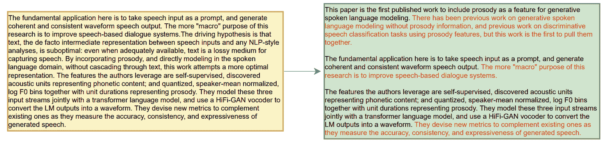
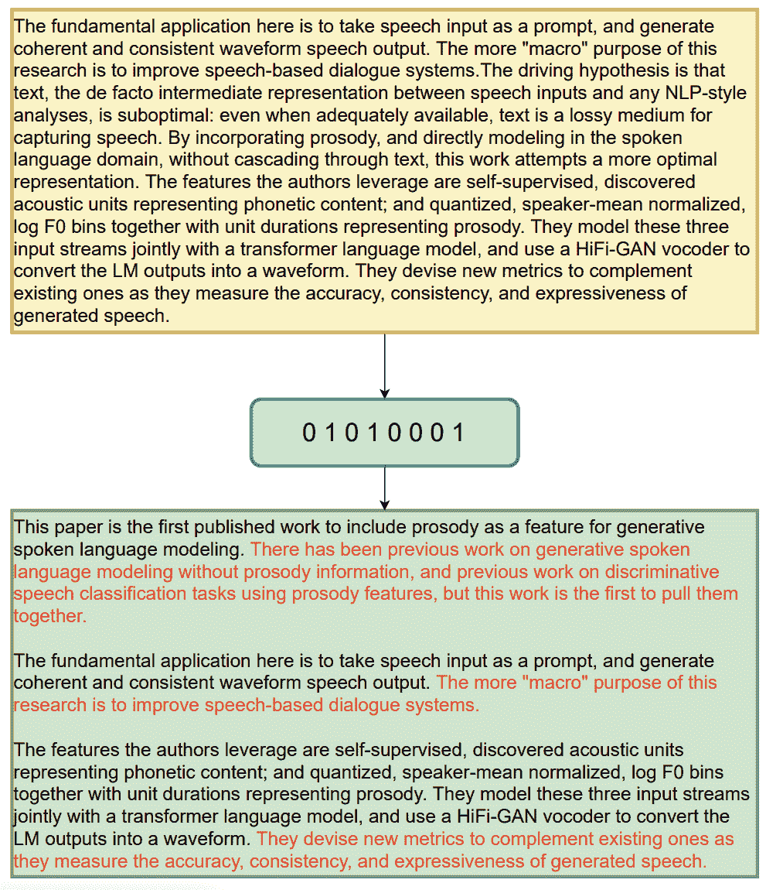
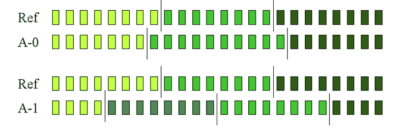
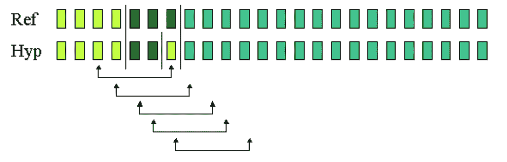
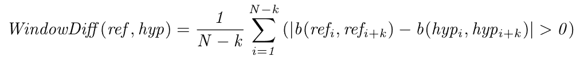
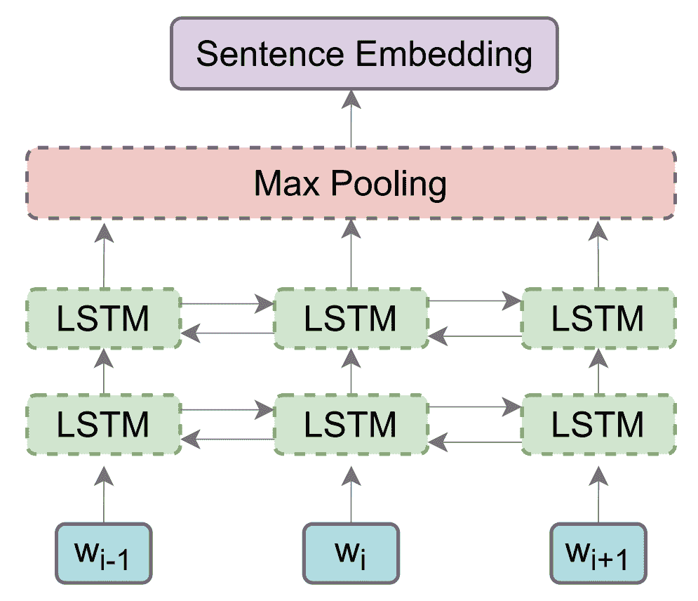
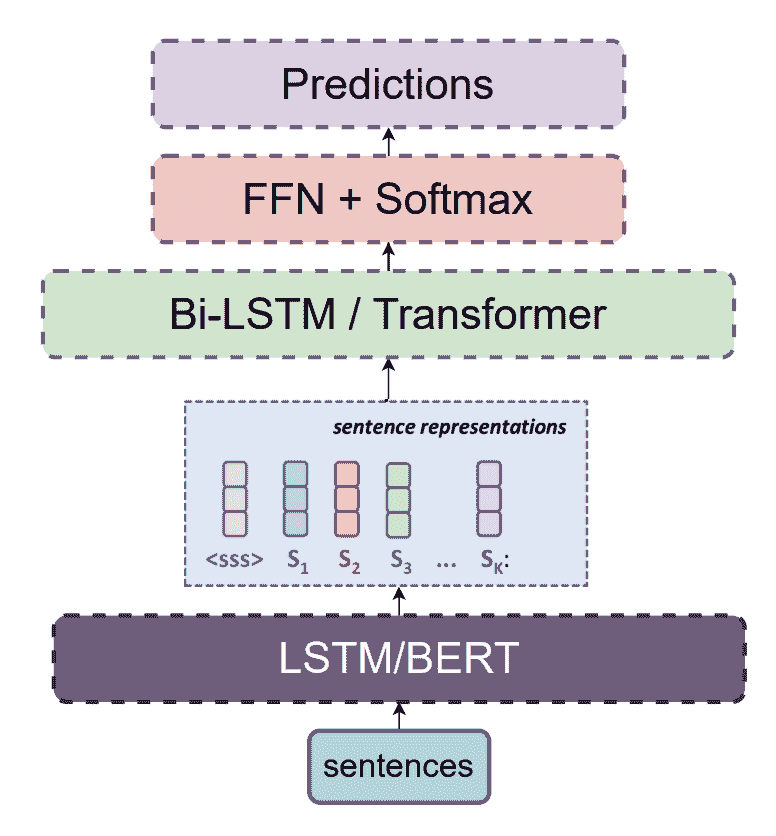

# 文本分割——方法、数据集和评估标准

> 原文：<https://www.assemblyai.com/blog/text-segmentation-approaches-datasets-and-evaluation-metrics/>

## 文本分割简介

文本分割是将文本分割成有意义的片段的任务。这些片段可以由单词、句子或主题组成。在这篇文章中，我们来看一种特定类型的文本分割任务——主题分割，它将一长段文本分割成与不同主题或子主题相对应的片段。

例如，考虑由[自动语音识别(ASR)](https://www.assemblyai.com/blog/what-is-asr/) 系统生成的长达一小时的播客转录。抄写可能会很长，因此很容易忘记你正在读的是哪一个句子。自动主题分割通过将文本分成多个片段来解决这个问题，使转录更具可读性。

Figure: Topic Segmentation

### 文本格式的类型

我们可能想要分割不同类型的文本。例如:

*   书面文本，如博客、文章、新闻等。
*   电视新闻的转录，一个人在说话
*   多人在讲话的播客的转录
*   电话记录(如呼叫中心)
*   许多人正在交谈的在线会议的记录

上面的列表是根据文本可能包含的干扰级别排序的(例如，在[自动转录](https://www.assemblyai.com/blog/what-is-asr/)的情况下，错别字、语法错误或不正确的用词)。噪声是预测主题时要考虑的一个重要因素，因为它有助于主题分段模型预测的分段的质量。我们将在后面的章节中对此进行更多的讨论。

因为博客和文章大多是在电脑上输入的，所以它们包含的噪音最少。

例如，在线会议的转录包含最高级别的噪声，因为可能有几个人使用不同质量的麦克风、用不同的口音以及在不同的互联网连接质量上讲话，这可能导致 ASR 系统的准确性问题。另一方面，电视新闻报道和播客通常是用录音室质量的麦克风录制的，因此与在线会议相比，噪音要小得多，这使得文本转录更加准确。

## 主题分段的用例

现在我们知道了什么是主题分段，以及我们正在处理的文本格式的类型，下面是一些现实生活中的用例:

*   可读性:我们想要将文本分割成多个段落大小的片段的主要原因之一是可读性。请考虑这篇没有任何章节名称、段落或中断的博客文章。这一长串文本使阅读变得更加困难。自动主题分割模型可用于将长而连续的文本分解成小块信息，以便读者更容易阅读。
*   文本摘要帮助读者对任何给定的文本进行摘要。然而，如果文本涉及多个主题，那么文本摘要模型捕获摘要中的所有主题是具有挑战性的。主题分段模型可以更容易地为每个分段生成要点摘要，涵盖给定文本中的所有主题或主题。
*   **将新闻** **报道变成文章:**如今，新闻报道通常通过多种渠道发布，这些渠道需要不同的格式，包括视频和书面格式(如文章或博客帖子)。为了将新闻报道视频作为文章或博客重用，我们可以使用[语音到文本 API](www.assemblyai.com) 转录视频，就像我们在 [AssemblyAI](www.assemblyai.com) 构建的那样，并将主题分段应用于转录。这将有助于把文章组织成更便于读者阅读的格式。
*   **信息** **检索:**给定大量的文本文档，我们可以对属于同一主题的文本进行聚类。一旦我们的文档按主题分段，我们就可以很容易地从每个文档中提取我们需要的信息。
*   **AI 写作助手:**对于 Grammarly 这样的 AI 写作助手来说，主题分割可以用来向作者建议何时开始新的段落，使他们的写作更具可读性

## 主题分割和评价指标的方法

在开始讨论现有的自动主题分割方法之前，让我们首先研究主题分割问题的潜在解决方案，并查看分割准确性的评估指标。

概括地说，在自动主题分割中，我们的目标是通过主题/子主题来分割文本。自动主题分割模型将对文档中的每个句子进行分类，并确定它是否是边界句(即，段落的最后一句)。换句话说，我们可以把话题分割看作一个二元分类问题，我们对每一个句子进行分类，确定它是否是一个边界句。

Figure: Topic Segmentation as Binary Classification

既然我们已经建立了对主题分割问题的理解，那么让我们来讨论它的评估指标。最常用的指标是:

*   精确度和召回率
*   公园
*   windowsiff

### 精确度和召回率

由于这是一个二进制分类问题，您可能会尝试使用 Precision & Recall 作为评估指标。然而，对于这种类型的分类问题，使用精度和召回率存在一些挑战。让我们首先理解与主题分割相关精确和召回意味着什么。

**精度**:由模型识别的边界是真实边界的百分比

**回忆**:模型识别的真实边界的百分比

然而，精确和召回的主要挑战是它们对未遂事件不敏感。为了理解什么是未遂事件，让我们考虑两个主题分割模型 A-0 和 A-1。在下图中， **Ref** 是基本事实，每个块代表一个句子。垂直线表示主题/子主题分段边界。

Figure: Ground truth and output of segmentation algorithms

从图中，你可以清楚地看到模型 A-0 所做的预测非常接近实际情况。这就是所谓的“未遂事件”,这种情况下，预测会相差一两句话。另一方面，模特 A-1 所做的预测与事实相差甚远。从技术上讲，A-0 型的处罚应该比 A-1 型轻得多。但事实并非如此，两个模型得到了相同的精度和召回分数。这是因为 Precision & Recall 不考虑边界预测的远近。

### Pk 分数

为了解决精确度和召回率的挑战，Beeferemen 等人(1997 年)引入了 Pk 分数。

使用基于滑动窗口的方法计算 Pk。窗口大小通常设置为平均真实段数的一半。在滑动窗口的同时，该算法确定窗口的两端在地面真实分段中是在相同还是不同的分段中，并且如果存在不匹配，则增加计数器。通过在 0 和 1 之间调整罚分并除以测量次数来计算最终得分。

Figure: Sliding window over reference and predictions (Pevzner and Hearst - 2002)

正确预测所有边界的模型得分为 0。所以分数越低越好。

### Pk 评估指标面临的挑战:

*   假阴性比假阳性受到更多的惩罚。
*   不考虑边界的数量。如果窗口内部有多个边界，Pk 不考虑这一点。
*   对片段大小的变化很敏感。
*   差点失误被罚太多。

### windowsiff

WindowDiff 的引入是为了解决 Pk 分数的挑战。这也是通过滑动窗口计算的。在这种情况下，对于大小为 *k* 的窗口的每一个位置，我们简单的比较一下地面真实中有多少边界，有多少边界是由话题分割模型预测的。

Figure: Equation for calculating WindowDiff score

这里， *`b(i, j)`* 是一个函数，返回文本中两个位置*`i`**`j`*之间的界限数。 *N* 代表文中的句子数量。

在实践中，Pk 和 WindowDiff 分数都用于评估模型。较低的分数意味着预测更接近实际边界。有关这些指标的更详细的比较以及 WindowDiff score 如何解决 Pk 的挑战，您可以参考 [Pevzner 等人(2002)](https://aclanthology.org/J02-1002/) 。

## 主题分割方法

在这一节中，我们来看看最常见的主题分割方法，这些方法主要可以分为两类——有监督的和无监督的。

### 监督方法

监督方法非常简单——我们获取一个带标签的数据集，然后尝试在其上拟合一个模型。当我们有一个特定于领域的分割任务，并且数据集属于同一个领域时，这种方法非常有效。例如，如果我们知道我们的模型将在推理时看到类似于维基百科的文本，那么在 **Wiki-727k** 上训练模型将产生最佳结果。然而，如果用于其他领域，例如新闻文章或会议记录，它的性能会更差。

在有监督的方法中，我们希望对每个句子进行分类，以确定它是否是边界句。以下是管道的高级工作方式:

1.  将文本作为输入
2.  从文本中提取所有句子，即将文本分割成句子。(可以使用`nltk`、`stanza`、`trankit`等库。对于此任务)
3.  对每个句子进行分类——这将是一个二元分类

需要注意的一件重要事情是，我们在单词级别接受输入，在句子级别进行预测。这意味着我们需要将单词级的表示(嵌入)转换到句子级。我们可以将一个句子中所有标记的嵌入相加，得到一个聚合表示。这将给我们句子级的嵌入。

Figure: Calculation of sentence embeddings from word embedding

此外，如果我们使用像 BERT 这样的模型，我们可以得到嵌入的`[CLS]`标记，而不是聚合一个句子中所有的单词嵌入。这是因为在 BERT 中，`[CLS]`标记聚集了整个序列的表示。

接下来，我们将嵌入传递给一个**双向** LSTM 或变压器，并计算输出的 softmax。在这里使用双向 LSTM/转换器是一个好主意，因为它将使模型能够在做出决定之前查看句子的左右上下文。

Figure: Boundary sentence classifier model

上述基于 LSTM 的方法实际上用于 [Koshorek 等人](https://arxiv.org/abs/1803.09337)。**，**在 Wiki-727k 数据集上取得了 22.13 的 Pk 分数。

[Glavas 等人(2020)](https://arxiv.org/abs/2001.00891) 提出了一个基于 Transformer 的模型，该模型保存了 Wiki-727k、CHOI、Elements &城市等数据集的当前最新成果。他们使用了两个级别的转换器:一个在标记级别，另一个在句子级别。在此基础上，预测目标增加了一个辅助一致性建模目标。其核心思想是文本连贯性与文本分割相关。这意味着一个片段中的文本预期比不同片段中的文本更连贯。

### 无人监管的方法

无监督的方法既没有学习阶段，也没有标记数据。因此，无监督方法利用不同的主题分割技术，例如:

*   词汇衔接
*   主题建模
*   图表
*   相似性度量

我们将从较高的层面介绍这些方法是如何工作的。

### 词汇衔接

如果一组词在语义上是相关的，那么它们就是“词汇衔接的”。词汇衔接的水平由词汇的频率和分布决定，并且存在利用词汇衔接来分割文本的算法。这个想法是，当有子话题转移时，两个文本块之间的词汇衔接会更低，我们可以在此基础上分割文本。

**TextTiling:** TextTiling 由 [Hearst (1997)](https://aclanthology.org/J97-1003.pdf) 提出，是最早的无监督主题分割算法之一。这是一种基于移动窗口的方法，使用文本块之间的词汇衔接来检测主题边界。

该算法有三个主要部分:

*   首先，它将输入文本划分为相关的标记序列，并计算每个潜在边界点的内聚性。
*   然后，它使用这些内聚分数来为每个潜在边界点产生深度分数，该潜在边界点具有比相邻边界点更低的内聚分数。
*   使用这些深度分数，该算法能够选择深度相对于其他深度分数较低的边界点，指示该间隙代表文本中的主题转移。

**LCseg:** LCseg 由 [Galley 等人(2003)](https://aclanthology.org/P03-1071/) 引入，用于分割多方会话。该算法使用词汇衔接来分割主题，它可以处理语音和文本。LCseg 的核心算法有两个主要部分:

*   一种使用词汇链识别和加权强术语重复的方法。
*   一种假设主题边界的方法，已知多个同时出现的术语重复链。

### 主题建模

**主题化:**该算法类似于文本平铺，只是它使用了潜在的狄利克雷分配(LDA)主题模型来进行分割。从概念上讲，它更简单，因为它不必考虑基于单词的特征的稀疏性。使用由 LDA 主题模型生成的主题 id 来代替单词。

### 基于图形

**graph seg:**[Glavas et al .(2016)](https://aclanthology.org/S16-2016/)提出了一种基于图的算法，直接捕捉片段之间的语义相关度，而不是用主题相似度来近似。图的每个节点是一个句子，并且为语义相关的句子对创建边。然后通过找到相关度图的最大集团来确定连贯片段。

### 基于相似性

**余弦相似度:**可以使用类似于文本平铺的基于窗口的方法来测量两个文本块之间的余弦相似度。文本可以用 BERT 上下文嵌入来表示，这比简单的单词包或 word2vec 嵌入要好得多。例如， [Solbiati et al (2021)](https://arxiv.org/abs/2106.12978) 使用来自句子-BERT 的嵌入，句子-BERT 具有连体和三联体网络结构，并提供更丰富的句子级嵌入。

## 资料组

以下是主题分段的常用数据集列表:

### TDT 语料库(1998)

*   话题检测和跟踪(TDT)是 DARPA 发起的一项倡议，旨在调查话题检测的最新成果。
*   该数据集有 16，000 个新闻故事，一半来自路透社新闻专线，另一半来自 CNN 广播新闻文字稿。
*   数据集:[https://catalog.ldc.upenn.edu/LDC98T25](https://catalog.ldc.upenn.edu/LDC98T25)

### 崔(2000)

*   这是一个从布朗语料库生成的合成数据集，基本上是通过连接随机文档生成的。
*   包含 700 个文档。
*   片段长度从 3 到 11 个句子不等。
*   数据集:[https://github . com/koomri/text-segmentation/tree/master/data/choi](https://github.com/koomri/text-segmentation/tree/master/data/choi)

### 图库数据集 _2003)

*   也是人工生成的语料库。
*   包含两个语料库，每个都有 500 个文档。
*   与 CHOI 相比，节段从 4 到 22 不等。

### 元素与城市(2009)

*   陈等人(2009)从维基百科的城市和元素中创建了这两个小数据集。
*   通常用于主题分割模型的评估。

### 维基 727k (2018)

*   根据维基百科文章创建。
*   Wiki727k 包含 727，746 个英语文档，涵盖了各种各样的主题。
*   数据集:[https://github.com/koomri/text-segmentation](https://github.com/koomri/text-segmentation)

### Malach Corpus (2019)

*   该语料库包括来自 32 种不同语言的 52，000 名说话者的超过 115，000 小时的自然语音。
*   对于主题分段任务，该数据集的 10%已经被手动分段。
*   数据集:[https://catalog.ldc.upenn.edu/LDC2019S11](https://catalog.ldc.upenn.edu/LDC2019S11)

### QMSum (2021 年)

*   这个数据集主要用于文本摘要任务，由 AMI 会议语料库和 ICSI 的转录版本构成。
*   转录也基于主题或子主题的转移而被分段。
*   如果您想要针对对话、交谈和会议等口语文本评估您的主题分割模型，这是一个非常好的数据集。
*   数据集:[https://github.com/Yale-LILY/QMSum](https://github.com/Yale-LILY/QMSum)

## 关键要点

*   基于主题或子主题对文本进行分段可以显著提高文本的可读性，并使摘要或信息检索等下游任务变得更加容易。
*   评估文本分割模型的主要方法是通过 Precision & Recall、Pk 和 WindowDiff 评估指标。
*   根据手头的任务，有监督和无监督的模型训练方法都为构建性能良好的文本分割模型提供了可行的选择。

## 参考

*   [野外话语连贯:数据集、评估和方法](https://arxiv.org/pdf/1805.04993.pdf)
*   [独立于领域的线性文本分割的进展](https://aclanthology.org/A00-2004.pdf)
*   [多方通话的话语分割](https://aclanthology.org/P03-1071.pdf)
*   [使用潜在排列的文档结构的全局模型](https://aclanthology.org/N09-1042.pdf)
*   [作为监督学习任务的文本分割](https://aclanthology.org/N18-2075.pdf)
*   [大型口语档案的自动转录和主题分割](https://citeseerx.ist.psu.edu/viewdoc/download?doi=10.1.1.89.9534&rep=rep1&type=pdf)
*   QMSum:基于查询的多领域会议摘要的新基准
*   [作为监督学习任务的文本分割](https://arxiv.org/abs/1803.09337)
*   [文本分割的统计模型](https://www.cs.cmu.edu/~aberger/pdf/ml.pdf)
*   [对文本分割评价指标的评价和改进](https://aclanthology.org/J02-1002/)
*   [用于改进文本分割的两级变换器和辅助一致性建模](https://arxiv.org/abs/2001.00891)
*   [文本平铺:将文本分割成多段副标题段落](https://aclanthology.org/J97-1003.pdf)
*   [多方通话的话语分割](https://aclanthology.org/P03-1071/)
*   [使用语义相关图的无监督文本分割](https://aclanthology.org/S16-2016/)
*   [具有 BERT 嵌入的会议的无监督主题分割](https://arxiv.org/abs/2106.12978)