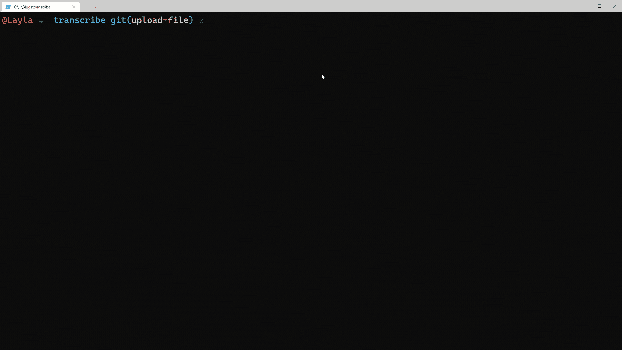

# 用 Node.js 转录本地音频文件

> 原文：<https://www.assemblyai.com/blog/uploading-files-to-assemblyai-using-node-js-and-javascript/>

在之前的[博客](https://www.assemblyai.com/blog/getting-started-with-speech-to-text-transcriptions-with-assemblyai-javascript-and-node-js/)中，我们介绍了如何使用 AssemblyAI 语音转文本 API、Node.js 和 JavaScript 构建一个简单的命令行应用程序来转录音频文件。那个博客用的是音频网址。但是如果你想直接从你的电脑或者设备上传一个音频文件呢？

艾议员会掩护你的！


在这篇文章中，我们将通过引入文件上传功能来扩展我们在之前的[博客](https://www.assemblyai.com/blog/getting-started-with-speech-to-text-transcriptions-with-assemblyai-javascript-and-node-js?undefined)中创建的应用。

### 先决条件

*   一个免费的 [AssemblyAI 账户](https://app.assemblyai.com/)
*   一个代码编辑器，比如 [VS 代码](https://code.visualstudio.com/?undefined)
*   [Node.js](https://nodejs.org/?undefined) 和 [npm](https://www.npmjs.com/?undefined)
*   [‍](https://www.npmjs.com/?undefined) 这个 [GitHub 库](https://github.com/AssemblyAI/nodejs-getting-started-stt?undefined)的副本或者[克隆](https://docs.github.com/en/github/creating-cloning-and-archiving-repositories/cloning-a-repository?undefined)

如果你想看完整的代码项目，可以从这个 [GitHub 库](https://github.com/AssemblyAI/nodejs-getting-started-stt/tree/upload-file?undefined)获得。

### 设置克隆的存储库

如果您还没有完成上一篇博客中的教程，那么遵循那篇文章中的步骤可能是个好主意，即使您只是打算使用 GitHub 资源库中已完成的代码。

我们需要导航到包含我们的节点应用程序的目录。

```py
cd transcribe
```

‍Create 的一个新文件在`transcribe` 目录里面:

*如果使用 Windows:*

```py
New-Item uploadFile.js
```

*或者，如果使用 macOS 或 Linux:*

```py
touch uploadFile.js
```

如果您还没有将 AssemblyAI API 密钥添加到。env "文件，那么现在就这样做。您可以在 [AssemblyAI 仪表板](https://app.assemblyai.com/)中找到您的 API 键，并将其作为值添加到变量中，如下所示:

```py
ASSEMBLYAI_API_KEY = "YOUR_API_KEY"
```

您现在已经准备好编写`uploadFile`函数了。

## 将本地音频文件上传到程序集

当我们上传一个文件到 AssemblyAI 时，我们需要以 [`chunked data`](https://en.wikipedia.org/wiki/Chunked_transfer_encoding?undefined) 的形式发送它。这是 HTTP 中使用的一种传输编码方法。

AssemblyAI 然后会将音频文件保存到私有存储中，创建一个只能通过 AssemblyAI API 访问的 URL。所有上传在转录后立即被删除，因为我们不存储上传。

对我们的 HTTP 请求的响应将包括这个存储的音频文件的 URL。

我们开始吧！

在您的代码编辑器中打开我们之前创建的`uploadFile.js`。将以下代码复制并粘贴到该文件中:

```py
require('dotenv').config();
const fetch = require('node-fetch');
const fs = require('fs');
const url = 'https://api.assemblyai.com/v2/upload';
```

上面的代码将导入我们将使用的 Node.js 库。我们还将`url`设置为 AssemblyAI `upload` API 端点的值。

Node.js [`fs`](https://nodejs.org/api/fs.html?undefined) (文件流)库包含在 Node 标准库中，我们将使用它来创建本地音频文件的文件流，准备作为分块数据发送到 AssemblyAI。

就像我们在上一篇文章中制作的应用程序一样，我们将在命令行上传递一个参数。这一次，它将是我们的音频文件的文件路径。

```py
let args = process.argv.slice(2);
let audioPath = args[0];
```

接下来，我们将使用包含在`fs`模块中的`readFile`方法将音频文件转换成流。此方法需要文件路径和一个函数。

```py
fs.readFile(audioPath, (err, data) => { 
  if (err) {
    return console.log(err);
  }
}
```

上面的代码使用一个[箭头函数](https://www.w3schools.com/js/js_arrow_function.asp?undefined)来处理文件流。如果出现错误，该函数会将错误记录到命令行中。

现在我们在内存中有了我们的文件作为`data`的值，我们可以继续向 AssemblyAI 发出 HTTP POST 请求。

和上一篇文章一样，我们将使用`fetch`来发出请求。Fetch 需要一些参数，下面的代码定义了它们。将此代码*添加到`fs`箭头函数*中。

```py
fs.readFile(audioPath, (err, data) => { 
  if (err) {
    return console.log(err);
  }
}
// add the code below to the arrow function
const params = {
  headers: {
    "authorization": process.env.ASSEMBLYAI_API_KEY,
    "Transfer-Encoding" : "chunked"
  },
  body: data,
  method: 'POST'
};
```

我们正在添加一个 AssemblyAI API 键，它是从`.env`文件中检索到的，与`chunked`的重要的`Transfer-Encoding`设置一起添加到标题中。

请求的主体是文件流`data`。

最后一步是发出实际的 HTTP Post 请求，并将结果`upload_url`打印到命令行！

```py
fs.readFile(audioPath, (err, data) => { 
  if (err) {
    return console.log(err);
  }

const params = {
  headers: {
    "authorization": process.env.ASSEMBLYAI_API_KEY,
    "Transfer-Encoding" : "chunked"
  },
  body: data,
  method: 'POST'
};

// add the code below to the arrow function

fetch(url, params)
  .then(response => response.json())
  .then(data => {
   console.log(`URL: ${data['upload_url']}`)
  })
  .catch((error) => {
    console.error(`Error: ${error}`);
  });

}
```

‍We 还处理 HTTP 请求期间发生的任何错误。

整个代码应该如下所示:

```py
require('dotenv').config();
const fetch = require('node-fetch');
const fs = require('fs');
const url = 'https://api.assemblyai.com/v2/upload';

let args = process.argv.slice(2);
let audioPath = args[0];

fs.readFile(audioPath, (err, data) => {
  if (err) {
    return console.log(err);
  }

  const params = {
    headers: {
      "authorization": process.env.ASSEMBLYAI_API_KEY,
      "Transfer-Encoding": "chunked"
    },
    body: data,
    method: 'POST'
  };

  fetch(url, params)
    .then(response => response.json())
    .then(data => {
      console.log(`URL: ${data['upload_url']}`)
    })
    .catch((error) => {
      console.error(`Error: ${error}`);
    });
});
```

## 是时候尝试一下了！

我们的应用程序现在能够从本地文件系统或互联网上的资源上传音频文件。更好的是，我们可以从命令行完成整个过程。

第一步是上传文件。确保当前目录是`transcribe`，或者您的代码所在的位置，并输入以下命令:

```py
node uploadFile.js C:\Path\To\Audio\File.mp3
```

确保使用计算机上音频剪辑的路径更新上述代码。如果你需要一个示例音频剪辑来测试，请随意下载这个 [one](https://s3-us-west-2.amazonaws.com/blog.assemblyai.com/audio/8-7-2018-post/7510.mp3?undefined) 。

如果您没有任何错误，您应该会看到`upload_url`被打印到命令行。

现在，您可以复制这个 URL，并将其传递到应用程序的下一个阶段，使用前一篇博文中编写的代码。

```py
node upload.js RETURNED_UPLOAD_URL
```

‍This 命令应该将转录 ID 打印到屏幕上。复制 ID 并输入应用程序的最终命令。

```py
node download.js TRANSCRIPTION_ID
```

‍If 你的转录准备好了，你的文本将被打印到命令行！



## 现在怎么办？

在这篇文章中，我们成功地学习了如何使用`fs`将文件作为二进制对象上传到 AssemblyAI 上传 API。

如果你还没有尝试过[上一篇文章](https://www.assemblyai.com/blog/getting-started-with-speech-to-text-transcriptions-with-assemblyai-javascript-and-node-js/)中的挑战，这可能是一个有趣的下一步。

让我们知道你的进展如何，或者如果你对这篇博文或 AssemblyAI 的主题有任何问题！