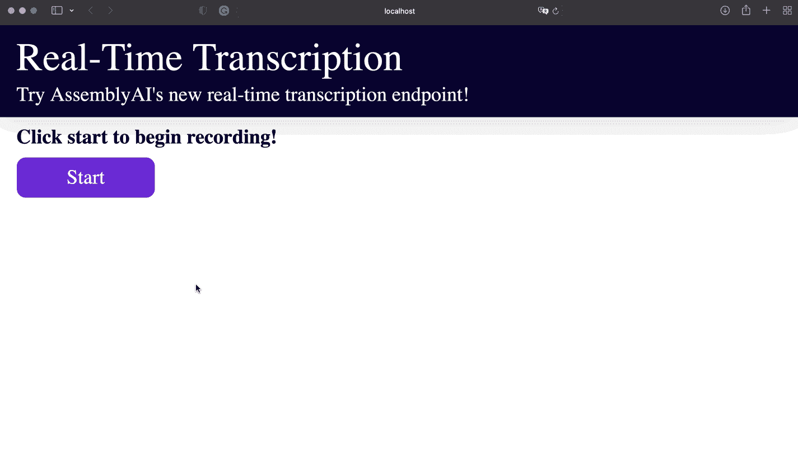

# 如何使用 JavaScript 将语音转换成文本

> 原文：<https://www.assemblyai.com/blog/voice-to-text-javascript/>

本文展示了如何通过几行代码将麦克风录音中的实时语音识别集成到您的 JavaScript 应用程序中。



## 使用 AssemblyAI 在 JavaScript 中实现实时语音转文本

最简单的解决方案是一个[语音转文本 API](https://www.assemblyai.com/blog/the-top-free-speech-to-text-apis-and-open-source-engines/) ，可以用每种编程语言的简单 HTTP 客户端访问它。最容易使用的 API 之一是 AssemblyAI，它不仅为音频文件提供传统的语音转录服务，还提供了一个[实时语音识别端点](https://www.assemblyai.com/blog/improved-accuracy-on-assemblyais-real-time-speech-to-text-api/)，它可以在几百毫秒内通过 WebSockets 将转录文本传输给你。

在开始之前，我们需要获得一个有效的 API 密钥。您可以在此获得一个，并免费开始使用:

[Get a free API Key](https://app.assemblyai.com/signup)

## 步骤 1:设置 HTML 代码和麦克风记录器

创建一个文件`index.html`并添加一些 HTML 元素来显示文本。为了使用麦克风，我们嵌入了 [RecordRTC](https://recordrtc.org) ，这是一个用于音频和视频录制的 JavaScript 库。

此外，我们嵌入了`index.js`，它将是处理前端部分的 JavaScript 文件。这是完整的 HTML 代码:

```py
<!DOCTYPE html>
<html lang="en">
<head>
  <meta charset="UTF-8">
  <meta http-equiv="X-UA-Compatible" content="IE=edge">
  <meta name="viewport" content="width=device-width, initial-scale=1.0">
  <title>Document</title>
  <link rel="stylesheet" href="./css/reset.css">
  <link rel="stylesheet" href="./css/styles.css"> 
</head>
<script src="https://www.WebRTC-Experiment.com/RecordRTC.js"></script>
<body>
  <header>
    <h1 class="header__title">Real-Time Transcription</h1>
    <p class="header__sub-title">Try AssemblyAI's new real-time transcription endpoint!</p>
  </header>
  <div class="real-time-interface">
    <p id="real-time-title" class="real-time-interface__title">Click start to begin recording!</p>
    <p id="button" class="real-time-interface__button">Start</p>
    <p id="message" class="real-time-interface__message"></p>
  </div>
  <script src="./js/index.js"></script>
</body>
</html> 
```

## 步骤 2:用 JavaScript 设置带有 WebSocket 连接的客户机

接下来，创建`index.js`并访问相应 HTML 文件的 DOM 元素。此外，我们使用全局变量来存储记录器、WebSocket 和记录状态。

```py
// required dom elements
const buttonEl = document.getElementById('button');
const messageEl = document.getElementById('message');
const titleEl = document.getElementById('real-time-title');

// initial states and global variables
messageEl.style.display = 'none';
let isRecording = false;
let socket;
let recorder; 
```

然后我们只需要创建一个函数来处理所有的逻辑。每当用户点击按钮开始或停止录制时，都会执行该功能。我们切换记录状态，并为这两种状态实现一个 if-else 语句。

如果记录停止了，我们就停止记录器实例并关闭套接字。在关闭之前，我们还需要发送一个包含`{terminate_session: true}`的 JSON 消息:

```py
const run = async () => {
  isRecording = !isRecording;
  buttonEl.innerText = isRecording ? 'Stop' : 'Record';
  titleEl.innerText = isRecording ? 'Click stop to end recording!' : 'Click start to begin recording!'

  if (!isRecording) { 

    if (recorder) {
      recorder.pauseRecording();
      recorder = null;
    }

    if (socket) {
      socket.send(JSON.stringify({terminate_session: true}));
      socket.close();
      socket = null;
    }

  } else {
    // TODO: setup websocket and handle events
  }
};

buttonEl.addEventListener('click', () => run()); 
```

然后我们需要实现录音开始时执行的`else`部分。为了不在客户端暴露 API 密钥，我们向后端发送一个请求并获取一个会话令牌。

然后我们建立一个与`wss://api.assemblyai.com/v2/realtime/ws`连接的 WebSocket。对于套接字，我们必须处理事件`onmessage`、`onerror`、`onclose`和`onopen`。在`onmessage`事件中，我们解析传入的消息数据，并设置相应 HTML 元素的内部文本。

在`onopen`事件中，我们初始化 RecordRTC 实例，然后将音频数据作为 base64 编码的字符串发送。其他两个事件可用于关闭和重置套接字。这是`else`块的剩余代码:

```py
// get session token from backend
const response = await fetch('http://localhost:8000');
const data = await response.json();

if(data.error){
    alert(data.error)
}

const { token } = data;

// establish wss with AssemblyAI at 16000 sample rate
socket = new WebSocket(`wss://api.assemblyai.com/v2/realtime/ws?sample_rate=16000&token=${token}`);

// handle incoming messages to display transcription to the DOM
const texts = {};
socket.onmessage = (message) => {
    let msg = '';
    const res = JSON.parse(message.data);
    texts[res.audio_start] = res.text;
    const keys = Object.keys(texts);
    keys.sort((a, b) => a - b);
    for (const key of keys) {
        if (texts[key]) {
            msg += ` ${texts[key]}`;
        }
    }
    messageEl.innerText = msg;
};

// handle error
socket.onerror = (event) => {
    console.error(event);
    socket.close();
}

// handle socket close
socket.onclose = event => {
    console.log(event);
    socket = null;
}

// handle socket open
socket.onopen = () => {
    // begin recording
    messageEl.style.display = '';
    navigator.mediaDevices.getUserMedia({ audio: true })
    .then((stream) => {
        recorder = new RecordRTC(stream, {
        type: 'audio',
        mimeType: 'audio/webm;codecs=pcm', // endpoint requires 16bit PCM audio
        recorderType: StereoAudioRecorder,
        timeSlice: 250, // set 250 ms intervals of data
        desiredSampRate: 16000,
        numberOfAudioChannels: 1, // real-time requires only one channel
        bufferSize: 4096,
        audioBitsPerSecond: 128000,
        ondataavailable: (blob) => {
            const reader = new FileReader();
            reader.onload = () => {
                const base64data = reader.result;

                // audio data must be sent as a base64 encoded string
                if (socket) {
                    socket.send(JSON.stringify({ audio_data: base64data.split('base64,')[1] }));
                }
            };
            reader.readAsDataURL(blob);
        },
    });

    recorder.startRecording();
    })
    .catch((err) => console.error(err));
}; 
```

## 步骤 3:用 Express.js 设置一个服务器来处理认证

最后，我们需要创建另一个文件`server.js`来处理认证。这里我们创建一个服务器，它有一个端点，通过向`https://api.assemblyai.com/v2/realtime/token`发送 POST 请求来创建一个临时认证令牌。

要使用它，我们必须安装 *Express.js* 、 *Axios* 和 *cors* :

```py
$ npm install express axios cors 
```

这是服务器部分的完整代码:

```py
const express = require('express');
const axios = require('axios');
const cors = require('cors');

const app = express();
app.use(express.json());
app.use(cors());

app.get('/', async (req, res) => {
  try {
    const response = await axios.post('https://api.assemblyai.com/v2/realtime/token', 
      { expires_in: 3600 },
      { headers: { authorization: 'YOUR_TOKEN' } });
    const { data } = response;
    res.json(data);
  } catch (error) {
    const {response: {status, data}} = error;
    res.status(status).json(data);
  }
});

app.set('port', 8000);
const server = app.listen(app.get('port'), () => {
  console.log(`Server is running on port ${server.address().port}`);
}); 
```

每当记录开始时，后端的这个端点将向前端发送有效的会话令牌。就是这样！你可以在我们的 [GitHub 库](https://github.com/AssemblyAI/realtime-transcription-browser-js-example)中找到完整的代码。

## 运行 JavaScript 文件进行实时语音识别

现在我们必须运行后端和前端部分。使用以下命令启动服务器

```py
$ node server.js 
```

然后用[服务包](https://www.npmjs.com/package/serve)服务前端站点:

```py
$ npm i --global serve
$ serve -l 3000 
```

现在你可以访问`http://localhost:3000`，开始语音记录，并看到实时转录在行动中！